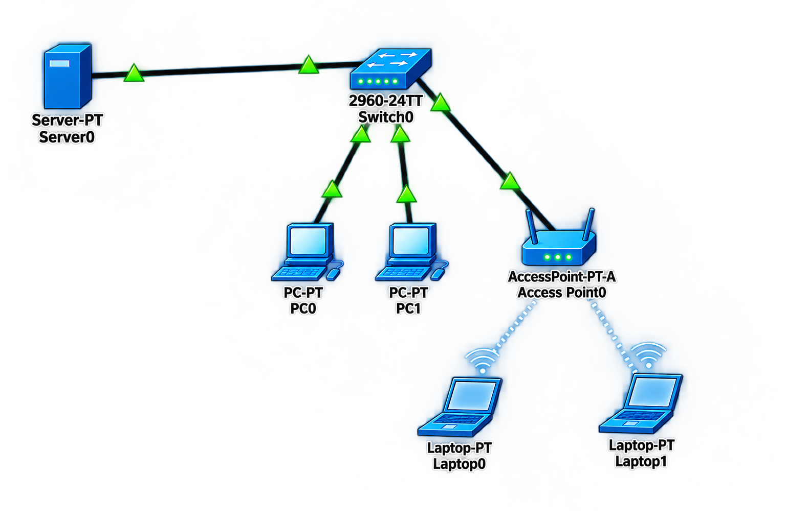

# 🌐 VLAN (Virtual Local Area Network)

## 📖 Apa itu VLAN?

**VLAN (Virtual Local Area Network)** adalah teknologi yang memungkinkan kita membagi satu switch fisik menjadi beberapa jaringan logis yang terisolasi satu sama lain. Dengan VLAN, perangkat yang terhubung ke switch yang sama dapat dipisahkan secara logis seolah-olah mereka berada di switch yang berbeda.

### 🎯 Tujuan VLAN:

1. **Keamanan** - Memisahkan traffic antar departemen atau fungsi
2. **Efisiensi Broadcast** - Mengurangi domain broadcast sehingga traffic tidak membanjiri seluruh jaringan
3. **Fleksibilitas** - Memudahkan perubahan jaringan tanpa perlu mengubah kabel fisik
4. **Manajemen** - Mengelompokkan perangkat berdasarkan fungsi atau departemen

### 🏷️ Jenis-Jenis VLAN:

| Jenis VLAN | Fungsi |
|------------|--------|
| **Data VLAN** | Membawa traffic data pengguna (default: VLAN 1) |
| **Voice VLAN** | Khusus untuk traffic VoIP (Quality of Service) |
| **Management VLAN** | Untuk akses manajemen perangkat (SSH, Telnet, SNMP) |
| **Native VLAN** | VLAN tanpa tag pada trunk (default: VLAN 1) |
| **Blackhole VLAN** | VLAN untuk port yang tidak digunakan (dinonaktifkan) |

---

## 🌐 Topologi



---

## 📊 Tabel Perangkat dan IP Address

| Perangkat | Antarmuka | VLAN | IP Address | Netmask | Gateway |
|-----------|-----------|------|------------|---------|---------|
| **Switch** | Fa0/1 | VLAN 10 | - | - | - |
| **Switch** | Fa0/2 | VLAN 10 | - | - | - |
| **Switch** | Fa0/12 | VLAN 20 | - | - | - |
| **Switch** | Fa0/24 | VLAN 30 | - | - | - |
| **PC1** | NIC | VLAN 10 | 192.168.2.10 | 255.255.255.0 | 192.168.2.1 |
| **PC2** | NIC | VLAN 10 | 192.168.2.20 | 255.255.255.0 | 192.168.2.1 |
| **Access Point** | NIC | VLAN 20 | DHCP | 255.255.255.0 | 192.168.3.1 |
| **Server** | NIC | VLAN 30 | 192.168.1.10 | 255.255.255.0 | 192.168.1.1 |

---

## 📋 Detail Konfigurasi VLAN

| Port | VLAN | Status | Keterangan |
|------|------|--------|------------|
| Fa0/1 | 10 | Up | PC1 |
| Fa0/2 | 10 | Up | PC2 |
| Fa0/3 - 11 | 10 | Down | Tidak digunakan |
| Fa0/12 | 20 | Up | Access Point |
| Fa0/13 - 23 | 999 | Down | Blackhole (Native VLAN) |
| Fa0/24 | 30 | Up | Server |

---

## ⚙️ Langkah-Langkah Konfigurasi

### 1. Konfigurasi Dasar Switch

```cisco
Switch> enable
Switch# configure terminal
Switch(config)# hostname SW1

! Nonaktifkan DNS lookup untuk mempercepat CLI
SW1(config)# no ip domain-lookup

! Enkripsi password
SW1(config)# service password-encryption

! Simpan konfigurasi
SW1(config)# end
SW1# copy running-config startup-config
```

---

### 2. Membuat VLAN

```cisco
SW1> enable
SW1# configure terminal

! Buat VLAN 10 (Data VLAN untuk PC)
SW1(config)# vlan 10
SW1(config-vlan)# name DATA_VLAN_10
SW1(config-vlan)# exit

! Buat VLAN 20 (Wireless VLAN untuk Access Point)
SW1(config)# vlan 20
SW1(config-vlan)# name WIRELESS_VLAN_20
SW1(config-vlan)# exit

! Buat VLAN 30 (Server VLAN)
SW1(config)# vlan 30
SW1(config-vlan)# name SERVER_VLAN_30
SW1(config-vlan)# exit

! Buat VLAN 999 (Blackhole untuk port yang tidak digunakan)
SW1(config)# vlan 999
SW1(config-vlan)# name BLACKHOLE
SW1(config-vlan)# exit

SW1(config)# end
SW1# copy running-config startup-config
```

---

### 3. Konfigurasi Access Port VLAN 10 (PC1 dan PC2)

```cisco
SW1> enable
SW1# configure terminal

! Port Fa0/1 untuk PC1 (VLAN 10)
SW1(config)# interface fastEthernet 0/1
SW1(config-if)# description === PC1 - VLAN 10 ===
SW1(config-if)# switchport mode access
SW1(config-if)# switchport access vlan 10
SW1(config-if)# no shutdown
SW1(config-if)# exit

! Port Fa0/2 untuk PC2 (VLAN 10)
SW1(config)# interface fastEthernet 0/2
SW1(config-if)# description === PC2 - VLAN 10 ===
SW1(config-if)# switchport mode access
SW1(config-if)# switchport access vlan 10
SW1(config-if)# no shutdown
SW1(config-if)# exit

! Port Fa0/3 - 11 (VLAN 10 - DOWN)
SW1(config)# interface range fastEthernet 0/3 - 11
SW1(config-if-range)# description === UNUSED - VLAN 10 DOWN ===
SW1(config-if-range)# switchport mode access
SW1(config-if-range)# switchport access vlan 10
SW1(config-if-range)# shutdown
SW1(config-if-range)# exit

SW1(config)# end
SW1# copy running-config startup-config
```

---

### 4. Konfigurasi Access Port VLAN 20 (Access Point)

```cisco
SW1> enable
SW1# configure terminal

! Port Fa0/12 untuk Access Point (VLAN 20)
SW1(config)# interface fastEthernet 0/12
SW1(config-if)# description === ACCESS POINT - VLAN 20 ===
SW1(config-if)# switchport mode access
SW1(config-if)# switchport access vlan 20
SW1(config-if)# no shutdown
SW1(config-if)# exit

SW1(config)# end
SW1# copy running-config startup-config
```

---

### 5. Konfigurasi Blackhole VLAN 999 (Port Tidak Digunakan)

```cisco
SW1> enable
SW1# configure terminal

! Port Fa0/13 - 23 (VLAN 999 - BLACKHOLE - DOWN)
SW1(config)# interface range fastEthernet 0/13 - 23
SW1(config-if-range)# description === BLACKHOLE - UNUSED ===
SW1(config-if-range)# switchport mode access
SW1(config-if-range)# switchport access vlan 999
SW1(config-if-range)# shutdown
SW1(config-if-range)# exit

SW1(config)# end
SW1# copy running-config startup-config
```

---

### 6. Konfigurasi Access Port VLAN 30 (Server)

```cisco
SW1> enable
SW1# configure terminal

! Port Fa0/24 untuk Server (VLAN 30)
SW1(config)# interface fastEthernet 0/24
SW1(config-if)# description === SERVER - VLAN 30 ===
SW1(config-if)# switchport mode access
SW1(config-if)# switchport access vlan 30
SW1(config-if)# no shutdown
SW1(config-if)# exit

SW1(config)# end
SW1# copy running-config startup-config
```

---

### 7. Konfigurasi IP Address di Server

**Server (VLAN 30):**

```cisco
! Akses ke Server melalui GUI atau CLI
! IP Address: 192.168.1.10/24
! Gateway: 192.168.1.1
! DNS: 8.8.8.8
```

---

### 8. Konfigurasi IP Address di PC

**PC1 (VLAN 10):**

| Parameter | Nilai |
|-----------|-------|
| IP Address | 192.168.2.10 |
| Netmask | 255.255.255.0 |
| Gateway | 192.168.2.1 |
| DNS | 8.8.8.8 |

**PC2 (VLAN 10):**

| Parameter | Nilai |
|-----------|-------|
| IP Address | 192.168.2.20 |
| Netmask | 255.255.255.0 |
| Gateway | 192.168.2.1 |
| DNS | 8.8.8.8 |

---

### 9. Konfigurasi Access Point (VLAN 20 - DHCP)

**Access Point:**

| Parameter | Nilai |
|-----------|-------|
| IP Address | DHCP (dari router/DHCP server) |
| VLAN | 20 |
| SSID | Wireless_Network |
| Security | WPA2-PSK |

---

## ✅ Verifikasi Konfigurasi

### 1. Cek Konfigurasi VLAN

```cisco
SW1# show vlan brief
```

**Output yang diharapkan:**
```
VLAN Name                             Status    Ports
---- -------------------------------- --------- -------------------------------
1    default                          active    Fa0/0, Gi0/1, Gi0/2
10   DATA_VLAN_10                     active    Fa0/1, Fa0/2
20   WIRELESS_VLAN_20                 active    Fa0/12
30   SERVER_VLAN_30                   active    Fa0/24
999  BLACKHOLE                        active    Fa0/13, Fa0/14, ... Fa0/23
```

---

### 2. Cek Status Port

```cisco
SW1# show interfaces status
```

**Output yang diharapkan:**
```
Port      Name               Status       Vlan       Duplex  Speed Type
Fa0/1     PC1 - VLAN 10      connected    10         a-full  a-100 10/100BaseTX
Fa0/2     PC2 - VLAN 10      connected    10         a-full  a-100 10/100BaseTX
Fa0/3     UNUSED - VLAN 10   disabled     10         auto    auto  10/100BaseTX
Fa0/12    AP - VLAN 20       connected    20         a-full  a-100 10/100BaseTX
Fa0/24    SERVER - VLAN 30   connected    30         a-full  a-100 10/100BaseTX
```

---

### 3. Cek Konfigurasi Port

```cisco
SW1# show running-config | begin interface
```

---

### 4. Uji Koneksi

**Dari PC1 (192.168.2.10):**

```cmd
ping 192.168.2.20    # ke PC2 - HARUS BERHASIL (sama VLAN)
ping 192.168.3.10    # ke AP - HARUS GAGAL (beda VLAN)
ping 192.168.1.10    # ke Server - HARUS GAGAL (beda VLAN)
```

**Dari Server (192.168.1.10):**

```cmd
ping 192.168.2.10    # ke PC1 - HARUS GAGAL (beda VLAN)
ping 192.168.3.10    # ke AP - HARUS GAGAL (beda VLAN)
ping 192.168.1.1     # ke Gateway - HARUS BERHASIL
```

---

## 📊 Ringkasan Konfigurasi

| VLAN ID | Nama | Port | Status | Perangkat |
|---------|------|------|--------|-----------|
| 10 | DATA_VLAN_10 | Fa0/1, Fa0/2 | Up | PC1, PC2 |
| 10 | DATA_VLAN_10 | Fa0/3 - 11 | Down | Tidak digunakan |
| 20 | WIRELESS_VLAN_20 | Fa0/12 | Up | Access Point |
| 30 | SERVER_VLAN_30 | Fa0/24 | Up | Server |
| 999 | BLACKHOLE | Fa0/13 - 23 | Down | Blackhole (Native VLAN) |

---

## 🔧 Troubleshooting

| Masalah | Kemungkinan Penyebab | Solusi |
|---------|---------------------|--------|
| PC tidak bisa ping ke PC lain di VLAN sama | Port tidak di VLAN yang sama | Cek `show vlan brief` |
| Port tidak aktif | Port dalam status shutdown | Gunakan `no shutdown` |
| VLAN tidak muncul | VLAN belum dibuat | Buat VLAN dengan `vlan [id]` |
| Perangkat tidak dapat IP | DHCP server tidak aktif | Konfigurasi DHCP server atau set IP statis |

---

## 📚 Referensi

- [Cisco VLAN Documentation](https://www.cisco.com/c/en/us/support/docs/lan-switching/virtual-lans/)
- [Cisco Networking Academy](https://www.netacad.com/)

---