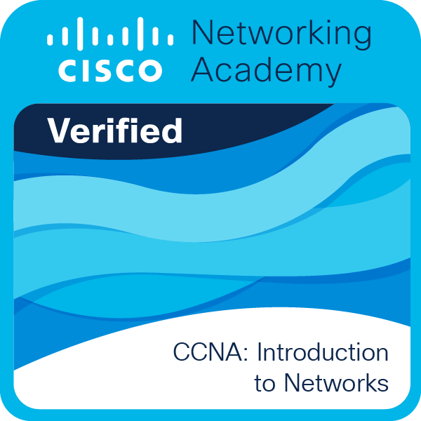

# 🌐 Network Engineering Learning Repository (Cisco)

<div align="center">
  
  <!-- BADGE (Sejajar dalam satu baris) -->
  
  
  
  
  <br>
  
  <!-- LOGO (Di bawah badge) -->
  
  
</div>

---

## 📖 Apa itu Network Engineering?

**Network Engineering** adalah disiplin ilmu yang mempelajari perancangan, implementasi, dan pengelolaan infrastruktur jaringan komputer. Seorang Network Engineer bertanggung jawab untuk memastikan bahwa data dapat mengalir dengan aman, cepat, dan andal dari satu perangkat ke perangkat lain di seluruh dunia.

Bayangkan jaringan komputer sebagai **sistem jalan raya digital**. Data adalah kendaraan yang melaju, router adalah persimpangan yang mengarahkan lalu lintas, switch adalah jalan lokal yang menghubungkan rumah-rumah, dan firewall adalah pos keamanan yang memeriksa setiap kendaraan yang lewat. Tanpa jaringan yang terkelola dengan baik, dunia digital yang kita kenal saat ini—mulai dari streaming video, e-commerce, hingga komunikasi global—tidak akan mungkin terwujud.

---

## 🧠 Pengenalan Dasar-Dasar Jaringan

Sebelum melangkah lebih jauh, penting untuk memahami fondasi dari jaringan komputer. Berikut adalah konsep-konsep fundamental yang menjadi dasar dari setiap implementasi jaringan:

## 📡 IP Address (Internet Protocol Address)

IP Address adalah **alamat unik** yang diberikan kepada setiap perangkat yang terhubung ke jaringan. Fungsinya seperti alamat rumah: tanpa alamat, paket data tidak akan tahu ke mana harus dikirim.

### 🔢 Jenis-Jenis IP Address

| Jenis | Deskripsi | Contoh |
|-------|-----------|--------|
| **IPv4** | 32-bit, terdiri dari 4 oktet (8 bit per oktet) | `192.168.1.1` |
| **IPv6** | 128-bit, terdiri dari 8 grup heksadesimal | `2001:0db8:85a3:0000:0000:8a2e:0370:7334` |
| **Public IP** | Dapat diakses dari internet, unik secara global | `8.8.8.8` |
| **Private IP** | Digunakan di jaringan lokal, tidak bisa diakses dari internet | `192.168.1.1`, `10.0.0.1`, `172.16.0.1` |
| **Static IP** | Tetap, dikonfigurasi manual | `192.168.1.100` |
| **Dynamic IP** | Berubah-ubah, diberikan oleh DHCP server | `192.168.1.101` |

---

## 📊 IPv4 Address Classes

IPv4 dibagi menjadi 5 kelas berdasarkan **oktet pertama** dari alamat IP:

| Kelas | Oktet Pertama | Range IP | Subnet Mask Default | Penggunaan |
|-------|---------------|----------|---------------------|------------|
| **A** | 1 - 126 | `1.0.0.0` - `126.255.255.255` | `255.0.0.0` (/8) | Jaringan besar (organisasi besar) |
| **B** | 128 - 191 | `128.0.0.0` - `191.255.255.255` | `255.255.0.0` (/16) | Jaringan menengah (perusahaan) |
| **C** | 192 - 223 | `192.0.0.0` - `223.255.255.255` | `255.255.255.0` (/24) | Jaringan kecil (kantor kecil) |
| **D** | 224 - 239 | `224.0.0.0` - `239.255.255.255` | - | Multicast (tidak untuk umum) |
| **E** | 240 - 255 | `240.0.0.0` - `255.255.255.255` | - | Eksperimental (tidak digunakan) |

### 📌 Catatan Penting:
- **127.0.0.0/8** adalah **Loopback Address** (digunakan untuk tes diri sendiri, `ping 127.0.0.1`)
- **0.0.0.0/8** adalah **Default Route** (digunakan untuk routing ke semua jaringan)

---

## 🔍 ARP (Address Resolution Protocol)

ARP adalah protokol yang digunakan untuk **menerjemahkan alamat IP menjadi alamat MAC** (Media Access Control). Ketika sebuah perangkat ingin mengirim data ke perangkat lain di jaringan yang sama, ia perlu mengetahui alamat MAC tujuan. ARP bekerja seperti **buku telepon** yang mencari nomor telepon (MAC Address) berdasarkan nama (IP Address).

**Cara Kerja ARP:**
1. Perangkat sumber mengirim **ARP Request** (broadcast) ke semua perangkat di jaringan: "Siapa yang punya IP `192.168.1.1`?"
2. Perangkat dengan IP tersebut menjawab **ARP Reply** (unicast): "Saya, ini MAC Address saya `00:0C:29:AB:CD:EF`"
3. Perangkat sumber menyimpan informasi ini di **ARP Cache** untuk penggunaan selanjutnya.

---

## 📦 ICMP (Internet Control Message Protocol)

ICMP adalah protokol yang digunakan untuk **mengirim pesan error dan informasi operasional** tentang jaringan. Perintah `ping` dan `traceroute` adalah contoh penggunaan ICMP. ICMP adalah **sistem peringatan** jaringan yang memberi tahu kita ketika ada masalah, seperti "host tidak ditemukan" atau "timeout".

**Jenis-Jenis Pesan ICMP:**

| Tipe | Nama | Fungsi |
|------|------|--------|
| 0 | Echo Reply | Respon dari `ping` |
| 3 | Destination Unreachable | Tujuan tidak dapat dijangkau |
| 8 | Echo Request | Permintaan `ping` |
| 11 | Time Exceeded | TTL habis (digunakan oleh `traceroute`) |

---

## ✂️ Subnetting

Subnetting adalah proses **membagi satu jaringan besar menjadi beberapa jaringan kecil** (subnet). Ini memungkinkan pengelolaan alamat IP yang lebih efisien, meningkatkan keamanan, dan mengurangi lalu lintas broadcast yang tidak perlu.

### 🎯 Tujuan Subnetting:
1. **Efisiensi IP Address** - Mengurangi pemborosan alamat IP
2. **Keamanan** - Memisahkan segmen jaringan
3. **Mengurangi Broadcast** - Membatasi domain broadcast
4. **Memudahkan Manajemen** - Mengorganisir jaringan lebih baik

---

### 🔢 Konsep Dasar Subnetting

| Komponen | Deskripsi | Contoh |
|----------|-----------|--------|
| **Network Address** | Alamat jaringan (seluruh bit host = 0) | `192.168.1.0/24` |
| **Broadcast Address** | Alamat broadcast (seluruh bit host = 1) | `192.168.1.255/24` |
| **First Usable Host** | Alamat host pertama yang bisa digunakan | `192.168.1.1/24` |
| **Last Usable Host** | Alamat host terakhir yang bisa digunakan | `192.168.1.254/24` |
| **Subnet Mask** | Menentukan bagian network dan host | `255.255.255.0` |
| **CIDR** | Classless Inter-Domain Routing (format /n) | `/24` |

---

### 📊 Tabel Subnet Mask dan CIDR

| CIDR | Subnet Mask | Jumlah Host | Jumlah IP |
|------|-------------|-------------|-----------|
| /32 | 255.255.255.255 | 1 | 1 |
| /31 | 255.255.255.254 | 2 | 2 |
| /30 | 255.255.255.252 | 2 | 4 |
| /29 | 255.255.255.248 | 6 | 8 |
| /28 | 255.255.255.240 | 14 | 16 |
| /27 | 255.255.255.224 | 30 | 32 |
| /26 | 255.255.255.192 | 62 | 64 |
| /25 | 255.255.255.128 | 126 | 128 |
| /24 | 255.255.255.0 | 254 | 256 |
| /23 | 255.255.254.0 | 510 | 512 |
| /22 | 255.255.252.0 | 1022 | 1024 |
| /21 | 255.255.248.0 | 2046 | 2048 |
| /20 | 255.255.240.0 | 4094 | 4096 |
| /19 | 255.255.224.0 | 8190 | 8192 |
| /18 | 255.255.192.0 | 16382 | 16384 |
| /17 | 255.255.128.0 | 32766 | 32768 |
| /16 | 255.255.0.0 | 65534 | 65536 |

---

### 📐 Rumus-Rumus Subnetting

| Rumus | Fungsi |
|-------|--------|
| **Jumlah Subnet** = 2^n | n = jumlah bit yang dipinjam dari host |
| **Jumlah Host per Subnet** = 2^m - 2 | m = jumlah bit host yang tersisa |
| **Subnet Mask** = ... | Dihitung dari bit network yang aktif |
| **Network Address** = IP AND Subnet Mask | Operasi AND bitwise |
| **Broadcast Address** = Network Address + (2^m - 1) | Semua bit host menjadi 1 |
| **First Host** = Network Address + 1 | |
| **Last Host** = Broadcast Address - 1 | |

---

### 🧮 Contoh Perhitungan Subnetting

**Soal:** Diberikan network `192.168.1.0/24`, buatlah 4 subnet!

**Langkah 1: Tentukan kebutuhan**
- Network: `192.168.1.0/24`
- Subnet yang dibutuhkan: 4
- Rumus: 2^n ≥ 4 → n = 2 (karena 2^2 = 4)

**Langkah 2: Hitung subnet mask baru**
- Subnet mask default /24 = `11111111.11111111.11111111.00000000`
- Pinjam 2 bit = `11111111.11111111.11111111.11000000`
- Subnet mask baru = `255.255.255.192` (/26)

**Langkah 3: Hitung jumlah host per subnet**
- Sisa bit host = 8 - 2 = 6 bit
- Jumlah host = 2^6 - 2 = 64 - 2 = 62 host

**Langkah 4: Tentukan subnet-subnet**

| Subnet | Network Address | First Host | Last Host | Broadcast Address |
|--------|-----------------|------------|-----------|-------------------|
| 0 | 192.168.1.0/26 | 192.168.1.1 | 192.168.1.62 | 192.168.1.63 |
| 1 | 192.168.1.64/26 | 192.168.1.65 | 192.168.1.126 | 192.168.1.127 |
| 2 | 192.168.1.128/26 | 192.168.1.129 | 192.168.1.190 | 192.168.1.191 |
| 3 | 192.168.1.192/26 | 192.168.1.193 | 192.168.1.254 | 192.168.1.255 |

---

### 🧮 Contoh Subnetting dengan Class B

**Soal:** Diberikan network `172.16.0.0/16`, buatlah subnet dengan kebutuhan 1000 host per subnet!

**Langkah 1: Tentukan kebutuhan host**
- Kebutuhan host = 1000
- 2^m - 2 ≥ 1000 → 2^10 - 2 = 1022 ≥ 1000 → m = 10

**Langkah 2: Hitung subnet mask baru**
- Default /16 = `11111111.11111111.00000000.00000000`
- Pinjam untuk network = 16 - 10 = 6 bit
- Subnet mask = `11111111.11111111.11111100.00000000` = `255.255.252.0` (/22)

**Langkah 3: Tentukan subnet pertama**
- Network: `172.16.0.0/22`
- First Host: `172.16.0.1`
- Last Host: `172.16.3.254`
- Broadcast: `172.16.3.255`

**Langkah 4: Subnet berikutnya**
- Increment = 4 (dari nilai oktet ketiga subnet mask 252)
- Subnet 1: `172.16.4.0/22`
- Subnet 2: `172.16.8.0/22`
- dst...

---

## 🌐 Wildcard Mask

**Wildcard Mask** adalah kebalikan dari subnet mask. Digunakan dalam **Access Control List (ACL)** untuk menentukan range IP address yang akan difilter.

### 📐 Cara Menghitung Wildcard Mask

### 📊 Contoh Wildcard Mask

| Subnet Mask | Wildcard Mask | Penggunaan |
|-------------|---------------|------------|
| 255.255.255.0 (/24) | 0.0.0.255 | Satu subnet /24 |
| 255.255.255.255 (/32) | 0.0.0.0 | Satu IP spesifik |
| 255.255.0.0 (/16) | 0.0.255.255 | Satu subnet /16 |
| 255.255.255.192 (/26) | 0.0.0.63 | Satu subnet /26 |

### 🧮 Contoh Penggunaan di ACL

```cisco
! Mengizinkan semua IP di subnet 192.168.1.0/24
access-list 10 permit 192.168.1.0 0.0.0.255

! Mengizinkan hanya IP 192.168.1.10
access-list 10 permit 192.168.1.10 0.0.0.0
```


## 📏 VLSM (Variable Length Subnet Mask)

VLSM adalah teknik subnetting **lanjutan** yang memungkinkan kita menggunakan subnet mask dengan panjang yang berbeda dalam satu jaringan yang sama. Ini memaksimalkan efisiensi penggunaan alamat IP dengan memberikan subnet mask yang sesuai dengan kebutuhan jumlah host di setiap segmen jaringan.

### 🎯 Keuntungan VLSM:

1. **Efisiensi IP Address** - Tidak ada pemborosan IP
2. **Fleksibilitas** - Setiap subnet bisa memiliki ukuran yang berbeda
3. **Optimasi** - Mengalokasikan IP sesuai kebutuhan aktual

---

### 🧮 Contoh Perhitungan VLSM

**Soal:** Diberikan network `192.168.1.0/24`, buatlah subnet dengan kebutuhan:

- Subnet A: 50 host
- Subnet B: 25 host
- Subnet C: 10 host
- Subnet D: 2 host (untuk koneksi router ke router)

---

#### Langkah 1: Urutkan dari kebutuhan terbesar ke terkecil

| Subnet | Kebutuhan Host | 2^m - 2 ≥ Host | m | Bit Tersisa | CIDR |
|--------|----------------|----------------|---|-------------|------|
| A | 50 | 2^6 - 2 = 62 | 6 | 8 - 6 = 2 | /26 |
| B | 25 | 2^5 - 2 = 30 | 5 | 8 - 5 = 3 | /27 |
| C | 10 | 2^4 - 2 = 14 | 4 | 8 - 4 = 4 | /28 |
| D | 2 | 2^2 - 2 = 2 | 2 | 8 - 2 = 6 | /30 |

---

#### Langkah 2: Tentukan subnet-subnet

**Subnet A (/26) - 62 host:**

| Komponen | Nilai |
|----------|-------|
| Network | 192.168.1.0/26 |
| First Host | 192.168.1.1 |
| Last Host | 192.168.1.62 |
| Broadcast | 192.168.1.63 |
| Next Subnet | 192.168.1.64 |

**Subnet B (/27) - 30 host:**

| Komponen | Nilai |
|----------|-------|
| Network | 192.168.1.64/27 |
| First Host | 192.168.1.65 |
| Last Host | 192.168.1.94 |
| Broadcast | 192.168.1.95 |
| Next Subnet | 192.168.1.96 |

**Subnet C (/28) - 14 host:**

| Komponen | Nilai |
|----------|-------|
| Network | 192.168.1.96/28 |
| First Host | 192.168.1.97 |
| Last Host | 192.168.1.110 |
| Broadcast | 192.168.1.111 |
| Next Subnet | 192.168.1.112 |

**Subnet D (/30) - 2 host (link antar router):**

| Komponen | Nilai |
|----------|-------|
| Network | 192.168.1.112/30 |
| First Host | 192.168.1.113 |
| Last Host | 192.168.1.114 |
| Broadcast | 192.168.1.115 |

---

#### 📊 Tabel Hasil VLSM

| Subnet | Network | CIDR | Subnet Mask | Total IP | Host IP | Kebutuhan | Sisa |
|--------|---------|------|-------------|----------|---------|-----------|------|
| A | 192.168.1.0 | /26 | 255.255.255.192 | 64 | 62 | 50 | 12 |
| B | 192.168.1.64 | /27 | 255.255.255.224 | 32 | 30 | 25 | 5 |
| C | 192.168.1.96 | /28 | 255.255.255.240 | 16 | 14 | 10 | 4 |
| D | 192.168.1.112 | /30 | 255.255.255.252 | 4 | 2 | 2 | 0 |

---

### 🧮 Contoh VLSM dengan Network Berbeda

**Soal:** Diberikan network `10.0.0.0/16`, buatlah subnet untuk 3 lokasi:

- Kantor Pusat: 500 host
- Kantor Cabang: 200 host
- Koneksi WAN: 2 host (point-to-point)

---

#### Langkah 1: Urutkan kebutuhan

| Subnet | Kebutuhan | 2^m - 2 | m | Bit Tersisa | CIDR |
|--------|-----------|---------|---|-------------|------|
| Pusat | 500 | 2^9 - 2 = 510 | 9 | 16 - 9 = 7 | /23 |
| Cabang | 200 | 2^8 - 2 = 254 | 8 | 16 - 8 = 8 | /24 |
| WAN | 2 | 2^2 - 2 = 2 | 2 | 16 - 2 = 14 | /30 |

---

#### Langkah 2: Tentukan subnet

| Subnet | Network | CIDR | Range Host |
|--------|---------|------|------------|
| Pusat | 10.0.0.0 | /23 | 10.0.0.1 - 10.0.1.254 |
| Cabang | 10.0.2.0 | /24 | 10.0.2.1 - 10.0.2.254 |
| WAN | 10.0.3.0 | /30 | 10.0.3.1 - 10.0.3.2 |

---

### 📋 Ringkasan Perbandingan Subnetting vs VLSM

| Aspek | Subnetting (Fixed) | VLSM |
|-------|-------------------|------|
| **Subnet Mask** | Sama untuk semua subnet | Berbeda sesuai kebutuhan |
| **Efisiensi IP** | Kurang efisien (pemborosan) | Sangat efisien |
| **Kompleksitas** | Sederhana | Lebih kompleks |
| **Penggunaan** | Jaringan kecil | Jaringan besar dengan kebutuhan beragam |
| **Contoh** | Semua subnet /24 | Ada /26, /27, /28, /30 |

---

### 🔑 Poin Penting VLSM

1. **Selalu urutkan dari kebutuhan host terbesar ke terkecil**
2. **Gunakan rumus 2^m - 2 ≥ kebutuhan host** untuk menentukan CIDR
3. **Perhatikan sisa IP** - semakin sedikit sisa, semakin efisien
4. **Network Address selalu kelipatan dari nilai subnet mask** (increment)
5. **VLSM sangat berguna** untuk jaringan dengan kebutuhan host yang bervariasi

---

---

## 🖥️ Perangkat Jaringan dan Fungsinya

Berikut adalah perangkat-perangkat utama yang membangun infrastruktur jaringan:

| Perangkat | Fungsi | Analogi |
|-----------|--------|---------|
| **Router** | Menghubungkan jaringan yang berbeda dan mengarahkan lalu lintas data antar jaringan | **Persimpangan jalan** yang mengarahkan kendaraan ke tujuan yang benar |
| **Switch** | Menghubungkan perangkat dalam satu jaringan lokal (LAN) dan meneruskan data berdasarkan alamat MAC | **Jalan lokal** yang menghubungkan rumah-rumah dalam satu kompleks |
| **Firewall** | Mengawasi dan mengontrol lalu lintas data berdasarkan aturan keamanan | **Pos keamanan** yang memeriksa setiap kendaraan yang masuk dan keluar |
| **Access Point (AP)** | Menyediakan koneksi nirkabel (Wi-Fi) ke perangkat | **Pancaran sinyal** yang memungkinkan perangkat terhubung tanpa kabel |
| **Hub** | Perangkat sederhana yang menyebarkan sinyal ke semua port | **Spliter kabel** yang mengirim sinyal ke semua arah (sudah jarang digunakan) |
| **Bridge** | Menghubungkan dua segmen jaringan dan menyaring lalu lintas | **Jembatan** yang menghubungkan dua sisi sungai |
| **Modem** | Mengubah sinyal digital menjadi analog (dan sebaliknya) untuk transmisi melalui kabel telepon/kabel | **Penerjemah** yang mengubah bahasa digital ke bahasa analog |

---

## 🏢 Brand-Brand Terkenal di Dunia Networking

Beberapa vendor terkemuka yang mendominasi industri jaringan:

| Brand | Spesialisasi | Produk Utama |
|-------|--------------|--------------|
| **Cisco Systems** | Router, Switch, Firewall, Wireless | Catalyst, ISR, Nexus, ASA |
| **Juniper Networks** | Router, Switch, Firewall | MX, EX, SRX |
| **Huawei** | Router, Switch, Wireless | AR, S Series |
| **Aruba (HPE)** | Wireless, Switch | Aruba AP, CX Switch |
| **Palo Alto Networks** | Firewall, Keamanan | PA Series Firewall |
| **Fortinet** | Firewall, Keamanan | FortiGate |
| **MikroTik** | Router, Wireless | RouterBoard |
| **Ubiquiti Networks** | Wireless, Router | UniFi, EdgeRouter |

---

## 🏆 Mengenal Cisco Systems


**Cisco Systems, Inc.** adalah perusahaan teknologi multinasional yang berkantor pusat di San Jose, California, Amerika Serikat. Didirikan pada tahun 1984 oleh **Leonard Bosack** dan **Sandy Lerner**, Cisco adalah pelopor dalam pengembangan perangkat keras jaringan seperti router dan switch.

### 📌 Mengapa Cisco Mendominasi?

1. **Standardisasi**: Cisco mempopulerkan protokol dan standar seperti **IOS (Internetwork Operating System)** yang menjadi referensi di industri.
2. **Edukasi**: Melalui **Cisco Networking Academy**, Cisco telah melatih jutaan profesional jaringan di seluruh dunia.
3. **Inovasi**: Cisco terus berinovasi di bidang keamanan siber, IoT, dan otomatisasi jaringan.
4. **Ekosistem**: Produk Cisco saling terintegrasi dengan baik, menciptakan ekosistem yang kuat untuk enterprise.

**Cisco Certified Network Associate (CCNA)** adalah salah satu sertifikasi paling diakui di dunia untuk memulai karir di bidang jaringan.

---

## 🎯 Tentang Repository Ini

Repository ini adalah **kumpulan dokumentasi, konfigurasi, dan skenario** yang saya pelajari dan praktikkan selama perjalanan saya di dunia networking. Materi mencakup:

- 🔹 **Dasar-Dasar Jaringan** (IP, Subnetting, VLSM)
- 🔹 **Konfigurasi Cisco IOS** (Router, Switch)
- 🔹 **Protokol Routing** (Static, RIP, OSPF, EIGRP, BGP)
- 🔹 **Switching & VLAN** (Trunk, VTP, Inter-VLAN)
- 🔹 **Keamanan Jaringan** (ACL, Port Security, VPN)
- 🔹 **Layanan Jaringan** (DHCP, DNS, NAT, QoS)
- 🔹 **Dan masih banyak lagi...**

---

## 📚 Referensi dan Sumber Belajar

- [Cisco Networking Academy](https://www.netacad.com/)
- [Cisco Documentation](https://www.cisco.com/c/en/us/support/index.html)
- [Packet Tracer](https://www.netacad.com/courses/packet-tracer)

---

<div align="center">
  
  **"The best way to predict the future is to create it."** – *Alan Kay*
  
  Selamat belajar dan berkontribusi! 🚀
  
</div>
