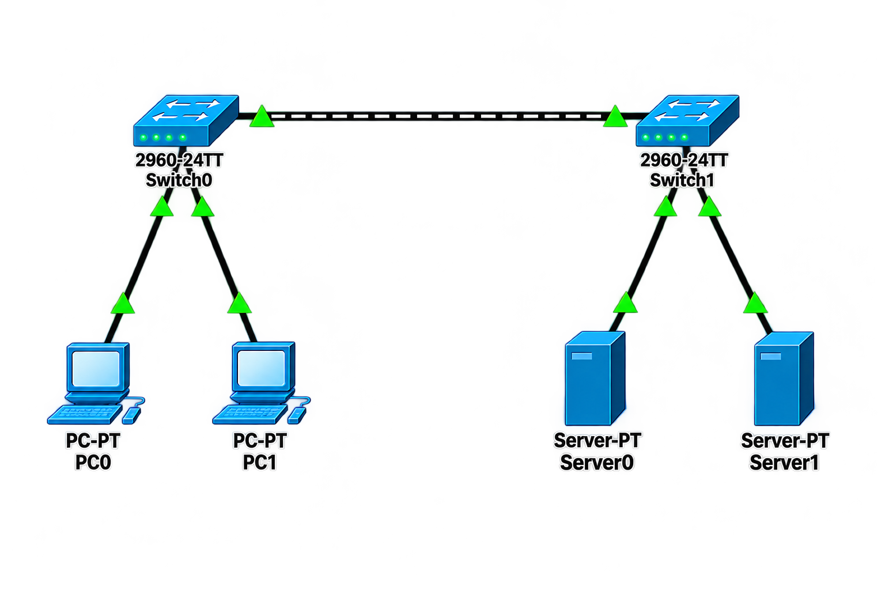

# 🌐 Inter-VLAN Routing

## 📖 Apa itu Inter-VLAN Routing?

**Inter-VLAN Routing** adalah proses memungkinkan perangkat di VLAN yang berbeda untuk saling berkomunikasi. Karena VLAN memisahkan jaringan secara logis (seperti jaringan fisik yang berbeda), mereka memerlukan router untuk menghubungkannya.

### 🎯 Tujuan Inter-VLAN Routing:

1. **Komunikasi Antar VLAN** - Memungkinkan perangkat di VLAN berbeda untuk bertukar data
2. **Fleksibilitas** - Tetap mempertahankan isolasi VLAN namun tetap bisa berkomunikasi saat dibutuhkan
3. **Keamanan** - Traffic antar VLAN dapat dipantau dan difilter melalui router

### 🏗️ Metode Inter-VLAN Routing:

| Metode | Deskripsi | Kelebihan | Kekurangan |
|--------|-----------|-----------|------------|
| **Router-on-a-stick** | Satu interface router dibagi menjadi sub-interface untuk setiap VLAN | Hemat port router | Kinerja terbatas pada satu link |
| **Multilayer Switch (SVI)** | Menggunakan switch Layer 3 dengan Switch Virtual Interface (SVI) | Kinerja tinggi, skalabel | Membutuhkan switch Layer 3 |
| **Router Fisik** | Setiap VLAN terhubung ke port router yang berbeda | Sederhana | Memakan banyak port router |

---

## 🌐 Topologi



---

## 📊 Tabel Perangkat dan IP Address

### Router (Router-on-a-stick)

| Antarmuka | VLAN | IP Address | Netmask | Keterangan |
|-----------|------|------------|---------|------------|
| G0/0.10 | VLAN 10 | 192.168.1.1 | 255.255.255.0 | Gateway VLAN 10 |
| G0/0.20 | VLAN 20 | 192.168.2.1 | 255.255.255.0 | Gateway VLAN 20 |
| G0/0 | - | - | - | Interface Fisik (no shutdown) |

---

### Switch 1

| Port | VLAN | Status | Keterangan |
|------|------|--------|------------|
| Fa0/1 | 10 | Up | PC1 |
| Fa0/2 | 20 | Up | PC2 |
| Fa0/3 | Trunk | Up | Ke Switch 2 |
| Fa0/4 - 24 | 999 | Down | Blackhole (Native VLAN) |

---

### Switch 2

| Port | VLAN | Status | Keterangan |
|------|------|--------|------------|
| Fa0/1 | 10 | Up | PC3 |
| Fa0/2 | 20 | Up | PC4 |
| Fa0/3 | Trunk | Up | Ke Switch 1 |
| Fa0/4 - 24 | 999 | Down | Blackhole (Native VLAN) |

---

### Perangkat Akhir

| Perangkat | VLAN | IP Address | Netmask | Gateway |
|-----------|------|------------|---------|---------|
| **PC1** | VLAN 10 | 192.168.1.10 | 255.255.255.0 | 192.168.1.1 |
| **PC2** | VLAN 20 | 192.168.2.10 | 255.255.255.0 | 192.168.2.1 |
| **PC3** | VLAN 10 | 192.168.1.20 | 255.255.255.0 | 192.168.1.1 |
| **PC4** | VLAN 20 | 192.168.2.20 | 255.255.255.0 | 192.168.2.1 |

---

## ⚙️ Langkah-Langkah Konfigurasi

### 1. Konfigurasi Switch 1

```cisco
Switch> enable
Switch# configure terminal
Switch(config)# hostname SW1

! Nonaktifkan DNS lookup
SW1(config)# no ip domain-lookup

! Enkripsi password
SW1(config)# service password-encryption

! ======== BUAT VLAN ========
SW1(config)# vlan 10
SW1(config-vlan)# name VLAN_10
SW1(config-vlan)# exit

SW1(config)# vlan 20
SW1(config-vlan)# name VLAN_20
SW1(config-vlan)# exit

SW1(config)# vlan 999
SW1(config-vlan)# name BLACKHOLE
SW1(config-vlan)# exit

! ======== KONFIGURASI ACCESS PORT VLAN 10 ========
SW1(config)# interface fastEthernet 0/1
SW1(config-if)# description === PC1 - VLAN 10 ===
SW1(config-if)# switchport mode access
SW1(config-if)# switchport access vlan 10
SW1(config-if)# no shutdown
SW1(config-if)# exit

! ======== KONFIGURASI ACCESS PORT VLAN 20 ========
SW1(config)# interface fastEthernet 0/2
SW1(config-if)# description === PC2 - VLAN 20 ===
SW1(config-if)# switchport mode access
SW1(config-if)# switchport access vlan 20
SW1(config-if)# no shutdown
SW1(config-if)# exit

! ======== KONFIGURASI TRUNK PORT ========
SW1(config)# interface fastEthernet 0/3
SW1(config-if)# description === TRUNK TO SWITCH 2 ===
SW1(config-if)# switchport mode trunk
SW1(config-if)# switchport nonegotiate
SW1(config-if)# switchport trunk native vlan 999
SW1(config-if)# switchport trunk allowed vlan 10,20
SW1(config-if)# no shutdown
SW1(config-if)# exit

! ======== BLACKHOLE PORT (DOWN) ========
SW1(config)# interface range fastEthernet 0/4 - 24
SW1(config-if-range)# description === BLACKHOLE - UNUSED ===
SW1(config-if-range)# switchport mode access
SW1(config-if-range)# switchport access vlan 999
SW1(config-if-range)# shutdown
SW1(config-if-range)# exit

SW1(config)# end
SW1# copy running-config startup-config
```

---

### 2. Konfigurasi Switch 2

```cisco
Switch> enable
Switch# configure terminal
Switch(config)# hostname SW2

! Nonaktifkan DNS lookup
SW2(config)# no ip domain-lookup

! Enkripsi password
SW2(config)# service password-encryption

! ======== BUAT VLAN ========
SW2(config)# vlan 10
SW2(config-vlan)# name VLAN_10
SW2(config-vlan)# exit

SW2(config)# vlan 20
SW2(config-vlan)# name VLAN_20
SW2(config-vlan)# exit

SW2(config)# vlan 999
SW2(config-vlan)# name BLACKHOLE
SW2(config-vlan)# exit

! ======== KONFIGURASI ACCESS PORT VLAN 10 ========
SW2(config)# interface fastEthernet 0/1
SW2(config-if)# description === PC3 - VLAN 10 ===
SW2(config-if)# switchport mode access
SW2(config-if)# switchport access vlan 10
SW2(config-if)# no shutdown
SW2(config-if)# exit

! ======== KONFIGURASI ACCESS PORT VLAN 20 ========
SW2(config)# interface fastEthernet 0/2
SW2(config-if)# description === PC4 - VLAN 20 ===
SW2(config-if)# switchport mode access
SW2(config-if)# switchport access vlan 20
SW2(config-if)# no shutdown
SW2(config-if)# exit

! ======== KONFIGURASI TRUNK PORT ========
SW2(config)# interface fastEthernet 0/3
SW2(config-if)# description === TRUNK TO SWITCH 1 ===
SW2(config-if)# switchport mode trunk
SW2(config-if)# switchport nonegotiate
SW2(config-if)# switchport trunk native vlan 999
SW2(config-if)# switchport trunk allowed vlan 10,20
SW2(config-if)# no shutdown
SW2(config-if)# exit

! ======== BLACKHOLE PORT (DOWN) ========
SW2(config)# interface range fastEthernet 0/4 - 24
SW2(config-if-range)# description === BLACKHOLE - UNUSED ===
SW2(config-if-range)# switchport mode access
SW2(config-if-range)# switchport access vlan 999
SW2(config-if-range)# shutdown
SW2(config-if-range)# exit

SW2(config)# end
SW2# copy running-config startup-config
```

---

### 3. Konfigurasi Router (Router-on-a-stick)

```cisco
Router> enable
Router# configure terminal
Router(config)# hostname R1

! Nonaktifkan DNS lookup
R1(config)# no ip domain-lookup

! Enkripsi password
R1(config)# service password-encryption

! ======== AKTIFKAN INTERFACE FISIK ========
R1(config)# interface gigabitEthernet 0/0
R1(config-if)# no shutdown
R1(config-if)# exit

! ======== SUB-INTERFACE VLAN 10 ========
R1(config)# interface gigabitEthernet 0/0.10
R1(config-subif)# encapsulation dot1Q 10
R1(config-subif)# ip address 192.168.1.1 255.255.255.0
R1(config-subif)# exit

! ======== SUB-INTERFACE VLAN 20 ========
R1(config)# interface gigabitEthernet 0/0.20
R1(config-subif)# encapsulation dot1Q 20
R1(config-subif)# ip address 192.168.2.1 255.255.255.0
R1(config-subif)# exit

R1(config)# end
R1# copy running-config startup-config
```

---

### 4. Konfigurasi IP Address di PC

**PC1 (VLAN 10 - Switch 1):**

| Parameter | Nilai |
|-----------|-------|
| IP Address | 192.168.1.10 |
| Netmask | 255.255.255.0 |
| Gateway | 192.168.1.1 |
| DNS | 8.8.8.8 |

**PC2 (VLAN 20 - Switch 1):**

| Parameter | Nilai |
|-----------|-------|
| IP Address | 192.168.2.10 |
| Netmask | 255.255.255.0 |
| Gateway | 192.168.2.1 |
| DNS | 8.8.8.8 |

**PC3 (VLAN 10 - Switch 2):**

| Parameter | Nilai |
|-----------|-------|
| IP Address | 192.168.1.20 |
| Netmask | 255.255.255.0 |
| Gateway | 192.168.1.1 |
| DNS | 8.8.8.8 |

**PC4 (VLAN 20 - Switch 2):**

| Parameter | Nilai |
|-----------|-------|
| IP Address | 192.168.2.20 |
| Netmask | 255.255.255.0 |
| Gateway | 192.168.2.1 |
| DNS | 8.8.8.8 |

---

## ✅ Verifikasi Konfigurasi

### 1. Cek VLAN di Switch 1

```cisco
SW1# show vlan brief
```

**Output yang diharapkan:**
```
VLAN Name                             Status    Ports
---- -------------------------------- --------- -------------------------------
1    default                          active    Fa0/0, Gi0/1, Gi0/2
10   VLAN_10                          active    Fa0/1
20   VLAN_20                          active    Fa0/2
999  BLACKHOLE                        active    Fa0/4, Fa0/5, ... Fa0/24
```

---

### 2. Cek Trunk di Switch 1

```cisco
SW1# show interfaces trunk
```

**Output yang diharapkan:**
```
Port        Mode         Encapsulation  Status        Native vlan
Fa0/3       on           802.1q         trunking      999

Port        Vlans allowed on trunk
Fa0/3       10,20
```

---

### 3. Cek Sub-interface di Router

```cisco
R1# show ip interface brief
```

**Output yang diharapkan:**
```
Interface                  IP-Address      OK? Method Status                Protocol
GigabitEthernet0/0         unassigned      YES unset  up                    up
GigabitEthernet0/0.10      192.168.1.1     YES manual up                    up
GigabitEthernet0/0.20      192.168.2.1     YES manual up                    up
```

---

### 4. Cek Tabel Routing Router

```cisco
R1# show ip route
```

**Output yang diharapkan:**
```
Codes: C - connected, S - static, R - RIP, O - OSPF, ...

C    192.168.1.0/24 is directly connected, GigabitEthernet0/0.10
C    192.168.2.0/24 is directly connected, GigabitEthernet0/0.20
```

---

### 5. Uji Koneksi

**Dari PC1 (VLAN 10 - 192.168.1.10):**

```cmd
ping 192.168.1.20    # ke PC3 (VLAN 10) - HARUS BERHASIL
ping 192.168.2.10    # ke PC2 (VLAN 20) - HARUS BERHASIL (via router)
ping 192.168.1.1     # ke Gateway - HARUS BERHASIL
```

**Dari PC2 (VLAN 20 - 192.168.2.10):**

```cmd
ping 192.168.1.10    # ke PC1 (VLAN 10) - HARUS BERHASIL (via router)
ping 192.168.2.20    # ke PC4 (VLAN 20) - HARUS BERHASIL
```

---

## 📊 Ringkasan Konfigurasi

### Switch 1

| VLAN | Port | Status | Perangkat |
|------|------|--------|-----------|
| 10 | Fa0/1 | Up | PC1 |
| 20 | Fa0/2 | Up | PC2 |
| Trunk | Fa0/3 | Up | Ke Switch 2 |
| 999 | Fa0/4-24 | Down | Blackhole |

### Switch 2

| VLAN | Port | Status | Perangkat |
|------|------|--------|-----------|
| 10 | Fa0/1 | Up | PC3 |
| 20 | Fa0/2 | Up | PC4 |
| Trunk | Fa0/3 | Up | Ke Switch 1 |
| 999 | Fa0/4-24 | Down | Blackhole |

### Router

| Sub-interface | VLAN | IP Address | Fungsi |
|---------------|------|------------|--------|
| G0/0.10 | 10 | 192.168.1.1/24 | Gateway VLAN 10 |
| G0/0.20 | 20 | 192.168.2.1/24 | Gateway VLAN 20 |

---

## 🔧 Troubleshooting

| Masalah | Kemungkinan Penyebab | Solusi |
|---------|---------------------|--------|
| PC tidak bisa ping ke PC di VLAN lain | Inter-VLAN routing tidak aktif | Cek router dan sub-interface |
| Trunk tidak aktif | Native VLAN mismatch | Pastikan Native VLAN sama di kedua sisi |
| PC tidak bisa ping gateway | IP gateway salah | Cek IP di PC dan router |
| Sub-interface down | Interface fisik down | Pastikan `no shutdown` di interface fisik |

---

## 📚 Referensi

- [Cisco Inter-VLAN Routing Documentation](https://www.cisco.com/c/en/us/support/docs/lan-switching/inter-vlan-routing/)
- [Cisco Networking Academy](https://www.netacad.com/)

---

