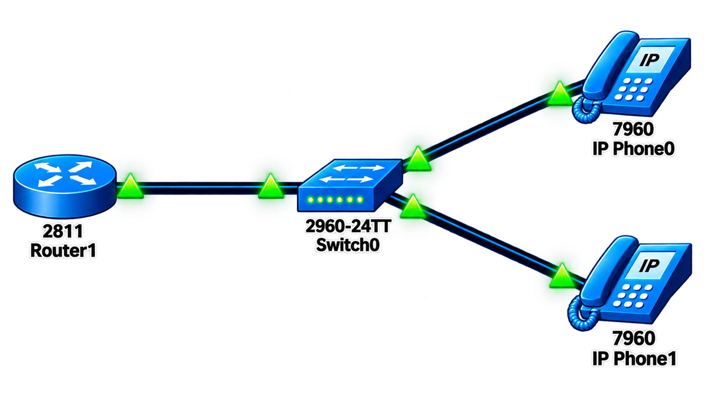

# 📞 VoIP (Voice over IP)

## 📖 Apa itu VoIP?

**VoIP (Voice over IP)** adalah teknologi yang memungkinkan komunikasi suara (telepon) melalui jaringan berbasis IP (Internet Protocol). VoIP mengubah sinyal suara analog menjadi paket data digital yang ditransmisikan melalui jaringan data, sehingga memungkinkan panggilan telepon melalui infrastruktur jaringan yang sama dengan data.

### 🎯 Tujuan VoIP:

1. **Efisiensi Biaya** - Mengurangi biaya komunikasi dengan menggunakan jaringan data yang sudah ada
2. **Integrasi** - Menggabungkan jaringan suara dan data dalam satu infrastruktur
3. **Fleksibilitas** - Mendukung komunikasi dari berbagai perangkat (IP Phone, softphone, mobile)
4. **Fitur Lanjutan** - Mendukung fitur-fitur seperti konferensi, call forwarding, voicemail, dll.

### 🏷️ Komponen VoIP:

| Komponen | Fungsi |
|----------|--------|
| **IP Phone** | Perangkat telepon yang terhubung ke jaringan IP |
| **Call Manager** | Server yang mengatur dan mengelola panggilan VoIP |
| **Gateway** | Menghubungkan jaringan VoIP dengan PSTN (Public Switched Telephone Network) |
| **Codec** | Mengubah sinyal suara menjadi paket data dan sebaliknya |
| **DHCP Server** | Memberikan alamat IP secara otomatis ke IP Phone |

---

## 🌐 Topologi



---

## 📊 Tabel Perangkat dan IP Address

### Router (Cisco 2811)

| Perangkat | Antarmuka | VLAN | IP Address | Netmask | Keterangan |
|-----------|-----------|------|------------|---------|------------|
| **Router** | Fa0/0 | - | - | - | Interface fisik (no shutdown) |
| **Router** | Fa0/0.10 | VLAN 10 | 192.168.1.1 | 255.255.255.0 | Sub-interface VoIP |

### Switch (Cisco Catalyst 2960-24TT)

| Perangkat | Antarmuka | VLAN | Status | Keterangan |
|-----------|-----------|------|--------|------------|
| **Switch** | Fa0/1 | Trunk (802.1Q) | Up | Ke Router |
| **Switch** | Fa0/2 | Voice VLAN 10 | Up | Ke IP Phone 1 |
| **Switch** | Fa0/3 | Voice VLAN 10 | Up | Ke IP Phone 2 |
| **Switch** | Fa0/4 | Voice VLAN 10 | Up | Ke IP Phone 3 (opsional) |

### IP Phone (Cisco 7960 Series)

| Perangkat | VLAN | IP Address | DHCP | Extension | Keterangan |
|-----------|------|------------|------|-----------|------------|
| **IP Phone 1** | VLAN 10 | DHCP | Ya | 1001 | Terhubung ke SW Fa0/2 |
| **IP Phone 2** | VLAN 10 | DHCP | Ya | 1002 | Terhubung ke SW Fa0/3 |
| **IP Phone 3** | VLAN 10 | DHCP | Ya | - | Terhubung ke SW Fa0/4 |

---

## 📋 Detail Konfigurasi

### Router (Cisco 2811)

| Interface | VLAN | IP Address | Status | Keterangan |
|-----------|------|------------|--------|------------|
| Fa0/0 | - | - | Up | Interface fisik |
| Fa0/0.10 | 10 | 192.168.1.1/24 | Up | Sub-interface untuk VoIP |

### Switch (Cisco Catalyst 2960-24TT)

| Port | Mode | VLAN | Status | Keterangan |
|------|------|------|--------|------------|
| Fa0/1 | Trunk (802.1Q) | - | Up | Ke Router |
| Fa0/2 | Access | Voice VLAN 10 | Up | Ke IP Phone 1 |
| Fa0/3 | Access | Voice VLAN 10 | Up | Ke IP Phone 2 |
| Fa0/4 | Access | Voice VLAN 10 | Up | Ke IP Phone 3 |

---

## ⚙️ Langkah-Langkah Konfigurasi

### 1. Persiapan Topologi Jaringan

**Perangkat yang Digunakan:**
- 1 Router Cisco 2811
- 1 Switch Cisco Catalyst 2960-24TT
- 2 Cisco IP Phone 7960 Series

**Langkah Persiapan:**
1. Buka Cisco Packet Tracer
2. Susun perangkat sesuai topologi yang telah ditentukan
3. Hubungkan perangkat dengan kabel yang sesuai:
   - Router ke Switch: Kabel Cross-over atau Straight-through (tergantung port)
   - Switch ke IP Phone: Kabel Straight-through
4. Pastikan semua perangkat dalam kondisi powered on

---

### 2. Konfigurasi Router

#### 2.1 Konfigurasi Dasar Router

```cisco
Router> enable
Router# configure terminal
Router(config)# hostname R1

! Nonaktifkan DNS lookup
R1(config)# no ip domain-lookup

! Enkripsi password
R1(config)# service password-encryption

R1(config)# end
R1# copy running-config startup-config
```

#### 2.2 Memberikan IP Address pada Router

```cisco
R1> enable
R1# configure terminal

! Aktifkan interface fisik FastEthernet 0/0
R1(config)# interface fastEthernet 0/0
R1(config-if)# no shutdown
R1(config-if)# exit

! Buat sub-interface untuk VLAN 10
R1(config)# interface fastEthernet 0/0.10
R1(config-subif)# encapsulation dot1q 10
R1(config-subif)# ip address 192.168.1.1 255.255.255.0
R1(config-subif)# no shutdown
R1(config-subif)# exit

R1(config)# end
R1# copy running-config startup-config
```

#### 2.3 Mengaktifkan DHCP Server

Agar IP Phone mendapatkan alamat IP secara otomatis, aktifkan DHCP:

```cisco
R1> enable
R1# configure terminal

! Buat DHCP pool untuk IP Phone
R1(config)# ip dhcp pool iptelepon
R1(dhcp-config)# network 192.168.1.0 255.255.255.0
R1(dhcp-config)# default-router 192.168.1.1
R1(dhcp-config)# option 150 ip 192.168.1.1
R1(dhcp-config)# exit

! Kecualikan IP gateway agar tidak diberikan ke client
R1(config)# ip dhcp excluded-address 192.168.1.1

R1(config)# end
R1# copy running-config startup-config
```

**Penjelasan:**
- `ip dhcp pool iptelepon`: Membuat pool DHCP bernama "iptelepon"
- `network 192.168.1.0 255.255.255.0`: Menentukan network yang akan diberikan ke client
- `default-router 192.168.1.1`: Menentukan gateway default untuk client
- `option 150 ip 192.168.1.1`: Menentukan TFTP server untuk IP Phone (option 150 digunakan untuk VoIP)
- `ip dhcp excluded-address 192.168.1.1`: Mencegah gateway diberikan ke client

#### 2.4 Mengaktifkan Telephony Service

Lakukan konfigurasi agar router mendukung layanan telepon:

```cisco
R1> enable
R1# configure terminal

! Aktifkan telephony service
R1(config)# telephony-service
R1(config-telephony)# ip source-address 192.168.1.1 port 2000
R1(config-telephony)# max-dn 2
R1(config-telephony)# max-ephone 2
R1(config-telephony)# auto assign 1 to 2
R1(config-telephony)# exit

! Konfigurasi Directory Number (DN) 1
R1(config)# ephone-dn 1
R1(config-ephone-dn)# number 1001
R1(config-ephone-dn)# exit

! Konfigurasi Directory Number (DN) 2
R1(config)# ephone-dn 2
R1(config-ephone-dn)# number 1002
R1(config-ephone-dn)# exit

R1(config)# end
R1# copy running-config startup-config
```

**Penjelasan:**
- `telephony-service`: Mengaktifkan layanan telepon pada router
- `ip source-address 192.168.1.1 port 2000`: Menentukan IP source dan port untuk komunikasi
- `max-dn 2`: Jumlah maksimal Directory Number (nomor telepon) yang didukung
- `max-ephone 2`: Jumlah maksimal IP Phone yang dapat terhubung
- `auto assign 1 to 2`: Otomatis mengassign DN 1 dan 2 ke IP Phone
- `ephone-dn 1`: Mendefinisikan Directory Number 1
- `number 1001`: Nomor telepon untuk DN 1
- `ephone-dn 2`: Mendefinisikan Directory Number 2
- `number 1002`: Nomor telepon untuk DN 2

**Catatan Penting:**
Karena simulasi ini hanya menggunakan 2 IP Phone, maka `max-dn` dan `max-ephone` diatur menjadi 2.

#### 2.5 Verifikasi Konfigurasi Router

```cisco
R1# show ip interface brief
R1# show interfaces fastEthernet 0/0.10
R1# show ip dhcp binding
R1# show telephony-service
R1# show ephone
R1# show ephone-dn
```

---

### 3. Konfigurasi Switch

Gunakan switch manageable agar dapat dikonfigurasi VLAN untuk VoIP.

#### 3.1 Konfigurasi Dasar Switch

```cisco
Switch> enable
Switch# configure terminal
Switch(config)# hostname SW1

! Nonaktifkan DNS lookup
SW1(config)# no ip domain-lookup

! Enkripsi password
SW1(config)# service password-encryption

SW1(config)# end
SW1# copy running-config startup-config
```

#### 3.2 Membuat VLAN

```cisco
SW1> enable
SW1# configure terminal

! Buat VLAN 10 untuk Voice (VoIP)
SW1(config)# vlan 10
SW1(config-vlan)# name VOICE_VLAN_10
SW1(config-vlan)# exit

SW1(config)# end
SW1# copy running-config startup-config
```

#### 3.3 Konfigurasi Trunk ke Router

```cisco
SW1> enable
SW1# configure terminal

! Interface Fa0/1 sebagai Trunk ke Router
SW1(config)# interface fastEthernet 0/1
SW1(config-if)# description === TRUNK TO ROUTER ===
SW1(config-if)# switchport trunk encapsulation dot1q
SW1(config-if)# switchport mode trunk
SW1(config-if)# switchport trunk native vlan 1
SW1(config-if)# switchport trunk allowed vlan 10
SW1(config-if)# no shutdown
SW1(config-if)# exit

SW1(config)# end
SW1# copy running-config startup-config
```

#### 3.4 Konfigurasi Voice VLAN untuk IP Phone

```cisco
SW1> enable
SW1# configure terminal

! Interface Fa0/2 - Fa0/4 sebagai Voice VLAN
SW1(config)# interface range fastEthernet 0/2 - 4
SW1(config-if-range)# description === IP PHONE - VOICE VLAN 10 ===
SW1(config-if-range)# switchport mode access
SW1(config-if-range)# switchport voice vlan 10
SW1(config-if-range)# no shutdown
SW1(config-if-range)# exit

SW1(config)# end
SW1# copy running-config startup-config
```

**Penjelasan:**
- `switchport voice vlan 10`: Mengkonfigurasi port untuk menerima IP Phone dengan VLAN 10 (Voice VLAN)
- `switchport mode access`: Mengatur port dalam mode access
- `switchport trunk allowed vlan 10`: Hanya mengizinkan VLAN 10 melewati trunk

#### 3.5 Verifikasi Konfigurasi Switch

```cisco
SW1# show vlan brief
SW1# show interfaces status
SW1# show interfaces trunk
SW1# show running-config | begin interface
```

---

### 4. Konfigurasi IP Phone

IP Phone akan secara otomatis melakukan konfigurasi setelah terhubung ke switch dan mendapatkan IP dari DHCP server.

#### 4.1 Proses Otomatis IP Phone

1. **DHCP Discovery**: IP Phone mencari DHCP server
2. **DHCP Offer**: Router memberikan IP address ke IP Phone
3. **DHCP Request**: IP Phone meminta IP address
4. **DHCP Acknowledgment**: Router mengonfirmasi IP address
5. **TFTP Request**: IP Phone meminta file konfigurasi dari TFTP server
6. **Registration**: IP Phone mendaftar ke Call Manager (Router)

#### 4.2 Cek IP yang Didapat IP Phone

Pada IP Phone, tekan tombol **Settings** → **Status** → **Network** → **IP Address**

**IP yang diharapkan:**
- IP Phone 1: 192.168.1.2 - 192.168.1.254 (DHCP)
- IP Phone 2: 192.168.1.3 - 192.168.1.254 (DHCP)

---

## ✅ Verifikasi Konfigurasi

### 1. Verifikasi DHCP Binding

```cisco
R1# show ip dhcp binding
```

**Output yang diharapkan:**
```
IP address       Client-ID/              Lease expiration        Type
                 Hardware address
192.168.1.2      0050.7966.6801          --                     Automatic
192.168.1.3      0050.7966.6802          --                     Automatic
```

### 2. Verifikasi IP Phone Registration

```cisco
R1# show ephone
```

**Output yang diharapkan:**
```
ephone-1 Mac:0050.7966.6801 TCP socket:[1] activeLine:0 REGISTERED in SCCP ver 5/5
ephone-2 Mac:0050.7966.6802 TCP socket:[2] activeLine:0 REGISTERED in SCCP ver 5/5
```

### 3. Verifikasi Directory Number

```cisco
R1# show ephone-dn
```

**Output yang diharapkan:**
```
Directory Number : 1001
Directory Number : 1002
```

### 4. Verifikasi Status Port Switch

```cisco
SW1# show interfaces status
```

**Output yang diharapkan:**
```
Port      Name               Status       Vlan       Duplex  Speed Type
Fa0/1     TRUNK TO ROUTER    connected    trunk      a-full  a-100 10/100BaseTX
Fa0/2     IP PHONE - VLAN10  connected    10         a-full  a-100 10/100BaseTX
Fa0/3     IP PHONE - VLAN10  connected    10         a-full  a-100 10/100BaseTX
Fa0/4     IP PHONE - VLAN10  connected    10         a-full  a-100 10/100BaseTX
```

---

## 📞 Pengujian IP Phone

### 1. Persiapan Pengujian

Setelah konfigurasi Router dan Switch selesai:
- IP Phone akan secara otomatis mendapatkan alamat IP dan dial number
- Pastikan kedua IP Phone sudah terdaftar (status REGISTERED)

### 2. Melakukan Panggilan

**Dari IP Phone 1 (Extension: 1001) ke IP Phone 2 (Extension: 1002):**

1. Angkat gagang telepon IP Phone 1
2. Tekan nomor **1002** pada keypad
3. Tunggu hingga panggilan terhubung
4. IP Phone 2 akan berdering
5. Angkat gagang IP Phone 2 untuk menjawab panggilan

**Dari IP Phone 2 (Extension: 1002) ke IP Phone 1 (Extension: 1001):**

1. Angkat gagang telepon IP Phone 2
2. Tekan nomor **1001** pada keypad
3. Tunggu hingga panggilan terhubung
4. IP Phone 1 akan berdering
5. Angkat gagang IP Phone 1 untuk menjawab panggilan

### 3. Indikator Keberhasilan

- ✅ IP Phone 1 dan 2 mendapatkan IP dari DHCP
- ✅ Panggilan dapat dilakukan dari 1001 ke 1002
- ✅ Panggilan dapat dilakukan dari 1002 ke 1001
- ✅ Suara dapat terdengar di kedua arah (2-way audio)
- ✅ Panggilan dapat diakhiri dengan menutup gagang telepon

### 4. Troubleshooting Panggilan

| Masalah | Kemungkinan Penyebab | Solusi |
|---------|---------------------|--------|
| IP Phone tidak dapat IP | DHCP tidak aktif | Cek `show ip dhcp binding` |
| IP Phone tidak terdaftar | Telephony service tidak aktif | Cek `show telephony-service` |
| Panggilan tidak tersambung | Extension tidak terdaftar | Cek `show ephone-dn` |
| Tidak ada suara (No audio) | Codec tidak match | Cek konfigurasi telephony-service |

---

## 📊 Ringkasan Konfigurasi

### Router (Cisco 2811)

| Parameter | Nilai |
|-----------|-------|
| **Hostname** | R1 |
| **Interface** | Fa0/0.10 |
| **VLAN** | 10 |
| **IP Address** | 192.168.1.1/24 |
| **DHCP Pool** | iptelepon |
| **DHCP Network** | 192.168.1.0/24 |
| **Option 150** | 192.168.1.1 |
| **max-dn** | 2 |
| **max-ephone** | 2 |
| **DN 1** | 1001 |
| **DN 2** | 1002 |

### Switch (Cisco Catalyst 2960-24TT)

| Parameter | Nilai |
|-----------|-------|
| **Hostname** | SW1 |
| **VLAN** | 10 - VOICE_VLAN_10 |
| **Trunk Port** | Fa0/1 (ke Router) |
| **Access Ports** | Fa0/2 - Fa0/4 |
| **Voice VLAN** | 10 |

### IP Phone (Cisco 7960)

| Parameter | IP Phone 1 | IP Phone 2 |
|-----------|------------|------------|
| **Extension** | 1001 | 1002 |
| **VLAN** | 10 | 10 |
| **IP Address** | DHCP | DHCP |
| **Gateway** | 192.168.1.1 | 192.168.1.1 |

---

## 🔧 Troubleshooting

| Masalah | Kemungkinan Penyebab | Solusi |
|---------|---------------------|--------|
| IP Phone tidak mendapatkan IP | DHCP server tidak aktif | Cek `show ip dhcp binding` dan pastikan DHCP pool aktif |
| IP Phone tidak terdaftar | Telephony service tidak aktif | Cek `show telephony-service` dan pastikan `no shutdown` |
| IP Phone status "UNREGISTERED" | IP source address salah | Cek `ip source-address` pada telephony-service |
| Panggilan gagal | Extension tidak match | Pastikan DN sudah terdaftar dengan `show ephone-dn` |
| Tidak ada audio | Codec tidak match | Pastikan codec yang digunakan sama (default: G.711) |
| Switch tidak mendeteksi IP Phone | Port tidak di-configure voice VLAN | Cek `show interfaces status` dan konfigurasi `switchport voice vlan` |
| Trunk tidak aktif | Native VLAN mismatch | Pastikan native VLAN sama di router dan switch |
| IP Phone tidak bisa menelepon | max-ephone melebihi kapasitas | Pastikan `max-ephone` >= jumlah IP Phone |

---

## 📚 Referensi

- [Cisco VoIP Configuration Guide](https://www.cisco.com/c/en/us/support/docs/voice/ip-telephony-voice-over-ip-voip/)
- [Cisco IOS Telephony Service](https://www.cisco.com/c/en/us/support/docs/voice-unified-communications/ios-telephony-services/)
- [Cisco Unified Communications Manager Express](https://www.cisco.com/c/en/us/support/unified-communications/unified-communications-manager-express/index.html)

---
