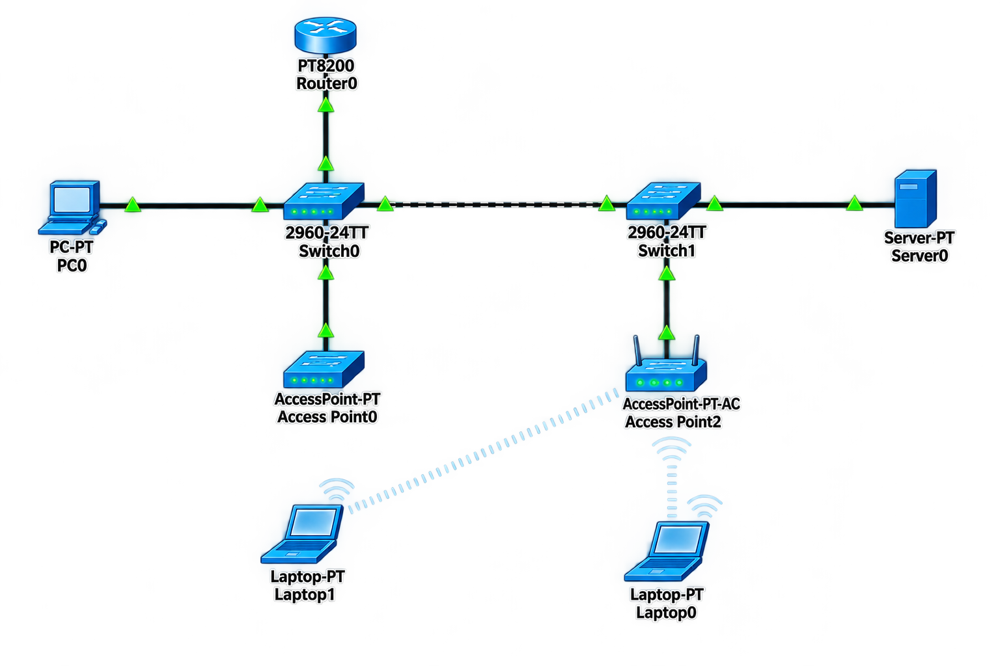

# 🔀 Router-on-a-Stick (ROAS)

## 📖 Apa itu Router-on-a-Stick?

**Router-on-a-Stick (ROAS)** adalah metode routing antar VLAN menggunakan satu interface fisik pada router yang dibagi menjadi beberapa sub-interface logis. Setiap sub-interface mewakili satu VLAN yang berbeda dan memiliki gateway sendiri. Teknik ini memungkinkan komunikasi antar VLAN tanpa memerlukan banyak interface fisik pada router.

### 🎯 Tujuan Router-on-a-Stick:

1. **Efisiensi Port** - Menghemat port pada router dengan menggunakan satu interface fisik
2. **Routing Antar VLAN** - Memungkinkan komunikasi antar VLAN yang berbeda
3. **Fleksibilitas** - Mudah menambah VLAN baru tanpa perlu hardware tambahan
4. **Cost Effective** - Mengurangi biaya hardware karena tidak perlu banyak interface

### 🏷️ Konsep Dasar:

| Komponen | Fungsi |
|----------|--------|
| **Sub-Interface** | Interface logis pada router untuk setiap VLAN |
| **802.1Q Trunk** | Protokol tagging VLAN pada link trunk |
| **Native VLAN** | VLAN tanpa tag pada trunk (default: VLAN 1) |
| **Gateway** | IP address sub-interface sebagai gateway untuk setiap VLAN |

---

## 🌐 Topologi



---

## 📊 Tabel Perangkat dan IP Address

### Router

| Perangkat | Antarmuka | VLAN | IP Address | Netmask | Gateway | Keterangan |
|-----------|-----------|------|------------|---------|---------|------------|
| **Router** | Gi0/0/0.10 | VLAN 10 | 172.168.10.1 | 255.255.255.0 | - | Gateway VLAN 10 |
| **Router** | Gi0/0/0.20 | VLAN 20 | 172.168.20.1 | 255.255.255.0 | - | Gateway VLAN 20 (DHCP) |

### Switch 1

| Perangkat | Antarmuka | VLAN | Status | Keterangan |
|-----------|-----------|------|--------|------------|
| **Switch 1** | Fa0/1 | Trunk (802.1Q) | Up | Ke Router |
| **Switch 1** | Fa0/2 | VLAN 20 | Up | Ke PC/Device VLAN 20 |
| **Switch 1** | Fa0/3 | VLAN 10 | Up | Ke PC/Device VLAN 10 |
| **Switch 1** | Fa0/4 | Trunk (802.1Q) | Up | Ke Switch 2 |
| **Switch 1** | Fa0/5-24 | VLAN 999 (Blackhole) | Down | Tidak digunakan |

### Switch 2

| Perangkat | Antarmuka | VLAN | Status | Keterangan |
|-----------|-----------|------|--------|------------|
| **Switch 2** | Fa0/2 | VLAN 20 | Up | Ke PC/Device VLAN 20 |
| **Switch 2** | Fa0/3 | VLAN 10 | Up | Ke PC/Device VLAN 10 |
| **Switch 2** | Fa0/4 | Trunk (802.1Q) | Up | Ke Switch 1 |

### Perangkat End-User

| Perangkat | VLAN | IP Address | Netmask | Gateway | Keterangan |
|-----------|------|------------|---------|---------|------------|
| **PC1** | VLAN 10 | 172.168.10.10 | 255.255.255.0 | 172.168.10.1 | Terhubung ke SW1 Fa0/3 |
| **PC2** | VLAN 20 | DHCP | 255.255.255.0 | 172.168.20.1 | Terhubung ke SW1 Fa0/2 |
| **PC3** | VLAN 10 | 172.168.10.20 | 255.255.255.0 | 172.168.10.1 | Terhubung ke SW2 Fa0/3 |
| **PC4** | VLAN 20 | DHCP | 255.255.255.0 | 172.168.20.1 | Terhubung ke SW2 Fa0/2 |

---

## 📋 Detail Konfigurasi VLAN

### Switch 1

| Port | VLAN | Status | Keterangan |
|------|------|--------|------------|
| Fa0/1 | Trunk (802.1Q) | Up | Ke Router |
| Fa0/2 | VLAN 20 | Up | End-Device VLAN 20 |
| Fa0/3 | VLAN 10 | Up | End-Device VLAN 10 |
| Fa0/4 | Trunk (802.1Q) | Up | Ke Switch 2 |
| Fa0/5-24 | VLAN 999 | Down | Blackhole (Native VLAN) |

### Switch 2

| Port | VLAN | Status | Keterangan |
|------|------|--------|------------|
| Fa0/2 | VLAN 20 | Up | End-Device VLAN 20 |
| Fa0/3 | VLAN 10 | Up | End-Device VLAN 10 |
| Fa0/4 | Trunk (802.1Q) | Up | Ke Switch 1 |

---

## ⚙️ Langkah-Langkah Konfigurasi

### 1. Konfigurasi Router

#### 1.1 Konfigurasi Dasar Router

```cisco
Router> enable
Router# configure terminal
Router(config)# hostname R1

! Nonaktifkan DNS lookup
R1(config)# no ip domain-lookup

! Enkripsi password
R1(config)# service password-encryption

R1(config)# end
R1# copy running-config startup-config
```

#### 1.2 Konfigurasi Sub-Interface VLAN 10

```cisco
R1> enable
R1# configure terminal

! Aktifkan interface fisik terlebih dahulu
R1(config)# interface gigabitEthernet 0/0/0
R1(config-if)# no shutdown
R1(config-if)# exit

! Buat sub-interface untuk VLAN 10
R1(config)# interface gigabitEthernet 0/0/0.10
R1(config-subif)# description === VLAN 10 Gateway ===
R1(config-subif)# encapsulation dot1Q 10
R1(config-subif)# ip address 172.168.10.1 255.255.255.0
R1(config-subif)# no shutdown
R1(config-subif)# exit

R1(config)# end
R1# copy running-config startup-config
```

#### 1.3 Konfigurasi Sub-Interface VLAN 20 (DHCP)

```cisco
R1> enable
R1# configure terminal

! Buat sub-interface untuk VLAN 20
R1(config)# interface gigabitEthernet 0/0/0.20
R1(config-subif)# description === VLAN 20 Gateway (DHCP) ===
R1(config-subif)# encapsulation dot1Q 20
R1(config-subif)# ip address 172.168.20.1 255.255.255.0
R1(config-subif)# no shutdown
R1(config-subif)# exit

R1(config)# end
R1# copy running-config startup-config
```

#### 1.4 Konfigurasi DHCP Server pada Router

```cisco
R1> enable
R1# configure terminal

! Buat DHCP pool untuk VLAN 20
R1(config)# ip dhcp pool VLAN20_POOL
R1(dhcp-config)# network 172.168.20.0 255.255.255.0
R1(dhcp-config)# default-router 172.168.20.1
R1(dhcp-config)# dns-server 8.8.8.8
R1(dhcp-config)# exit

! Kecualikan IP gateway agar tidak diberikan ke client
R1(config)# ip dhcp excluded-address 172.168.20.1

R1(config)# end
R1# copy running-config startup-config
```

#### 1.5 Verifikasi Konfigurasi Router

```cisco
R1# show ip interface brief
R1# show interfaces gigabitEthernet 0/0/0.10
R1# show interfaces gigabitEthernet 0/0/0.20
R1# show ip dhcp binding
R1# show ip route
```

---

### 2. Konfigurasi Switch 1

#### 2.1 Konfigurasi Dasar Switch 1

```cisco
Switch> enable
Switch# configure terminal
Switch(config)# hostname SW1

! Nonaktifkan DNS lookup
SW1(config)# no ip domain-lookup

! Enkripsi password
SW1(config)# service password-encryption

SW1(config)# end
SW1# copy running-config startup-config
```

#### 2.2 Membuat VLAN di Switch 1

```cisco
SW1> enable
SW1# configure terminal

! Buat VLAN 10
SW1(config)# vlan 10
SW1(config-vlan)# name DATA_VLAN_10
SW1(config-vlan)# exit

! Buat VLAN 20
SW1(config)# vlan 20
SW1(config-vlan)# name DATA_VLAN_20
SW1(config-vlan)# exit

! Buat VLAN 999 (Blackhole)
SW1(config)# vlan 999
SW1(config-vlan)# name BLACKHOLE
SW1(config-vlan)# exit

SW1(config)# end
SW1# copy running-config startup-config
```

#### 2.3 Konfigurasi Trunk ke Router (Fa0/1)

```cisco
SW1> enable
SW1# configure terminal

! Interface Fa0/1 ke Router
SW1(config)# interface fastEthernet 0/1
SW1(config-if)# description === TRUNK TO ROUTER ===
SW1(config-if)# switchport trunk encapsulation dot1q
SW1(config-if)# switchport mode trunk
SW1(config-if)# switchport trunk native vlan 999
SW1(config-if)# switchport trunk allowed vlan 10,20
SW1(config-if)# no shutdown
SW1(config-if)# exit

SW1(config)# end
SW1# copy running-config startup-config
```

#### 2.4 Konfigurasi Access Port VLAN 10 (Fa0/3)

```cisco
SW1> enable
SW1# configure terminal

! Interface Fa0/3 untuk VLAN 10
SW1(config)# interface fastEthernet 0/3
SW1(config-if)# description === PC - VLAN 10 ===
SW1(config-if)# switchport mode access
SW1(config-if)# switchport access vlan 10
SW1(config-if)# no shutdown
SW1(config-if)# exit

SW1(config)# end
SW1# copy running-config startup-config
```

#### 2.5 Konfigurasi Access Port VLAN 20 (Fa0/2)

```cisco
SW1> enable
SW1# configure terminal

! Interface Fa0/2 untuk VLAN 20
SW1(config)# interface fastEthernet 0/2
SW1(config-if)# description === PC - VLAN 20 ===
SW1(config-if)# switchport mode access
SW1(config-if)# switchport access vlan 20
SW1(config-if)# no shutdown
SW1(config-if)# exit

SW1(config)# end
SW1# copy running-config startup-config
```

#### 2.6 Konfigurasi Trunk ke Switch 2 (Fa0/4)

```cisco
SW1> enable
SW1# configure terminal

! Interface Fa0/4 ke Switch 2
SW1(config)# interface fastEthernet 0/4
SW1(config-if)# description === TRUNK TO SW2 ===
SW1(config-if)# switchport trunk encapsulation dot1q
SW1(config-if)# switchport mode trunk
SW1(config-if)# switchport trunk native vlan 999
SW1(config-if)# switchport trunk allowed vlan 10,20
SW1(config-if)# no shutdown
SW1(config-if)# exit

SW1(config)# end
SW1# copy running-config startup-config
```

#### 2.7 Konfigurasi Blackhole VLAN 999 (Fa0/5-24)

```cisco
SW1> enable
SW1# configure terminal

! Interface Fa0/5-24 sebagai Blackhole
SW1(config)# interface range fastEthernet 0/5 - 24
SW1(config-if-range)# description === BLACKHOLE - UNUSED ===
SW1(config-if-range)# switchport mode access
SW1(config-if-range)# switchport access vlan 999
SW1(config-if-range)# shutdown
SW1(config-if-range)# exit

SW1(config)# end
SW1# copy running-config startup-config
```

---

### 3. Konfigurasi Switch 2

#### 3.1 Konfigurasi Dasar Switch 2

```cisco
Switch> enable
Switch# configure terminal
Switch(config)# hostname SW2

! Nonaktifkan DNS lookup
SW2(config)# no ip domain-lookup

! Enkripsi password
SW2(config)# service password-encryption

SW2(config)# end
SW2# copy running-config startup-config
```

#### 3.2 Membuat VLAN di Switch 2

```cisco
SW2> enable
SW2# configure terminal

! Buat VLAN 10
SW2(config)# vlan 10
SW2(config-vlan)# name DATA_VLAN_10
SW2(config-vlan)# exit

! Buat VLAN 20
SW2(config)# vlan 20
SW2(config-vlan)# name DATA_VLAN_20
SW2(config-vlan)# exit

! Buat VLAN 999 (Blackhole)
SW2(config)# vlan 999
SW2(config-vlan)# name BLACKHOLE
SW2(config-vlan)# exit

SW2(config)# end
SW2# copy running-config startup-config
```

#### 3.3 Konfigurasi Trunk ke Switch 1 (Fa0/4)

```cisco
SW2> enable
SW2# configure terminal

! Interface Fa0/4 ke Switch 1
SW2(config)# interface fastEthernet 0/4
SW2(config-if)# description === TRUNK TO SW1 ===
SW2(config-if)# switchport trunk encapsulation dot1q
SW2(config-if)# switchport mode trunk
SW2(config-if)# switchport trunk native vlan 999
SW2(config-if)# switchport trunk allowed vlan 10,20
SW2(config-if)# no shutdown
SW2(config-if)# exit

SW2(config)# end
SW2# copy running-config startup-config
```

#### 3.4 Konfigurasi Access Port VLAN 10 (Fa0/3)

```cisco
SW2> enable
SW2# configure terminal

! Interface Fa0/3 untuk VLAN 10
SW2(config)# interface fastEthernet 0/3
SW2(config-if)# description === PC - VLAN 10 ===
SW2(config-if)# switchport mode access
SW2(config-if)# switchport access vlan 10
SW2(config-if)# no shutdown
SW2(config-if)# exit

SW2(config)# end
SW2# copy running-config startup-config
```

#### 3.5 Konfigurasi Access Port VLAN 20 (Fa0/2)

```cisco
SW2> enable
SW2# configure terminal

! Interface Fa0/2 untuk VLAN 20
SW2(config)# interface fastEthernet 0/2
SW2(config-if)# description === PC - VLAN 20 ===
SW2(config-if)# switchport mode access
SW2(config-if)# switchport access vlan 20
SW2(config-if)# no shutdown
SW2(config-if)# exit

SW2(config)# end
SW2# copy running-config startup-config
```

---

### 4. Konfigurasi Perangkat End-User

#### 4.1 PC1 (VLAN 10 - Terhubung ke SW1 Fa0/3)

| Parameter | Nilai |
|-----------|-------|
| IP Address | 172.168.10.10 |
| Netmask | 255.255.255.0 |
| Gateway | 172.168.10.1 |
| DNS | 8.8.8.8 |

#### 4.2 PC2 (VLAN 20 - Terhubung ke SW1 Fa0/2)

| Parameter | Nilai |
|-----------|-------|
| IP Address | DHCP |
| Netmask | 255.255.255.0 |
| Gateway | 172.168.20.1 |
| DNS | 8.8.8.8 |

#### 4.3 PC3 (VLAN 10 - Terhubung ke SW2 Fa0/3)

| Parameter | Nilai |
|-----------|-------|
| IP Address | 172.168.10.20 |
| Netmask | 255.255.255.0 |
| Gateway | 172.168.10.1 |
| DNS | 8.8.8.8 |

#### 4.4 PC4 (VLAN 20 - Terhubung ke SW2 Fa0/2)

| Parameter | Nilai |
|-----------|-------|
| IP Address | DHCP |
| Netmask | 255.255.255.0 |
| Gateway | 172.168.20.1 |
| DNS | 8.8.8.8 |

---

## ✅ Verifikasi Konfigurasi

### 1. Cek Konfigurasi Router

```cisco
R1# show ip interface brief
```

**Output yang diharapkan:**
```
Interface              IP-Address      OK? Method Status                Protocol
GigabitEthernet0/0/0   unassigned      YES unset  up                    up
GigabitEthernet0/0/0.10 172.168.10.1   YES manual up                    up
GigabitEthernet0/0/0.20 172.168.20.1   YES manual up                    up
```

```cisco
R1# show ip route
```

**Output yang diharapkan:**
```
Codes: C - connected, S - static, O - OSPF, etc.
C    172.168.10.0/24 is directly connected, GigabitEthernet0/0/0.10
C    172.168.20.0/24 is directly connected, GigabitEthernet0/0/0.20
```

```cisco
R1# show ip dhcp binding
```

**Output yang diharapkan:**
```
IP address       Client-ID/              Lease expiration        Type
                 Hardware address
172.168.20.2     0050.7966.6804          00:02:00                Automatic
```

---

### 2. Cek Konfigurasi VLAN di Switch

```cisco
SW1# show vlan brief
```

**Output yang diharapkan:**
```
VLAN Name                             Status    Ports
---- -------------------------------- --------- -------------------------------
1    default                          active    Fa0/0, Gi0/1, Gi0/2
10   DATA_VLAN_10                     active    Fa0/3
20   DATA_VLAN_20                     active    Fa0/2
999  BLACKHOLE                        active    Fa0/5, Fa0/6, ... Fa0/24
```

```cisco
SW1# show interfaces trunk
```

**Output yang diharapkan:**
```
Port        Mode         Encapsulation  Status        Native vlan
Fa0/1       on           802.1q         trunking      999
Fa0/4       on           802.1q         trunking      999

Port        Vlans allowed on trunk
Fa0/1       10,20
Fa0/4       10,20

Port        Vlans allowed and active in management domain
Fa0/1       10,20
Fa0/4       10,20

Port        Vlans in spanning tree forwarding state and not pruned
Fa0/1       10,20
Fa0/4       10,20
```

---

### 3. Cek Status Port Switch 1

```cisco
SW1# show interfaces status
```

**Output yang diharapkan:**
```
Port      Name               Status       Vlan       Duplex  Speed Type
Fa0/1     TRUNK TO ROUTER    connected    trunk      a-full  a-100 10/100BaseTX
Fa0/2     PC - VLAN 20       connected    20         a-full  a-100 10/100BaseTX
Fa0/3     PC - VLAN 10       connected    10         a-full  a-100 10/100BaseTX
Fa0/4     TRUNK TO SW2       connected    trunk      a-full  a-100 10/100BaseTX
Fa0/5     BLACKHOLE - USED   disabled     999        auto    auto  10/100BaseTX
```

---

### 4. Uji Koneksi Antar VLAN

**Dari PC1 (172.168.10.10):**

```cmd
ping 172.168.10.1     # ke Gateway VLAN 10 - HARUS BERHASIL
ping 172.168.10.20    # ke PC3 - HARUS BERHASIL (sama VLAN)
ping 172.168.20.1     # ke Gateway VLAN 20 - HARUS BERHASIL
ping 172.168.20.2     # ke PC2 - HARUS BERHASIL (beda VLAN via router)
ping 172.168.20.3     # ke PC4 - HARUS BERHASIL (beda VLAN via router)
```

**Dari PC2 (DHCP - VLAN 20):**

```cmd
ipconfig              # Cek IP yang didapat dari DHCP
ping 172.168.20.1     # ke Gateway VLAN 20 - HARUS BERHASIL
ping 172.168.10.1     # ke Gateway VLAN 10 - HARUS BERHASIL
ping 172.168.10.10    # ke PC1 - HARUS BERHASIL (beda VLAN via router)
ping 172.168.10.20    # ke PC3 - HARUS BERHASIL (beda VLAN via router)
```

---

## 📊 Ringkasan Konfigurasi

### Router

| Sub-Interface | VLAN | IP Address | DHCP | Keterangan |
|---------------|------|------------|------|------------|
| Gi0/0/0.10 | 10 | 172.168.10.1/24 | Tidak | Gateway VLAN 10 |
| Gi0/0/0.20 | 20 | 172.168.20.1/24 | Ya | Gateway VLAN 20 |

### Switch 1

| Port | Mode | VLAN | Keterangan |
|------|------|------|------------|
| Fa0/1 | Trunk | 10,20,999 (Native) | Ke Router |
| Fa0/2 | Access | 20 | End-Device |
| Fa0/3 | Access | 10 | End-Device |
| Fa0/4 | Trunk | 10,20,999 (Native) | Ke SW2 |
| Fa0/5-24 | Access | 999 (Down) | Blackhole |

### Switch 2

| Port | Mode | VLAN | Keterangan |
|------|------|------|------------|
| Fa0/2 | Access | 20 | End-Device |
| Fa0/3 | Access | 10 | End-Device |
| Fa0/4 | Trunk | 10,20,999 (Native) | Ke SW1 |

---

## 🔧 Troubleshooting

| Masalah | Kemungkinan Penyebab | Solusi |
|---------|---------------------|--------|
| PC tidak bisa ping ke gateway | Sub-interface tidak aktif | Cek `show ip interface brief` |
| VLAN tidak bisa komunikasi antar VLAN | Routing tidak aktif | Cek `show ip route` |
| PC tidak dapat IP dari DHCP | DHCP server tidak konfigurasi | Cek `show ip dhcp binding` |
| Trunk tidak aktif | Native VLAN mismatch | Pastikan native VLAN sama di kedua ujung |
| Port tidak aktif | Port dalam status shutdown | Gunakan `no shutdown` |
| Sub-interface down | Interface fisik down | Cek `show interfaces` |
| Encapsulation error | Dot1Q tidak sesuai | Pastikan `encapsulation dot1Q [vlan]` sesuai |

---

## 📚 Referensi

- [Cisco Router-on-a-Stick Configuration](https://www.cisco.com/c/en/us/support/docs/lan-switching/inter-vlan-routing/41860-howto-intervlan-routing.html)
- [Cisco VLAN Trunking Protocol](https://www.cisco.com/c/en/us/support/docs/lan-switching/vtp/10558-21.html)
- [Cisco DHCP Configuration Guide](https://www.cisco.com/c/en/us/support/docs/ip/dynamic-address-allocation-resolution/41681-dhcp-config.html)

---