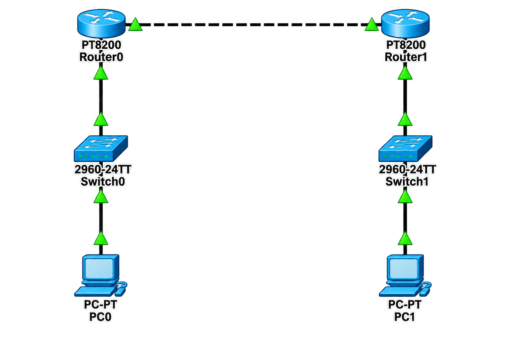

# 🗺️ Static Routing

## 📖 Apa itu Static Routing?

**Static Routing** adalah metode routing di mana administrator jaringan secara manual mengkonfigurasi jalur (route) yang harus dilalui oleh paket data untuk mencapai jaringan tujuan. Berbeda dengan dynamic routing yang menggunakan algoritma untuk menentukan jalur secara otomatis, static routing membutuhkan intervensi manual untuk setiap perubahan topologi jaringan.

### 🎯 Tujuan Static Routing:

1. **Kontrol Penuh** - Administrator memiliki kontrol penuh atas jalur yang dilalui paket data
2. **Keamanan** - Tidak ada update routing yang dikirimkan, sehingga lebih aman dari serangan
3. **Efisiensi** - Tidak memakan bandwidth untuk update routing
4. **Stabilitas** - Tidak terjadi fluktuasi jalur karena tidak ada algoritma routing
5. **Sederhana** - Cocok untuk jaringan kecil dengan topologi yang stabil

### 🏷️ Karakteristik Static Routing:

| Karakteristik | Deskripsi |
|---------------|-----------|
| **Konfigurasi Manual** | Administrator harus menambahkan route secara manual |
| **Tidak Adaptif** | Tidak bisa menyesuaikan diri dengan perubahan topologi |
| **Administrative Distance** | 1 (lebih tinggi prioritasnya dari dynamic routing) |
| **Penggunaan Bandwidth** | Tidak menggunakan bandwidth untuk update routing |
| **Keamanan** | Lebih aman karena tidak ada informasi routing yang disebarkan |
| **Skala** | Tidak cocok untuk jaringan besar yang dinamis |

### 📝 Format Perintah Static Route:

```cisco
ip route [network_tujuan] [netmask] [next_hop_address] [administrative_distance] [permanent]
```

---

## 🌐 Topologi



---

## 📊 Tabel Perangkat dan IP Address

### Router 1

| Perangkat | Antarmuka | IP Address | Netmask | Keterangan |
|-----------|-----------|------------|---------|------------|
| **Router 1** | Gi0/0/0 | 10.10.10.1 | 255.255.255.0 | Ke Router 2 |
| **Router 1** | Gi0/0/1 | 192.168.1.1 | 255.255.255.0 | Ke Switch 1 |

### Router 2

| Perangkat | Antarmuka | IP Address | Netmask | Keterangan |
|-----------|-----------|------------|---------|------------|
| **Router 2** | Gi0/0/0 | 10.10.10.2 | 255.255.255.0 | Ke Router 1 |
| **Router 2** | Gi0/0/1 | 192.168.2.1 | 255.255.255.0 | Ke Switch 2 |

### Switch 1

| Perangkat | Antarmuka | VLAN | Status | Keterangan |
|-----------|-----------|------|--------|------------|
| **Switch 1** | Fa0/1 | VLAN 1 (Native) | Up | Ke Router 1 Gi0/0/1 |
| **Switch 1** | Fa0/2-24 | VLAN 1 (Native) | Up | Ke End-Devices |

### Switch 2

| Perangkat | Antarmuka | VLAN | Status | Keterangan |
|-----------|-----------|------|--------|------------|
| **Switch 2** | Fa0/1 | VLAN 1 (Native) | Up | Ke Router 2 Gi0/0/1 |
| **Switch 2** | Fa0/2-24 | VLAN 1 (Native) | Up | Ke End-Devices |

### Perangkat End-User

| Perangkat | Network | IP Address | Netmask | Gateway | Keterangan |
|-----------|---------|------------|---------|---------|------------|
| **PC1** | 192.168.1.0/24 | 192.168.1.10 | 255.255.255.0 | 192.168.1.1 | Terhubung ke SW1 |
| **PC2** | 192.168.1.0/24 | 192.168.1.20 | 255.255.255.0 | 192.168.1.1 | Terhubung ke SW1 |
| **PC3** | 192.168.2.0/24 | 192.168.2.10 | 255.255.255.0 | 192.168.2.1 | Terhubung ke SW2 |
| **PC4** | 192.168.2.0/24 | 192.168.2.20 | 255.255.255.0 | 192.168.2.1 | Terhubung ke SW2 |

---

## 📋 Detail Konfigurasi

### Router 1

| Antarmuka | IP Address | Subnet Mask | Status | Keterangan |
|-----------|------------|-------------|--------|------------|
| Gi0/0/0 | 10.10.10.1 | 255.255.255.0 | Up | Link ke Router 2 |
| Gi0/0/1 | 192.168.1.1 | 255.255.255.0 | Up | Link ke Switch 1 |

### Router 2

| Antarmuka | IP Address | Subnet Mask | Status | Keterangan |
|-----------|------------|-------------|--------|------------|
| Gi0/0/0 | 10.10.10.2 | 255.255.255.0 | Up | Link ke Router 1 |
| Gi0/0/1 | 192.168.2.1 | 255.255.255.0 | Up | Link ke Switch 2 |

### Tabel Routing

| Router | Network Tujuan | Netmask | Next Hop | Interface | Keterangan |
|--------|---------------|---------|----------|-----------|------------|
| **R1** | 192.168.2.0 | 255.255.255.0 | 10.10.10.2 | Gi0/0/0 | Ke network SW2 |
| **R2** | 192.168.1.0 | 255.255.255.0 | 10.10.10.1 | Gi0/0/0 | Ke network SW1 |

---

## ⚙️ Langkah-Langkah Konfigurasi

### 1. Konfigurasi Router 1

#### 1.1 Konfigurasi Dasar Router 1

```cisco
Router> enable
Router# configure terminal
Router(config)# hostname R1

! Nonaktifkan DNS lookup
R1(config)# no ip domain-lookup

! Enkripsi password
R1(config)# service password-encryption

! Set password untuk akses console dan VTY
R1(config)# line console 0
R1(config-line)# password cisco
R1(config-line)# login
R1(config-line)# exit

R1(config)# line vty 0 4
R1(config-line)# password cisco
R1(config-line)# login
R1(config-line)# exit

! Set enable password
R1(config)# enable secret cisco123

R1(config)# end
R1# copy running-config startup-config
```

#### 1.2 Konfigurasi IP Address Router 1

```cisco
R1> enable
R1# configure terminal

! Konfigurasi interface ke Router 2 (Gi0/0/0)
R1(config)# interface gigabitEthernet 0/0/0
R1(config-if)# description === LINK TO ROUTER 2 (10.10.10.0/24) ===
R1(config-if)# ip address 10.10.10.1 255.255.255.0
R1(config-if)# no shutdown
R1(config-if)# exit

! Konfigurasi interface ke Switch 1 (Gi0/0/1)
R1(config)# interface gigabitEthernet 0/0/1
R1(config-if)# description === LINK TO SWITCH 1 (192.168.1.0/24) ===
R1(config-if)# ip address 192.168.1.1 255.255.255.0
R1(config-if)# no shutdown
R1(config-if)# exit

R1(config)# end
R1# copy running-config startup-config
```

#### 1.3 Konfigurasi Static Route di Router 1

```cisco
R1> enable
R1# configure terminal

! Tambahkan static route ke network 192.168.2.0/24 melalui Router 2
R1(config)# ip route 192.168.2.0 255.255.255.0 10.10.10.2

! Verifikasi konfigurasi
R1(config)# end
R1# show ip route
R1# copy running-config startup-config
```

**Penjelasan:**
- `ip route 192.168.2.0 255.255.255.0 10.10.10.2`
  - `192.168.2.0` = Network tujuan
  - `255.255.255.0` = Subnet mask network tujuan
  - `10.10.10.2` = Next hop (IP address Router 2)

---

### 2. Konfigurasi Router 2

#### 2.1 Konfigurasi Dasar Router 2

```cisco
Router> enable
Router# configure terminal
Router(config)# hostname R2

! Nonaktifkan DNS lookup
R2(config)# no ip domain-lookup

! Enkripsi password
R2(config)# service password-encryption

! Set password untuk akses console dan VTY
R2(config)# line console 0
R2(config-line)# password cisco
R2(config-line)# login
R2(config-line)# exit

R2(config)# line vty 0 4
R2(config-line)# password cisco
R2(config-line)# login
R2(config-line)# exit

! Set enable password
R2(config)# enable secret cisco123

R2(config)# end
R2# copy running-config startup-config
```

#### 2.2 Konfigurasi IP Address Router 2

```cisco
R2> enable
R2# configure terminal

! Konfigurasi interface ke Router 1 (Gi0/0/0)
R2(config)# interface gigabitEthernet 0/0/0
R2(config-if)# description === LINK TO ROUTER 1 (10.10.10.0/24) ===
R2(config-if)# ip address 10.10.10.2 255.255.255.0
R2(config-if)# no shutdown
R2(config-if)# exit

! Konfigurasi interface ke Switch 2 (Gi0/0/1)
R2(config)# interface gigabitEthernet 0/0/1
R2(config-if)# description === LINK TO SWITCH 2 (192.168.2.0/24) ===
R2(config-if)# ip address 192.168.2.1 255.255.255.0
R2(config-if)# no shutdown
R2(config-if)# exit

R2(config)# end
R2# copy running-config startup-config
```

#### 2.3 Konfigurasi Static Route di Router 2

```cisco
R2> enable
R2# configure terminal

! Tambahkan static route ke network 192.168.1.0/24 melalui Router 1
R2(config)# ip route 192.168.1.0 255.255.255.0 10.10.10.1

! Verifikasi konfigurasi
R2(config)# end
R2# show ip route
R2# copy running-config startup-config
```

**Penjelasan:**
- `ip route 192.168.1.0 255.255.255.0 10.10.10.1`
  - `192.168.1.0` = Network tujuan
  - `255.255.255.0` = Subnet mask network tujuan
  - `10.10.10.1` = Next hop (IP address Router 1)

---

### 3. Konfigurasi Switch 1

#### 3.1 Konfigurasi Dasar Switch 1

```cisco
Switch> enable
Switch# configure terminal
Switch(config)# hostname SW1

! Nonaktifkan DNS lookup
SW1(config)# no ip domain-lookup

! Enkripsi password
SW1(config)# service password-encryption

! Set password untuk akses console dan VTY
SW1(config)# line console 0
SW1(config-line)# password cisco
SW1(config-line)# login
SW1(config-line)# exit

SW1(config)# line vty 0 15
SW1(config-line)# password cisco
SW1(config-line)# login
SW1(config-line)# exit

! Set enable password
SW1(config)# enable secret cisco123

SW1(config)# end
SW1# copy running-config startup-config
```

#### 3.2 Konfigurasi Port Switch 1

```cisco
SW1> enable
SW1# configure terminal

! Konfigurasi port Fa0/1 ke Router 1
SW1(config)# interface fastEthernet 0/1
SW1(config-if)# description === LINK TO ROUTER 1 ===
SW1(config-if)# switchport mode access
SW1(config-if)# switchport access vlan 1
SW1(config-if)# no shutdown
SW1(config-if)# exit

! Konfigurasi port Fa0/2-24 untuk end-devices
SW1(config)# interface range fastEthernet 0/2 - 24
SW1(config-if-range)# description === END-DEVICES VLAN 1 ===
SW1(config-if-range)# switchport mode access
SW1(config-if-range)# switchport access vlan 1
SW1(config-if-range)# no shutdown
SW1(config-if-range)# exit

SW1(config)# end
SW1# copy running-config startup-config
```

---

### 4. Konfigurasi Switch 2

#### 4.1 Konfigurasi Dasar Switch 2

```cisco
Switch> enable
Switch# configure terminal
Switch(config)# hostname SW2

! Nonaktifkan DNS lookup
SW2(config)# no ip domain-lookup

! Enkripsi password
SW2(config)# service password-encryption

! Set password untuk akses console dan VTY
SW2(config)# line console 0
SW2(config-line)# password cisco
SW2(config-line)# login
SW2(config-line)# exit

SW2(config)# line vty 0 15
SW2(config-line)# password cisco
SW2(config-line)# login
SW2(config-line)# exit

! Set enable password
SW2(config)# enable secret cisco123

SW2(config)# end
SW2# copy running-config startup-config
```

#### 4.2 Konfigurasi Port Switch 2

```cisco
SW2> enable
SW2# configure terminal

! Konfigurasi port Fa0/1 ke Router 2
SW2(config)# interface fastEthernet 0/1
SW2(config-if)# description === LINK TO ROUTER 2 ===
SW2(config-if)# switchport mode access
SW2(config-if)# switchport access vlan 1
SW2(config-if)# no shutdown
SW2(config-if)# exit

! Konfigurasi port Fa0/2-24 untuk end-devices
SW2(config)# interface range fastEthernet 0/2 - 24
SW2(config-if-range)# description === END-DEVICES VLAN 1 ===
SW2(config-if-range)# switchport mode access
SW2(config-if-range)# switchport access vlan 1
SW2(config-if-range)# no shutdown
SW2(config-if-range)# exit

SW2(config)# end
SW2# copy running-config startup-config
```

---

### 5. Konfigurasi Perangkat End-User

#### 5.1 PC1 (Terhubung ke SW1)

| Parameter | Nilai |
|-----------|-------|
| IP Address | 192.168.1.10 |
| Netmask | 255.255.255.0 |
| Gateway | 192.168.1.1 |
| DNS | 8.8.8.8 |

#### 5.2 PC2 (Terhubung ke SW1)

| Parameter | Nilai |
|-----------|-------|
| IP Address | 192.168.1.20 |
| Netmask | 255.255.255.0 |
| Gateway | 192.168.1.1 |
| DNS | 8.8.8.8 |

#### 5.3 PC3 (Terhubung ke SW2)

| Parameter | Nilai |
|-----------|-------|
| IP Address | 192.168.2.10 |
| Netmask | 255.255.255.0 |
| Gateway | 192.168.2.1 |
| DNS | 8.8.8.8 |

#### 5.4 PC4 (Terhubung ke SW2)

| Parameter | Nilai |
|-----------|-------|
| IP Address | 192.168.2.20 |
| Netmask | 255.255.255.0 |
| Gateway | 192.168.2.1 |
| DNS | 8.8.8.8 |

---

## ✅ Verifikasi Konfigurasi

### 1. Verifikasi IP Address Router 1

```cisco
R1# show ip interface brief
```

**Output yang diharapkan:**
```
Interface              IP-Address      OK? Method Status                Protocol
GigabitEthernet0/0/0   10.10.10.1      YES manual up                    up
GigabitEthernet0/0/1   192.168.1.1     YES manual up                    up
```

### 2. Verifikasi IP Address Router 2

```cisco
R2# show ip interface brief
```

**Output yang diharapkan:**
```
Interface              IP-Address      OK? Method Status                Protocol
GigabitEthernet0/0/0   10.10.10.2      YES manual up                    up
GigabitEthernet0/0/1   192.168.2.1     YES manual up                    up
```

### 3. Verifikasi Tabel Routing Router 1

```cisco
R1# show ip route
```

**Output yang diharapkan:**
```
Codes: L - local, C - connected, S - static, R - RIP, M - mobile, B - BGP
       D - EIGRP, EX - EIGRP external, O - OSPF, IA - OSPF inter area
       N1 - OSPF NSSA external type 1, N2 - OSPF NSSA external type 2
       E1 - OSPF external type 1, E2 - OSPF external type 2
       i - IS-IS, su - IS-IS summary, L1 - IS-IS level-1, L2 - IS-IS level-2
       ia - IS-IS inter area, * - candidate default

Gateway of last resort is not set

C    10.10.10.0/24 is directly connected, GigabitEthernet0/0/0
L    10.10.10.1/32 is directly connected, GigabitEthernet0/0/0
C    192.168.1.0/24 is directly connected, GigabitEthernet0/0/1
L    192.168.1.1/32 is directly connected, GigabitEthernet0/0/1
S    192.168.2.0/24 [1/0] via 10.10.10.2
```

**Penjelasan:**
- `C` = Connected (terhubung langsung)
- `L` = Local (alamat lokal pada interface)
- `S` = Static (route statis yang dikonfigurasi manual)
- `[1/0]` = Administrative distance 1, metric 0
- `via 10.10.10.2` = Next hop untuk mencapai network tujuan

### 4. Verifikasi Tabel Routing Router 2

```cisco
R2# show ip route
```

**Output yang diharapkan:**
```
Codes: L - local, C - connected, S - static, R - RIP, M - mobile, B - BGP
       D - EIGRP, EX - EIGRP external, O - OSPF, IA - OSPF inter area
       N1 - OSPF NSSA external type 1, N2 - OSPF NSSA external type 2
       E1 - OSPF external type 1, E2 - OSPF external type 2
       i - IS-IS, su - IS-IS summary, L1 - IS-IS level-1, L2 - IS-IS level-2
       ia - IS-IS inter area, * - candidate default

Gateway of last resort is not set

C    10.10.10.0/24 is directly connected, GigabitEthernet0/0/0
L    10.10.10.2/32 is directly connected, GigabitEthernet0/0/0
S    192.168.1.0/24 [1/0] via 10.10.10.1
C    192.168.2.0/24 is directly connected, GigabitEthernet0/0/1
L    192.168.2.1/32 is directly connected, GigabitEthernet0/0/1
```

### 5. Verifikasi Static Route di Router 1

```cisco
R1# show ip route static
```

**Output yang diharapkan:**
```
S    192.168.2.0/24 [1/0] via 10.10.10.2
```

### 6. Verifikasi Static Route di Router 2

```cisco
R2# show ip route static
```

**Output yang diharapkan:**
```
S    192.168.1.0/24 [1/0] via 10.10.10.1
```

### 7. Verifikasi Koneksi Antar PC

**Dari PC1 (192.168.1.10):**

```cmd
ping 192.168.1.1     # ke Gateway R1 - HARUS BERHASIL
ping 192.168.1.20    # ke PC2 - HARUS BERHASIL (sama network)
ping 10.10.10.2      # ke R2 - HARUS BERHASIL
ping 192.168.2.1     # ke Gateway R2 - HARUS BERHASIL
ping 192.168.2.10    # ke PC3 - HARUS BERHASIL (beda router via static route)
ping 192.168.2.20    # ke PC4 - HARUS BERHASIL (beda router via static route)
```

**Dari PC3 (192.168.2.10):**

```cmd
ping 192.168.2.1     # ke Gateway R2 - HARUS BERHASIL
ping 192.168.2.20    # ke PC4 - HARUS BERHASIL (sama network)
ping 10.10.10.1      # ke R1 - HARUS BERHASIL
ping 192.168.1.1     # ke Gateway R1 - HARUS BERHASIL
ping 192.168.1.10    # ke PC1 - HARUS BERHASIL (beda router via static route)
ping 192.168.1.20    # ke PC2 - HARUS BERHASIL (beda router via static route)
```

### 8. Verifikasi Traceroute

**Dari PC1 ke PC3:**

```cmd
tracert 192.168.2.10
```

**Output yang diharapkan:**
```
Tracing route to 192.168.2.10 over a maximum of 30 hops:

  1    <1 ms    <1 ms    <1 ms  192.168.1.1
  2    <1 ms    <1 ms    <1 ms  10.10.10.2
  3    <1 ms    <1 ms    <1 ms  192.168.2.10

Trace complete.
```

---

## 📊 Ringkasan Konfigurasi

### Router 1

| Parameter | Nilai |
|-----------|-------|
| **Hostname** | R1 |
| **Gi0/0/0 IP** | 10.10.10.1/24 |
| **Gi0/0/1 IP** | 192.168.1.1/24 |
| **Static Route** | 192.168.2.0/24 via 10.10.10.2 |

### Router 2

| Parameter | Nilai |
|-----------|-------|
| **Hostname** | R2 |
| **Gi0/0/0 IP** | 10.10.10.2/24 |
| **Gi0/0/1 IP** | 192.168.2.1/24 |
| **Static Route** | 192.168.1.0/24 via 10.10.10.1 |

### Switch 1

| Parameter | Nilai |
|-----------|-------|
| **Hostname** | SW1 |
| **VLAN** | 1 (Native) |
| **Port ke R1** | Fa0/1 (Access VLAN 1) |
| **Port ke PC** | Fa0/2-24 (Access VLAN 1) |

### Switch 2

| Parameter | Nilai |
|-----------|-------|
| **Hostname** | SW2 |
| **VLAN** | 1 (Native) |
| **Port ke R2** | Fa0/1 (Access VLAN 1) |
| **Port ke PC** | Fa0/2-24 (Access VLAN 1) |

### PC

| Perangkat | Network | IP Address | Gateway |
|-----------|---------|------------|---------|
| **PC1** | 192.168.1.0/24 | 192.168.1.10 | 192.168.1.1 |
| **PC2** | 192.168.1.0/24 | 192.168.1.20 | 192.168.1.1 |
| **PC3** | 192.168.2.0/24 | 192.168.2.10 | 192.168.2.1 |
| **PC4** | 192.168.2.0/24 | 192.168.2.20 | 192.168.2.1 |

---

## 🔧 Troubleshooting

| Masalah | Kemungkinan Penyebab | Solusi |
|---------|---------------------|--------|
| PC tidak bisa ping ke gateway | IP address salah atau interface down | Cek `show ip interface brief` |
| PC1 tidak bisa ping ke PC3 | Static route tidak ada | Cek `show ip route` dan tambahkan static route |
| Interface down | No shutdown tidak dijalankan | Gunakan `no shutdown` pada interface |
| Static route tidak muncul | Format route salah | Cek format `ip route [network] [netmask] [next-hop]` |
| Routing loop | Static route tidak seimbang | Pastikan kedua router memiliki route yang saling mengarah |
| Koneksi antar router gagal | IP address tidak segaris | Cek IP address di kedua ujung link |
| Next hop tidak reachable | Interface down atau IP salah | Cek konektivitas ke next hop dengan `ping` |
| Paket hilang di tengah jalan | MTU mismatch | Cek MTU pada interface |

---

## 📚 Referensi

- [Cisco Static Routing Documentation](https://www.cisco.com/c/en/us/support/docs/ip/routing-information-protocol-rip/14956-route-static.html)
- [Cisco IOS IP Routing Configuration Guide](https://www.cisco.com/c/en/us/support/docs/ip/enhanced-interior-gateway-routing-protocol-eigrp/16406-eigrp-toc.html)
- [Cisco Routing Fundamentals](https://www.cisco.com/c/en/us/solutions/enterprise-networks/routing/index.html)

---