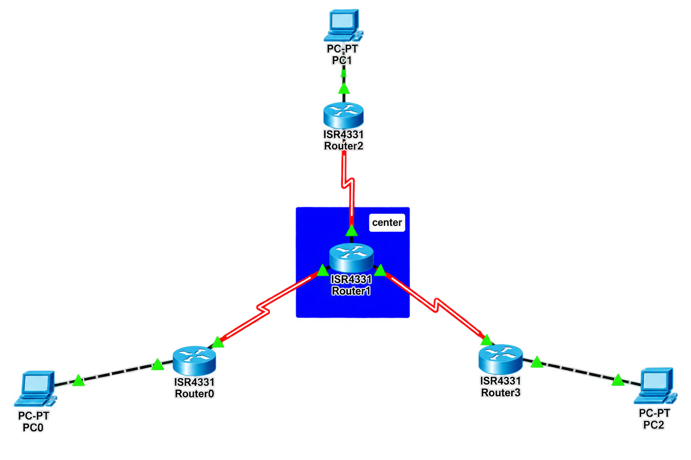

# 🔄 Multi-Area OSPF

## 📖 Apa itu Multi-Area OSPF?

**Multi-Area OSPF** adalah implementasi OSPF yang membagi jaringan menjadi beberapa area untuk meningkatkan skalabilitas dan efisiensi. Dengan membagi jaringan menjadi area-area yang lebih kecil, OSPF dapat mengurangi ukuran database link-state, mempercepat konvergensi, dan mengisolasi dampak perubahan topologi hanya pada area tertentu.

### 🎯 Tujuan Multi-Area OSPF:

1. **Skalabilitas** - Membagi jaringan besar menjadi area-area yang lebih kecil
2. **Efisiensi** - Mengurangi ukuran LSDB dan traffic routing
3. **Konvergensi Cepat** - Perubahan topologi hanya mempengaruhi area tertentu
4. **Isolasi** - Masalah di satu area tidak mempengaruhi area lain
5. **Hierarki** - Membangun struktur routing yang terorganisir

### 🏷️ Karakteristik Multi-Area OSPF:

| Karakteristik | Deskripsi |
|---------------|-----------|
| **Backbone Area (Area 0)** | Area pusat yang menghubungkan semua area lain |
| **Non-Backbone Area** | Area yang terhubung ke Area 0 melalui ABR |
| **ABR (Area Border Router)** | Router yang terhubung ke Area 0 dan area lain |
| **ASBR (Autonomous System Border Router)** | Router yang menghubungkan OSPF dengan routing protocol lain |
| **LSA Types** | Berbagai jenis LSA untuk komunikasi antar area |
| **Summary Routes** | Rute ringkasan yang di-advertise antar area |

### 📊 OSPF LSA Types:

| LSA Type | Nama | Deskripsi |
|----------|------|-----------|
| **Type 1** | Router LSA | Informasi router di dalam area |
| **Type 2** | Network LSA | Informasi network multi-access (DR) |
| **Type 3** | Summary LSA | Route ringkasan antar area (ABR) |
| **Type 4** | ASBR Summary LSA | Informasi ASBR ke area lain |
| **Type 5** | External LSA | Route dari luar OSPF (ASBR) |
| **Type 7** | NSSA External LSA | External route di NSSA area |

### 📝 OSPF Area Types:

| Area Type | Deskripsi | LSA yang Diterima |
|-----------|-----------|-------------------|
| **Backbone (Area 0)** | Area pusat | Semua LSA |
| **Standard Area** | Area normal | Semua LSA |
| **Stub Area** | Area tanpa external route | Type 1, 2, 3 |
| **Totally Stubby Area** | Area tanpa external dan inter-area | Type 1, 2 (default route) |
| **NSSA (Not-So-Stubby Area)** | Stub area dengan external route | Type 1, 2, 3, 7 |

---

## 🌐 Topologi




---

## 📊 Tabel Perangkat dan IP Address

### Router Center (Area 0 - ABR)

| Perangkat | Antarmuka | IP Address | Netmask | Area | Keterangan |
|-----------|-----------|------------|---------|------|------------|
| **Router Center** | Se0/1/0 | 10.10.10.2 | 255.255.255.252 | Area 0 | Ke Router 1 |
| **Router Center** | Se0/1/1 | 20.20.20.2 | 255.255.255.252 | Area 0 | Ke Router 2 |
| **Router Center** | Se0/2/0 | 30.30.30.2 | 255.255.255.252 | Area 0 | Ke Router 3 |

### Router 1 (Area 1)

| Perangkat | Antarmuka | IP Address | Netmask | Area | Keterangan |
|-----------|-----------|------------|---------|------|------------|
| **Router 1** | Se0/1/0 | 10.10.10.1 | 255.255.255.252 | Area 0 | Ke Router Center |
| **Router 1** | Gi0/0/0 | 192.168.10.1 | 255.255.255.0 | Area 1 | Ke Switch 1 |

### Router 2 (Area 2)

| Perangkat | Antarmuka | IP Address | Netmask | Area | Keterangan |
|-----------|-----------|------------|---------|------|------------|
| **Router 2** | Se0/1/0 | 20.20.20.1 | 255.255.255.252 | Area 0 | Ke Router Center |
| **Router 2** | Gi0/0/0 | 192.168.20.1 | 255.255.255.0 | Area 2 | Ke Switch 2 |

### Router 3 (Area 3)

| Perangkat | Antarmuka | IP Address | Netmask | Area | Keterangan |
|-----------|-----------|------------|---------|------|------------|
| **Router 3** | Se0/1/0 | 30.30.30.1 | 255.255.255.252 | Area 0 | Ke Router Center |
| **Router 3** | Gi0/0/0 | 192.168.30.1 | 255.255.255.0 | Area 3 | Ke Switch 3 |

### Switch

| Perangkat | Antarmuka | VLAN | Status | Keterangan |
|-----------|-----------|------|--------|------------|
| **Switch 1** | Fa0/1 | VLAN 1 (Native) | Up | Ke Router 1 Gi0/0/0 |
| **Switch 1** | Fa0/2-24 | VLAN 1 (Native) | Up | Ke End-Devices |
| **Switch 2** | Fa0/1 | VLAN 1 (Native) | Up | Ke Router 2 Gi0/0/0 |
| **Switch 2** | Fa0/2-24 | VLAN 1 (Native) | Up | Ke End-Devices |
| **Switch 3** | Fa0/1 | VLAN 1 (Native) | Up | Ke Router 3 Gi0/0/0 |
| **Switch 3** | Fa0/2-24 | VLAN 1 (Native) | Up | Ke End-Devices |

### Perangkat End-User

| Perangkat | Network | IP Address | Netmask | Gateway | Area | Keterangan |
|-----------|---------|------------|---------|---------|------|------------|
| **PC1** | 192.168.10.0/24 | 192.168.10.10 | 255.255.255.0 | 192.168.10.1 | Area 1 | Terhubung ke SW1 |
| **PC2** | 192.168.10.0/24 | 192.168.10.20 | 255.255.255.0 | 192.168.10.1 | Area 1 | Terhubung ke SW1 |
| **PC3** | 192.168.20.0/24 | 192.168.20.10 | 255.255.255.0 | 192.168.20.1 | Area 2 | Terhubung ke SW2 |
| **PC4** | 192.168.20.0/24 | 192.168.20.20 | 255.255.255.0 | 192.168.20.1 | Area 2 | Terhubung ke SW2 |
| **PC5** | 192.168.30.0/24 | 192.168.30.10 | 255.255.255.0 | 192.168.30.1 | Area 3 | Terhubung ke SW3 |
| **PC6** | 192.168.30.0/24 | 192.168.30.20 | 255.255.255.0 | 192.168.30.1 | Area 3 | Terhubung ke SW3 |

---

## 📋 Detail Konfigurasi

### Router Center (Area 0 - ABR)

| Antarmuka | IP Address | Subnet Mask | Area | Status | Keterangan |
|-----------|------------|-------------|------|--------|------------|
| Se0/1/0 | 10.10.10.2 | 255.255.255.252 | 0 | Up | Ke Router 1 |
| Se0/1/1 | 20.20.20.2 | 255.255.255.252 | 0 | Up | Ke Router 2 |
| Se0/2/0 | 30.30.30.2 | 255.255.255.252 | 0 | Up | Ke Router 3 |

### Router 1 (Area 1)

| Antarmuka | IP Address | Subnet Mask | Area | Status | Keterangan |
|-----------|------------|-------------|------|--------|------------|
| Se0/1/0 | 10.10.10.1 | 255.255.255.252 | 0 | Up | Ke Router Center |
| Gi0/0/0 | 192.168.10.1 | 255.255.255.0 | 1 | Up | Ke Switch 1 |

### Router 2 (Area 2)

| Antarmuka | IP Address | Subnet Mask | Area | Status | Keterangan |
|-----------|------------|-------------|------|--------|------------|
| Se0/1/0 | 20.20.20.1 | 255.255.255.252 | 0 | Up | Ke Router Center |
| Gi0/0/0 | 192.168.20.1 | 255.255.255.0 | 2 | Up | Ke Switch 2 |

### Router 3 (Area 3)

| Antarmuka | IP Address | Subnet Mask | Area | Status | Keterangan |
|-----------|------------|-------------|------|--------|------------|
| Se0/1/0 | 30.30.30.1 | 255.255.255.252 | 0 | Up | Ke Router Center |
| Gi0/0/0 | 192.168.30.1 | 255.255.255.0 | 3 | Up | Ke Switch 3 |

### OSPF Configuration Summary

| Router | Process ID | Area | Network | Interface |
|--------|-----------|------|---------|-----------|
| **Router Center** | 1 | 0 | 10.10.10.0/30 | Se0/1/0 |
| **Router Center** | 1 | 0 | 20.20.20.0/30 | Se0/1/1 |
| **Router Center** | 1 | 0 | 30.30.30.0/30 | Se0/2/0 |
| **Router 1** | 1 | 0 | 10.10.10.0/30 | Se0/1/0 |
| **Router 1** | 1 | 1 | 192.168.10.0/24 | Gi0/0/0 |
| **Router 2** | 1 | 0 | 20.20.20.0/30 | Se0/1/0 |
| **Router 2** | 1 | 2 | 192.168.20.0/24 | Gi0/0/0 |
| **Router 3** | 1 | 0 | 30.30.30.0/30 | Se0/1/0 |
| **Router 3** | 1 | 3 | 192.168.30.0/24 | Gi0/0/0 |

---

## ⚙️ Langkah-Langkah Konfigurasi

### 1. Konfigurasi Router Center (Area 0 - ABR)

#### 1.1 Konfigurasi Dasar Router Center

```cisco
Router> enable
Router# configure terminal
Router(config)# hostname R_CENTER

! Nonaktifkan DNS lookup
R_CENTER(config)# no ip domain-lookup

! Enkripsi password
R_CENTER(config)# service password-encryption

! Set password untuk akses console dan VTY
R_CENTER(config)# line console 0
R_CENTER(config-line)# password cisco
R_CENTER(config-line)# login
R_CENTER(config-line)# exit

R_CENTER(config)# line vty 0 4
R_CENTER(config-line)# password cisco
R_CENTER(config-line)# login
R_CENTER(config-line)# exit

! Set enable password
R_CENTER(config)# enable secret cisco123

R_CENTER(config)# end
R_CENTER# copy running-config startup-config
```

#### 1.2 Konfigurasi IP Address Router Center

```cisco
R_CENTER> enable
R_CENTER# configure terminal

! Konfigurasi interface ke Router 1 (Se0/1/0)
R_CENTER(config)# interface serial 0/1/0
R_CENTER(config-if)# description === LINK TO ROUTER 1 (Area 0) ===
R_CENTER(config-if)# ip address 10.10.10.2 255.255.255.252
R_CENTER(config-if)# clock rate 64000
R_CENTER(config-if)# no shutdown
R_CENTER(config-if)# exit

! Konfigurasi interface ke Router 2 (Se0/1/1)
R_CENTER(config)# interface serial 0/1/1
R_CENTER(config-if)# description === LINK TO ROUTER 2 (Area 0) ===
R_CENTER(config-if)# ip address 20.20.20.2 255.255.255.252
R_CENTER(config-if)# clock rate 64000
R_CENTER(config-if)# no shutdown
R_CENTER(config-if)# exit

! Konfigurasi interface ke Router 3 (Se0/2/0)
R_CENTER(config)# interface serial 0/2/0
R_CENTER(config-if)# description === LINK TO ROUTER 3 (Area 0) ===
R_CENTER(config-if)# ip address 30.30.30.2 255.255.255.252
R_CENTER(config-if)# clock rate 64000
R_CENTER(config-if)# no shutdown
R_CENTER(config-if)# exit

R_CENTER(config)# end
R_CENTER# copy running-config startup-config
```

#### 1.3 Konfigurasi OSPF di Router Center

```cisco
R_CENTER> enable
R_CENTER# configure terminal

! Aktifkan routing OSPF dengan process ID 1
R_CENTER(config)# router ospf 1

! Tambahkan network ke Area 0
R_CENTER(config-router)# network 10.10.10.0 0.0.0.3 area 0
R_CENTER(config-router)# network 20.20.20.0 0.0.0.3 area 0
R_CENTER(config-router)# network 30.30.30.0 0.0.0.3 area 0

! Exit dari mode routing
R_CENTER(config-router)# exit

! Verifikasi konfigurasi
R_CENTER(config)# end
R_CENTER# copy running-config startup-config
```

**Penjelasan:**
- `router ospf 1` : Mengaktifkan proses routing OSPF dengan Process ID 1
- `network 10.10.10.0 0.0.0.3 area 0` : Mengadvertise network 10.10.10.0/30 ke area 0
- `network 20.20.20.0 0.0.0.3 area 0` : Mengadvertise network 20.20.20.0/30 ke area 0
- `network 30.30.30.0 0.0.0.3 area 0` : Mengadvertise network 30.30.30.0/30 ke area 0
- Semua interface di Router Center berada di Area 0 (Backbone)

---

### 2. Konfigurasi Router 1 (Area 1)

#### 2.1 Konfigurasi Dasar Router 1

```cisco
Router> enable
Router# configure terminal
Router(config)# hostname R1

! Nonaktifkan DNS lookup
R1(config)# no ip domain-lookup

! Enkripsi password
R1(config)# service password-encryption

! Set password untuk akses console dan VTY
R1(config)# line console 0
R1(config-line)# password cisco
R1(config-line)# login
R1(config-line)# exit

R1(config)# line vty 0 4
R1(config-line)# password cisco
R1(config-line)# login
R1(config-line)# exit

! Set enable password
R1(config)# enable secret cisco123

R1(config)# end
R1# copy running-config startup-config
```

#### 2.2 Konfigurasi IP Address Router 1

```cisco
R1> enable
R1# configure terminal

! Konfigurasi interface ke Router Center (Se0/1/0 - Area 0)
R1(config)# interface serial 0/1/0
R1(config-if)# description === LINK TO ROUTER CENTER (Area 0) ===
R1(config-if)# ip address 10.10.10.1 255.255.255.252
R1(config-if)# no shutdown
R1(config-if)# exit

! Konfigurasi interface ke Switch 1 (Gi0/0/0 - Area 1)
R1(config)# interface gigabitEthernet 0/0/0
R1(config-if)# description === LINK TO SWITCH 1 (Area 1 - 192.168.10.0/24) ===
R1(config-if)# ip address 192.168.10.1 255.255.255.0
R1(config-if)# no shutdown
R1(config-if)# exit

R1(config)# end
R1# copy running-config startup-config
```

#### 2.3 Konfigurasi OSPF di Router 1

```cisco
R1> enable
R1# configure terminal

! Aktifkan routing OSPF dengan process ID 1
R1(config)# router ospf 1

! Tambahkan network ke Area 0 (link ke Center)
R1(config-router)# network 10.10.10.0 0.0.0.3 area 0

! Tambahkan network ke Area 1 (LAN)
R1(config-router)# network 192.168.10.0 0.0.0.255 area 1

! Exit dari mode routing
R1(config-router)# exit

! Verifikasi konfigurasi
R1(config)# end
R1# copy running-config startup-config
```

**Penjelasan:**
- `router ospf 1` : Mengaktifkan proses routing OSPF dengan Process ID 1
- `network 10.10.10.0 0.0.0.3 area 0` : Interface Serial di Area 0
- `network 192.168.10.0 0.0.0.255 area 1` : Interface Gigabit di Area 1
- Router 1 adalah ABR karena terhubung ke Area 0 dan Area 1

---

### 3. Konfigurasi Router 2 (Area 2)

#### 3.1 Konfigurasi Dasar Router 2

```cisco
Router> enable
Router# configure terminal
Router(config)# hostname R2

! Nonaktifkan DNS lookup
R2(config)# no ip domain-lookup

! Enkripsi password
R2(config)# service password-encryption

! Set password untuk akses console dan VTY
R2(config)# line console 0
R2(config-line)# password cisco
R2(config-line)# login
R2(config-line)# exit

R2(config)# line vty 0 4
R2(config-line)# password cisco
R2(config-line)# login
R2(config-line)# exit

! Set enable password
R2(config)# enable secret cisco123

R2(config)# end
R2# copy running-config startup-config
```

#### 3.2 Konfigurasi IP Address Router 2

```cisco
R2> enable
R2# configure terminal

! Konfigurasi interface ke Router Center (Se0/1/0 - Area 0)
R2(config)# interface serial 0/1/0
R2(config-if)# description === LINK TO ROUTER CENTER (Area 0) ===
R2(config-if)# ip address 20.20.20.1 255.255.255.252
R2(config-if)# no shutdown
R2(config-if)# exit

! Konfigurasi interface ke Switch 2 (Gi0/0/0 - Area 2)
R2(config)# interface gigabitEthernet 0/0/0
R2(config-if)# description === LINK TO SWITCH 2 (Area 2 - 192.168.20.0/24) ===
R2(config-if)# ip address 192.168.20.1 255.255.255.0
R2(config-if)# no shutdown
R2(config-if)# exit

R2(config)# end
R2# copy running-config startup-config
```

#### 3.3 Konfigurasi OSPF di Router 2

```cisco
R2> enable
R2# configure terminal

! Aktifkan routing OSPF dengan process ID 1
R2(config)# router ospf 1

! Tambahkan network ke Area 0 (link ke Center)
R2(config-router)# network 20.20.20.0 0.0.0.3 area 0

! Tambahkan network ke Area 2 (LAN)
R2(config-router)# network 192.168.20.0 0.0.0.255 area 2

! Exit dari mode routing
R2(config-router)# exit

! Verifikasi konfigurasi
R2(config)# end
R2# copy running-config startup-config
```

**Penjelasan:**
- `router ospf 1` : Mengaktifkan proses routing OSPF
- `network 20.20.20.0 0.0.0.3 area 0` : Interface Serial di Area 0
- `network 192.168.20.0 0.0.0.255 area 2` : Interface Gigabit di Area 2
- Router 2 adalah ABR karena terhubung ke Area 0 dan Area 2

---

### 4. Konfigurasi Router 3 (Area 3)

#### 4.1 Konfigurasi Dasar Router 3

```cisco
Router> enable
Router# configure terminal
Router(config)# hostname R3

! Nonaktifkan DNS lookup
R3(config)# no ip domain-lookup

! Enkripsi password
R3(config)# service password-encryption

! Set password untuk akses console dan VTY
R3(config)# line console 0
R3(config-line)# password cisco
R3(config-line)# login
R3(config-line)# exit

R3(config)# line vty 0 4
R3(config-line)# password cisco
R3(config-line)# login
R3(config-line)# exit

! Set enable password
R3(config)# enable secret cisco123

R3(config)# end
R3# copy running-config startup-config
```

#### 4.2 Konfigurasi IP Address Router 3

```cisco
R3> enable
R3# configure terminal

! Konfigurasi interface ke Router Center (Se0/1/0 - Area 0)
R3(config)# interface serial 0/1/0
R3(config-if)# description === LINK TO ROUTER CENTER (Area 0) ===
R3(config-if)# ip address 30.30.30.1 255.255.255.252
R3(config-if)# no shutdown
R3(config-if)# exit

! Konfigurasi interface ke Switch 3 (Gi0/0/0 - Area 3)
R3(config)# interface gigabitEthernet 0/0/0
R3(config-if)# description === LINK TO SWITCH 3 (Area 3 - 192.168.30.0/24) ===
R3(config-if)# ip address 192.168.30.1 255.255.255.0
R3(config-if)# no shutdown
R3(config-if)# exit

R3(config)# end
R3# copy running-config startup-config
```

#### 4.3 Konfigurasi OSPF di Router 3

```cisco
R3> enable
R3# configure terminal

! Aktifkan routing OSPF dengan process ID 1
R3(config)# router ospf 1

! Tambahkan network ke Area 0 (link ke Center)
R3(config-router)# network 30.30.30.0 0.0.0.3 area 0

! Tambahkan network ke Area 3 (LAN)
R3(config-router)# network 192.168.30.0 0.0.0.255 area 3

! Exit dari mode routing
R3(config-router)# exit

! Verifikasi konfigurasi
R3(config)# end
R3# copy running-config startup-config
```

**Penjelasan:**
- `router ospf 1` : Mengaktifkan proses routing OSPF
- `network 30.30.30.0 0.0.0.3 area 0` : Interface Serial di Area 0
- `network 192.168.30.0 0.0.0.255 area 3` : Interface Gigabit di Area 3
- Router 3 adalah ABR karena terhubung ke Area 0 dan Area 3

---

### 5. Konfigurasi Switch

#### 5.1 Konfigurasi Switch 1

```cisco
Switch> enable
Switch# configure terminal
Switch(config)# hostname SW1

! Nonaktifkan DNS lookup
SW1(config)# no ip domain-lookup

! Enkripsi password
SW1(config)# service password-encryption

! Set password untuk akses console dan VTY
SW1(config)# line console 0
SW1(config-line)# password cisco
SW1(config-line)# login
SW1(config-line)# exit

SW1(config)# line vty 0 15
SW1(config-line)# password cisco
SW1(config-line)# login
SW1(config-line)# exit

! Set enable password
SW1(config)# enable secret cisco123

SW1(config)# end
SW1# copy running-config startup-config

! Konfigurasi port Switch 1
SW1> enable
SW1# configure terminal

! Konfigurasi port Fa0/1 ke Router 1
SW1(config)# interface fastEthernet 0/1
SW1(config-if)# description === LINK TO ROUTER 1 ===
SW1(config-if)# switchport mode access
SW1(config-if)# switchport access vlan 1
SW1(config-if)# no shutdown
SW1(config-if)# exit

! Konfigurasi port Fa0/2-24 untuk end-devices
SW1(config)# interface range fastEthernet 0/2 - 24
SW1(config-if-range)# description === END-DEVICES VLAN 1 ===
SW1(config-if-range)# switchport mode access
SW1(config-if-range)# switchport access vlan 1
SW1(config-if-range)# no shutdown
SW1(config-if-range)# exit

SW1(config)# end
SW1# copy running-config startup-config
```

#### 5.2 Konfigurasi Switch 2

```cisco
Switch> enable
Switch# configure terminal
Switch(config)# hostname SW2

! Nonaktifkan DNS lookup
SW2(config)# no ip domain-lookup

! Enkripsi password
SW2(config)# service password-encryption

! Set password untuk akses console dan VTY
SW2(config)# line console 0
SW2(config-line)# password cisco
SW2(config-line)# login
SW2(config-line)# exit

SW2(config)# line vty 0 15
SW2(config-line)# password cisco
SW2(config-line)# login
SW2(config-line)# exit

! Set enable password
SW2(config)# enable secret cisco123

SW2(config)# end
SW2# copy running-config startup-config

! Konfigurasi port Switch 2
SW2> enable
SW2# configure terminal

! Konfigurasi port Fa0/1 ke Router 2
SW2(config)# interface fastEthernet 0/1
SW2(config-if)# description === LINK TO ROUTER 2 ===
SW2(config-if)# switchport mode access
SW2(config-if)# switchport access vlan 1
SW2(config-if)# no shutdown
SW2(config-if)# exit

! Konfigurasi port Fa0/2-24 untuk end-devices
SW2(config)# interface range fastEthernet 0/2 - 24
SW2(config-if-range)# description === END-DEVICES VLAN 1 ===
SW2(config-if-range)# switchport mode access
SW2(config-if-range)# switchport access vlan 1
SW2(config-if-range)# no shutdown
SW2(config-if-range)# exit

SW2(config)# end
SW2# copy running-config startup-config
```

#### 5.3 Konfigurasi Switch 3

```cisco
Switch> enable
Switch# configure terminal
Switch(config)# hostname SW3

! Nonaktifkan DNS lookup
SW3(config)# no ip domain-lookup

! Enkripsi password
SW3(config)# service password-encryption

! Set password untuk akses console dan VTY
SW3(config)# line console 0
SW3(config-line)# password cisco
SW3(config-line)# login
SW3(config-line)# exit

SW3(config)# line vty 0 15
SW3(config-line)# password cisco
SW3(config-line)# login
SW3(config-line)# exit

! Set enable password
SW3(config)# enable secret cisco123

SW3(config)# end
SW3# copy running-config startup-config

! Konfigurasi port Switch 3
SW3> enable
SW3# configure terminal

! Konfigurasi port Fa0/1 ke Router 3
SW3(config)# interface fastEthernet 0/1
SW3(config-if)# description === LINK TO ROUTER 3 ===
SW3(config-if)# switchport mode access
SW3(config-if)# switchport access vlan 1
SW3(config-if)# no shutdown
SW3(config-if)# exit

! Konfigurasi port Fa0/2-24 untuk end-devices
SW3(config)# interface range fastEthernet 0/2 - 24
SW3(config-if-range)# description === END-DEVICES VLAN 1 ===
SW3(config-if-range)# switchport mode access
SW3(config-if-range)# switchport access vlan 1
SW3(config-if-range)# no shutdown
SW3(config-if-range)# exit

SW3(config)# end
SW3# copy running-config startup-config
```

---

### 6. Konfigurasi Perangkat End-User

#### 6.1 PC1 (Area 1 - Terhubung ke SW1)

| Parameter | Nilai |
|-----------|-------|
| IP Address | 192.168.10.10 |
| Netmask | 255.255.255.0 |
| Gateway | 192.168.10.1 |
| DNS | 8.8.8.8 |

#### 6.2 PC2 (Area 1 - Terhubung ke SW1)

| Parameter | Nilai |
|-----------|-------|
| IP Address | 192.168.10.20 |
| Netmask | 255.255.255.0 |
| Gateway | 192.168.10.1 |
| DNS | 8.8.8.8 |

#### 6.3 PC3 (Area 2 - Terhubung ke SW2)

| Parameter | Nilai |
|-----------|-------|
| IP Address | 192.168.20.10 |
| Netmask | 255.255.255.0 |
| Gateway | 192.168.20.1 |
| DNS | 8.8.8.8 |

#### 6.4 PC4 (Area 2 - Terhubung ke SW2)

| Parameter | Nilai |
|-----------|-------|
| IP Address | 192.168.20.20 |
| Netmask | 255.255.255.0 |
| Gateway | 192.168.20.1 |
| DNS | 8.8.8.8 |

#### 6.5 PC5 (Area 3 - Terhubung ke SW3)

| Parameter | Nilai |
|-----------|-------|
| IP Address | 192.168.30.10 |
| Netmask | 255.255.255.0 |
| Gateway | 192.168.30.1 |
| DNS | 8.8.8.8 |

#### 6.6 PC6 (Area 3 - Terhubung ke SW3)

| Parameter | Nilai |
|-----------|-------|
| IP Address | 192.168.30.20 |
| Netmask | 255.255.255.0 |
| Gateway | 192.168.30.1 |
| DNS | 8.8.8.8 |

---

## ✅ Verifikasi Konfigurasi

### 1. Verifikasi IP Address Router Center

```cisco
R_CENTER# show ip interface brief
```

**Output yang diharapkan:**
```
Interface              IP-Address      OK? Method Status                Protocol
Serial0/1/0            10.10.10.2      YES manual up                    up
Serial0/1/1            20.20.20.2      YES manual up                    up
Serial0/2/0            30.30.30.2      YES manual up                    up
```

### 2. Verifikasi Neighbor OSPF Router Center

```cisco
R_CENTER# show ip ospf neighbor
```

**Output yang diharapkan:**
```
Neighbor ID     Pri   State           Dead Time   Address         Interface
10.10.10.1        0   FULL/  -        00:00:35    10.10.10.1      Serial0/1/0
20.20.20.1        0   FULL/  -        00:00:35    20.20.20.1      Serial0/1/1
30.30.30.1        0   FULL/  -        00:00:35    30.30.30.1      Serial0/2/0
```

**Penjelasan:**
- `Neighbor ID` = Router ID dari neighbor
- `Pri` = Priority (0 untuk serial link)
- `State` = FULL/- (FULL state untuk point-to-point)
- `Dead Time` = Waktu sebelum neighbor dianggap mati
- `Address` = IP address neighbor
- `Interface` = Interface yang terhubung

### 3. Verifikasi Neighbor OSPF Router 1

```cisco
R1# show ip ospf neighbor
```

**Output yang diharapkan:**
```
Neighbor ID     Pri   State           Dead Time   Address         Interface
10.10.10.2        0   FULL/  -        00:00:35    10.10.10.2      Serial0/1/0
```

### 4. Verifikasi Database OSPF Router Center

```cisco
R_CENTER# show ip ospf database
```

**Output yang diharapkan:**
```
            OSPF Router with ID (10.10.10.2) (Process ID 1)

                Router Link States (Area 0)

Link ID         ADV Router      Age         Seq#       Checksum Link count
10.10.10.1      10.10.10.1      21          0x80000004 0x00D2F0 1
10.10.10.2      10.10.10.2      15          0x80000005 0x00D3F1 3
20.20.20.1      20.20.20.1      22          0x80000004 0x00D4F2 1
30.30.30.1      30.30.30.1      19          0x80000004 0x00D5F3 1

                Net Link States (Area 0)

                Summary Net Link States (Area 0)

Link ID         ADV Router      Age         Seq#       Checksum
192.168.10.0    10.10.10.1      25          0x80000001 0x00A1B7
192.168.20.0    20.20.20.1      22          0x80000001 0x00A2B8
192.168.30.0    30.30.30.1      28          0x80000001 0x00A3B9
```

### 5. Verifikasi Tabel Routing Router Center

```cisco
R_CENTER# show ip route
```

**Output yang diharapkan:**
```
Codes: L - local, C - connected, S - static, R - RIP, M - mobile, B - BGP
       D - EIGRP, EX - EIGRP external, O - OSPF, IA - OSPF inter area
       N1 - OSPF NSSA external type 1, N2 - OSPF NSSA external type 2
       E1 - OSPF external type 1, E2 - OSPF external type 2
       i - IS-IS, su - IS-IS summary, L1 - IS-IS level-1, L2 - IS-IS level-2
       ia - IS-IS inter area, * - candidate default

Gateway of last resort is not set

C    10.10.10.0/30 is directly connected, Serial0/1/0
L    10.10.10.2/32 is directly connected, Serial0/1/0
C    20.20.20.0/30 is directly connected, Serial0/1/1
L    20.20.20.2/32 is directly connected, Serial0/1/1
C    30.30.30.0/30 is directly connected, Serial0/2/0
L    30.30.30.2/32 is directly connected, Serial0/2/0
O IA 192.168.10.0/24 [110/65] via 10.10.10.1, 00:01:00, Serial0/1/0
O IA 192.168.20.0/24 [110/65] via 20.20.20.1, 00:01:00, Serial0/1/1
O IA 192.168.30.0/24 [110/65] via 30.30.30.1, 00:01:00, Serial0/2/0
```

**Penjelasan:**
- `O IA` = OSPF Inter-Area route (dari area lain melalui ABR)
- `[110/65]` = Administrative distance 110, metric/cost 65
- Cost = 64 (serial) + 1 (Gigabit) = 65

### 6. Verifikasi Tabel Routing Router 1

```cisco
R1# show ip route
```

**Output yang diharapkan:**
```
Codes: L - local, C - connected, S - static, R - RIP, M - mobile, B - BGP
       D - EIGRP, EX - EIGRP external, O - OSPF, IA - OSPF inter area
       N1 - OSPF NSSA external type 1, N2 - OSPF NSSA external type 2
       E1 - OSPF external type 1, E2 - OSPF external type 2
       i - IS-IS, su - IS-IS summary, L1 - IS-IS level-1, L2 - IS-IS level-2
       ia - IS-IS inter area, * - candidate default

Gateway of last resort is not set

C    10.10.10.0/30 is directly connected, Serial0/1/0
L    10.10.10.1/32 is directly connected, Serial0/1/0
C    192.168.10.0/24 is directly connected, GigabitEthernet0/0/0
L    192.168.10.1/32 is directly connected, GigabitEthernet0/0/0
O IA 192.168.20.0/24 [110/130] via 10.10.10.2, 00:01:00, Serial0/1/0
O IA 192.168.30.0/24 [110/130] via 10.10.10.2, 00:01:00, Serial0/1/0
```

**Penjelasan:**
- Cost ke Area 2 = 64 (serial) + 64 (serial) + 1 (Gigabit) = 129 (approx 130)
- Cost ke Area 3 = 64 + 64 + 1 = 129 (approx 130)

### 7. Verifikasi ABR Status

```cisco
R_CENTER# show ip ospf
```

**Output yang diharapkan:**
```
Routing Process "ospf 1" with ID 10.10.10.2
Start time: 00:00:01.000, Time elapsed: 00:05:00.000
Supports only single TOS(TOS0) routes
Supports opaque LSA
Supports Link-local Signaling (LLS)
Supports area transit capability
It is an area border router
Router is not originating router-LSAs with maximum metric
Initial SPF schedule delay 5000 msecs
Minimum hold time between two consecutive SPFs 10000 msecs
Maximum wait time between two consecutive SPFs 10000 msecs
Incremental-SPF disabled
Minimum LSA interval 5 secs
Minimum LSA arrival 1000 msecs
LSA group pacing timer 240 secs
Interface flood pacing timer 33 msecs
Retransmission pacing timer 66 msecs
Number of areas in this router is 1. 1 normal 0 stub 0 nssa
Number of areas transit capable is 0
External flood list length 0
    Area BACKBONE(0)
        Number of interfaces in this area is 3
        It is a backbone area
        Area has no authentication
        SPF algorithm last executed 00:00:05.000 ago
        SPF algorithm executed 5 times
        Area ranges are
        Number of LSA 7. Checksum Sum 0x000000
        Number of opaque link LSA 0. Checksum Sum 0x000000
        Number of DCbitless LSA 0
        Number of indication LSA 0
        Number of DoNotAge LSA 0
        Flood list length 0
```

### 8. Verifikasi OSPF Interface

```cisco
R1# show ip ospf interface
```

**Output yang diharapkan:**
```
Serial0/1/0 is up, line protocol is up
  Internet Address 10.10.10.1/30, Area 0
  Process ID 1, Router ID 10.10.10.1, Network Type POINT_TO_POINT, Cost: 64
  Transmit Delay is 1 sec, State POINT_TO_POINT
  Timer intervals configured, Hello 10, Dead 40, Wait 40, Retransmit 5
    oob-resync timeout 40
    Hello due in 00:00:03
  Supports Link-local Signaling (LLS)
  Cisco NSF helper support enabled
  IETF NSF helper support enabled
  Index 1/1/2, flood queue length 0
  Next 0x0(0)/0x0(0)/0x0(0)
  Last flood scan length is 0, maximum is 0
  Last flood scan time is 0 msec, maximum is 0 msec
  Neighbor Count is 1, Adjacent neighbor count is 1
    Adjacent with neighbor 10.10.10.2
  Suppress hello for 0 neighbor(s)

GigabitEthernet0/0/0 is up, line protocol is up
  Internet Address 192.168.10.1/24, Area 1
  Process ID 1, Router ID 10.10.10.1, Network Type BROADCAST, Cost: 1
  Transmit Delay is 1 sec, State DR, Priority 1
  Designated Router (ID) 10.10.10.1, Interface address 192.168.10.1
  No backup designated router on this network
  Timer intervals configured, Hello 10, Dead 40, Wait 40, Retransmit 5
    oob-resync timeout 40
    Hello due in 00:00:03
  Supports Link-local Signaling (LLS)
  Cisco NSF helper support enabled
  IETF NSF helper support enabled
  Index 1/1/2, flood queue length 0
  Next 0x0(0)/0x0(0)/0x0(0)
  Last flood scan length is 0, maximum is 0
  Last flood scan time is 0 msec, maximum is 0 msec
  Neighbor Count is 0, Adjacent neighbor count is 0
  Suppress hello for 0 neighbor(s)
```

### 9. Verifikasi Koneksi Antar Area

**Dari PC1 (Area 1 - 192.168.10.10):**

```cmd
ping 192.168.10.1     # ke Gateway R1 - HARUS BERHASIL
ping 192.168.10.20    # ke PC2 - HARUS BERHASIL (sama area)
ping 10.10.10.2       # ke Router Center - HARUS BERHASIL
ping 20.20.20.1       # ke R2 - HARUS BERHASIL
ping 192.168.20.1     # ke Gateway R2 - HARUS BERHASIL (beda area via OSPF)
ping 192.168.20.10    # ke PC3 - HARUS BERHASIL (beda area via OSPF)
ping 192.168.20.20    # ke PC4 - HARUS BERHASIL (beda area via OSPF)
ping 30.30.30.1       # ke R3 - HARUS BERHASIL
ping 192.168.30.1     # ke Gateway R3 - HARUS BERHASIL (beda area via OSPF)
ping 192.168.30.10    # ke PC5 - HARUS BERHASIL (beda area via OSPF)
ping 192.168.30.20    # ke PC6 - HARUS BERHASIL (beda area via OSPF)
```

**Dari PC3 (Area 2 - 192.168.20.10):**

```cmd
ping 192.168.20.1     # ke Gateway R2 - HARUS BERHASIL
ping 192.168.20.20    # ke PC4 - HARUS BERHASIL (sama area)
ping 10.10.10.2       # ke Router Center - HARUS BERHASIL
ping 10.10.10.1       # ke R1 - HARUS BERHASIL
ping 192.168.10.1     # ke Gateway R1 - HARUS BERHASIL (beda area via OSPF)
ping 192.168.10.10    # ke PC1 - HARUS BERHASIL (beda area via OSPF)
ping 192.168.10.20    # ke PC2 - HARUS BERHASIL (beda area via OSPF)
ping 30.30.30.1       # ke R3 - HARUS BERHASIL
ping 192.168.30.1     # ke Gateway R3 - HARUS BERHASIL (beda area via OSPF)
ping 192.168.30.10    # ke PC5 - HARUS BERHASIL (beda area via OSPF)
ping 192.168.30.20    # ke PC6 - HARUS BERHASIL (beda area via OSPF)
```

### 10. Verifikasi Traceroute Antar Area

**Dari PC1 (Area 1) ke PC3 (Area 2):**

```cmd
tracert 192.168.20.10
```

**Output yang diharapkan:**
```
Tracing route to 192.168.20.10 over a maximum of 30 hops:

  1    <1 ms    <1 ms    <1 ms  192.168.10.1
  2    <1 ms    <1 ms    <1 ms  10.10.10.2
  3    <1 ms    <1 ms    <1 ms  20.20.20.1
  4    <1 ms    <1 ms    <1 ms  192.168.20.10

Trace complete.
```

**Dari PC1 (Area 1) ke PC5 (Area 3):**

```cmd
tracert 192.168.30.10
```

**Output yang diharapkan:**
```
Tracing route to 192.168.30.10 over a maximum of 30 hops:

  1    <1 ms    <1 ms    <1 ms  192.168.10.1
  2    <1 ms    <1 ms    <1 ms  10.10.10.2
  3    <1 ms    <1 ms    <1 ms  30.30.30.1
  4    <1 ms    <1 ms    <1 ms  192.168.30.10

Trace complete.
```

### 11. Debugging OSPF (Opsional)

```cisco
! Untuk melihat event OSPF secara real-time
R_CENTER# debug ip ospf events

! Untuk melihat adjacency OSPF
R_CENTER# debug ip ospf adj

! Untuk melihat LSA OSPF
R_CENTER# debug ip ospf lsa-generation

! Matikan debugging
R_CENTER# undebug all
```

---

## 📊 Ringkasan Konfigurasi

### Router Center (Area 0 - ABR)

| Parameter | Nilai |
|-----------|-------|
| **Hostname** | R_CENTER |
| **Se0/1/0 IP** | 10.10.10.2/30 (Area 0) |
| **Se0/1/1 IP** | 20.20.20.2/30 (Area 0) |
| **Se0/2/0 IP** | 30.30.30.2/30 (Area 0) |
| **Routing Protocol** | OSPF Process 1 |
| **Network Advertised (Area 0)** | 10.10.10.0/30, 20.20.20.0/30, 30.30.30.0/30 |
| **Area Type** | Backbone (Area 0) |
| **Role** | ABR (Area Border Router) |

### Router 1 (Area 1)

| Parameter | Nilai |
|-----------|-------|
| **Hostname** | R1 |
| **Se0/1/0 IP** | 10.10.10.1/30 (Area 0) |
| **Gi0/0/0 IP** | 192.168.10.1/24 (Area 1) |
| **Routing Protocol** | OSPF Process 1 |
| **Network Advertised (Area 0)** | 10.10.10.0/30 |
| **Network Advertised (Area 1)** | 192.168.10.0/24 |
| **Area Type** | Standard Area |
| **Role** | ABR (Area Border Router) |

### Router 2 (Area 2)

| Parameter | Nilai |
|-----------|-------|
| **Hostname** | R2 |
| **Se0/1/0 IP** | 20.20.20.1/30 (Area 0) |
| **Gi0/0/0 IP** | 192.168.20.1/24 (Area 2) |
| **Routing Protocol** | OSPF Process 1 |
| **Network Advertised (Area 0)** | 20.20.20.0/30 |
| **Network Advertised (Area 2)** | 192.168.20.0/24 |
| **Area Type** | Standard Area |
| **Role** | ABR (Area Border Router) |

### Router 3 (Area 3)

| Parameter | Nilai |
|-----------|-------|
| **Hostname** | R3 |
| **Se0/1/0 IP** | 30.30.30.1/30 (Area 0) |
| **Gi0/0/0 IP** | 192.168.30.1/24 (Area 3) |
| **Routing Protocol** | OSPF Process 1 |
| **Network Advertised (Area 0)** | 30.30.30.0/30 |
| **Network Advertised (Area 3)** | 192.168.30.0/24 |
| **Area Type** | Standard Area |
| **Role** | ABR (Area Border Router) |

### Switch

| Perangkat | VLAN | Port ke Router | Port ke PC |
|-----------|------|----------------|------------|
| **SW1** | 1 (Native) | Fa0/1 | Fa0/2-24 |
| **SW2** | 1 (Native) | Fa0/1 | Fa0/2-24 |
| **SW3** | 1 (Native) | Fa0/1 | Fa0/2-24 |

### PC

| Perangkat | Area | Network | IP Address | Gateway |
|-----------|------|---------|------------|---------|
| **PC1** | 1 | 192.168.10.0/24 | 192.168.10.10 | 192.168.10.1 |
| **PC2** | 1 | 192.168.10.0/24 | 192.168.10.20 | 192.168.10.1 |
| **PC3** | 2 | 192.168.20.0/24 | 192.168.20.10 | 192.168.20.1 |
| **PC4** | 2 | 192.168.20.0/24 | 192.168.20.20 | 192.168.20.1 |
| **PC5** | 3 | 192.168.30.0/24 | 192.168.30.10 | 192.168.30.1 |
| **PC6** | 3 | 192.168.30.0/24 | 192.168.30.20 | 192.168.30.1 |

---

## 🔧 Troubleshooting

| Masalah | Kemungkinan Penyebab | Solusi |
|---------|---------------------|--------|
| OSPF neighbor tidak FULL | IP address atau subnet mask salah | Cek `show ip interface brief` |
| OSPF neighbor tidak FULL | Area berbeda | Pastikan area sama di kedua ujung link |
| OSPF neighbor tidak FULL | Hello/Dead timer berbeda | Pastikan timer sama di kedua ujung |
| Route antar area tidak muncul | ABR tidak meng-generate summary LSA | Cek `show ip ospf database summary` |
| Route antar area tidak muncul | Network tidak di-advertise | Cek `network` statement di setiap router |
| Router tidak menjadi ABR | Hanya satu area yang dikonfigurasi | Pastikan router terhubung ke minimal 2 area |
| Cost tinggi | Bandwidth interface rendah | Cek `bandwidth` pada interface serial |
| Route missing di tabel routing | Filtering route | Cek `area filter-list` dan `distribute-list` |
| LSA flooding berlebihan | Terlalu banyak route | Pertimbangkan route summarization |

---

## 📚 Referensi

- [Cisco OSPF Documentation](https://www.cisco.com/c/en/us/support/docs/ip/open-shortest-path-first-ospf/7039-1.html)
- [Cisco OSPF Multi-Area Configuration](https://www.cisco.com/c/en/us/support/docs/ip/open-shortest-path-first-ospf/12422-16.html)
- [OSPF Area Types and LSA Types](https://www.cisco.com/c/en/us/support/docs/ip/open-shortest-path-first-ospf/13703-6.html)

---