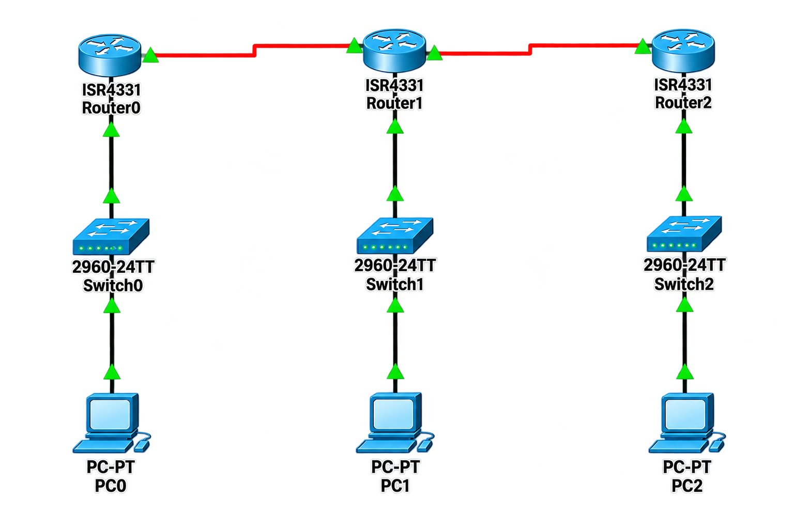

# 🔄 Redistribute Routing

## 📖 Apa itu Redistribute Routing?

**Redistribute Routing** adalah proses memasukkan rute dari satu protokol routing ke dalam protokol routing lainnya. Ini memungkinkan jaringan yang menggunakan protokol routing berbeda untuk saling berkomunikasi dan berbagi informasi routing. Redistribusi sering digunakan ketika menggabungkan beberapa jaringan yang menggunakan protokol routing yang berbeda, seperti OSPF dan BGP.

### 🎯 Tujuan Redistribute Routing:

1. **Interkoneksi Protokol** - Menghubungkan jaringan dengan protokol routing berbeda
2. **Migrasi Jaringan** - Memudahkan transisi dari satu protokol ke protokol lain
3. **Redundansi** - Menyediakan jalur backup antar protokol
4. **Integrasi** - Menggabungkan jaringan internal dengan jaringan eksternal (Internet)
5. **Fleksibilitas** - Memberikan fleksibilitas dalam desain jaringan

### 🏷️ Karakteristik Redistribute Routing:

| Karakteristik | Deskripsi |
|---------------|-----------|
| **Administrative Distance** | Digunakan untuk memilih route terbaik |
| **Metric Translation** | Metrik harus dikonversi antar protokol |
| **Routing Loop** | Potensi routing loop jika tidak hati-hati |
| **Mutual Redistribution** | Redistribusi dua arah |
| **One-Way Redistribution** | Redistribusi satu arah |
| **Route Filtering** | Memfilter route yang akan di-redistribute |

### 📊 Administrative Distance (AD):

| Protokol | Administrative Distance |
|----------|----------------------|
| **Connected** | 0 |
| **Static** | 1 |
| **eBGP** | 20 |
| **EIGRP Internal** | 90 |
| **OSPF** | 110 |
| **RIP** | 120 |
| **EIGRP External** | 170 |
| **iBGP** | 200 |
| **Unknown** | 255 |

### 📝 Redistribute Commands:

| Perintah | Deskripsi |
|----------|-----------|
| `redistribute ospf [process-id] metric [value]` | Redistribute OSPF ke protokol lain |
| `redistribute bgp [as-number] metric [value]` | Redistribute BGP ke protokol lain |
| `redistribute rip metric [value]` | Redistribute RIP ke protokol lain |
| `redistribute eigrp [as-number] metric [value]` | Redistribute EIGRP ke protokol lain |
| `redistribute connected` | Redistribute directly connected networks |
| `redistribute static` | Redistribute static routes |

---

## 🌐 Topologi



---

## 📊 Tabel Perangkat dan IP Address

### Router 1 (OSPF Area 0)

| Perangkat | Antarmuka | IP Address | Netmask | Protokol | Keterangan |
|-----------|-----------|------------|---------|----------|------------|
| **Router 1** | Se0/1/0 | 10.10.10.1 | 255.255.255.0 | OSPF Area 0 | Ke Router 2 |
| **Router 1** | Gi0/0/0 | 192.168.10.1 | 255.255.255.0 | Connected | Ke Switch 1 |

### Router 2 (OSPF Area 0 + BGP AS 6500)

| Perangkat | Antarmuka | IP Address | Netmask | Protokol | Keterangan |
|-----------|-----------|------------|---------|----------|------------|
| **Router 2** | Se0/1/0 | 10.10.10.2 | 255.255.255.0 | OSPF Area 0 | Ke Router 1 |
| **Router 2** | Se0/1/1 | 20.20.20.1 | 255.255.255.0 | BGP AS 6500 | Ke Router 3 |
| **Router 2** | Gi0/0/0 | 192.168.20.1 | 255.255.255.0 | Connected | Ke Switch 2 |

### Router 3 (BGP AS 6501)

| Perangkat | Antarmuka | IP Address | Netmask | Protokol | Keterangan |
|-----------|-----------|------------|---------|----------|------------|
| **Router 3** | Se0/1/1 | 20.20.20.2 | 255.255.255.0 | BGP AS 6501 | Ke Router 2 |
| **Router 3** | Gi0/0/0 | 192.168.30.1 | 255.255.255.0 | Connected | Ke Switch 3 |

### Switch

| Perangkat | Antarmuka | VLAN | Status | Keterangan |
|-----------|-----------|------|--------|------------|
| **Switch 1** | Fa0/1 | VLAN 1 (Native) | Up | Ke Router 1 Gi0/0/0 |
| **Switch 1** | Fa0/2-24 | VLAN 1 (Native) | Up | Ke End-Devices |
| **Switch 2** | Fa0/1 | VLAN 1 (Native) | Up | Ke Router 2 Gi0/0/0 |
| **Switch 2** | Fa0/2-24 | VLAN 1 (Native) | Up | Ke End-Devices |
| **Switch 3** | Fa0/1 | VLAN 1 (Native) | Up | Ke Router 3 Gi0/0/0 |
| **Switch 3** | Fa0/2-24 | VLAN 1 (Native) | Up | Ke End-Devices |

### Perangkat End-User

| Perangkat | Network | IP Address | Netmask | Gateway | Keterangan |
|-----------|---------|------------|---------|---------|------------|
| **PC1** | 192.168.10.0/24 | 192.168.10.10 | 255.255.255.0 | 192.168.10.1 | Terhubung ke SW1 |
| **PC2** | 192.168.10.0/24 | 192.168.10.20 | 255.255.255.0 | 192.168.10.1 | Terhubung ke SW1 |
| **PC3** | 192.168.20.0/24 | 192.168.20.10 | 255.255.255.0 | 192.168.20.1 | Terhubung ke SW2 |
| **PC4** | 192.168.20.0/24 | 192.168.20.20 | 255.255.255.0 | 192.168.20.1 | Terhubung ke SW2 |
| **PC5** | 192.168.30.0/24 | 192.168.30.10 | 255.255.255.0 | 192.168.30.1 | Terhubung ke SW3 |
| **PC6** | 192.168.30.0/24 | 192.168.30.20 | 255.255.255.0 | 192.168.30.1 | Terhubung ke SW3 |

---

## 📋 Detail Konfigurasi

### Router 1

| Antarmuka | IP Address | Subnet Mask | Protokol | Status | Keterangan |
|-----------|------------|-------------|----------|--------|------------|
| Se0/1/0 | 10.10.10.1 | 255.255.255.0 | OSPF Area 0 | Up | Ke Router 2 |
| Gi0/0/0 | 192.168.10.1 | 255.255.255.0 | Connected | Up | Ke Switch 1 |

### Router 2

| Antarmuka | IP Address | Subnet Mask | Protokol | Status | Keterangan |
|-----------|------------|-------------|----------|--------|------------|
| Se0/1/0 | 10.10.10.2 | 255.255.255.0 | OSPF Area 0 | Up | Ke Router 1 |
| Se0/1/1 | 20.20.20.1 | 255.255.255.0 | BGP AS 6500 | Up | Ke Router 3 |
| Gi0/0/0 | 192.168.20.1 | 255.255.255.0 | Connected | Up | Ke Switch 2 |

### Router 3

| Antarmuka | IP Address | Subnet Mask | Protokol | Status | Keterangan |
|-----------|------------|-------------|----------|--------|------------|
| Se0/1/1 | 20.20.20.2 | 255.255.255.0 | BGP AS 6501 | Up | Ke Router 2 |
| Gi0/0/0 | 192.168.30.1 | 255.255.255.0 | Connected | Up | Ke Switch 3 |

### Redistribute Configuration

| Router | Source Protocol | Destination Protocol | Action |
|--------|-----------------|---------------------|--------|
| **Router 2** | Connected (192.168.20.0/24) | OSPF | Redistribute to OSPF |
| **Router 2** | OSPF (10.10.10.0/24, 192.168.10.0/24) | BGP | Redistribute to BGP |
| **Router 2** | BGP (20.20.20.0/24, 192.168.30.0/24) | OSPF | Redistribute to OSPF |

---

## ⚙️ Langkah-Langkah Konfigurasi

### 1. Konfigurasi Router 1 (OSPF Area 0)

#### 1.1 Konfigurasi Dasar Router 1

```cisco
Router> enable
Router# configure terminal
Router(config)# hostname R1

! Nonaktifkan DNS lookup
R1(config)# no ip domain-lookup

! Enkripsi password
R1(config)# service password-encryption

! Set password untuk akses console dan VTY
R1(config)# line console 0
R1(config-line)# password cisco
R1(config-line)# login
R1(config-line)# exit

R1(config)# line vty 0 4
R1(config-line)# password cisco
R1(config-line)# login
R1(config-line)# exit

! Set enable password
R1(config)# enable secret cisco123

R1(config)# end
R1# copy running-config startup-config
```

#### 1.2 Konfigurasi IP Address Router 1

```cisco
R1> enable
R1# configure terminal

! Konfigurasi interface ke Router 2 (Se0/1/0)
R1(config)# interface serial 0/1/0
R1(config-if)# description === LINK TO ROUTER 2 (OSPF Area 0) ===
R1(config-if)# ip address 10.10.10.1 255.255.255.0
R1(config-if)# clock rate 64000
R1(config-if)# no shutdown
R1(config-if)# exit

! Konfigurasi interface ke Switch 1 (Gi0/0/0)
R1(config)# interface gigabitEthernet 0/0/0
R1(config-if)# description === LINK TO SWITCH 1 (192.168.10.0/24) ===
R1(config-if)# ip address 192.168.10.1 255.255.255.0
R1(config-if)# no shutdown
R1(config-if)# exit

R1(config)# end
R1# copy running-config startup-config
```

#### 1.3 Konfigurasi OSPF di Router 1

```cisco
R1> enable
R1# configure terminal

! Aktifkan routing OSPF dengan process ID 1
R1(config)# router ospf 1

! Tambahkan network ke Area 0
R1(config-router)# network 10.10.10.0 0.0.0.255 area 0
R1(config-router)# network 192.168.10.0 0.0.0.255 area 0

! Exit dari mode routing
R1(config-router)# exit

! Verifikasi konfigurasi
R1(config)# end
R1# copy running-config startup-config
```

**Penjelasan:**
- `router ospf 1` : Mengaktifkan routing OSPF dengan Process ID 1
- `network 10.10.10.0 0.0.0.255 area 0` : Mengadvertise network ke Area 0
- `network 192.168.10.0 0.0.0.255 area 0` : Mengadvertise network LAN ke Area 0

---

### 2. Konfigurasi Router 2 (OSPF + BGP + Redistribute)

#### 2.1 Konfigurasi Dasar Router 2

```cisco
Router> enable
Router# configure terminal
Router(config)# hostname R2

! Nonaktifkan DNS lookup
R2(config)# no ip domain-lookup

! Enkripsi password
R2(config)# service password-encryption

! Set password untuk akses console dan VTY
R2(config)# line console 0
R2(config-line)# password cisco
R2(config-line)# login
R2(config-line)# exit

R2(config)# line vty 0 4
R2(config-line)# password cisco
R2(config-line)# login
R2(config-line)# exit

! Set enable password
R2(config)# enable secret cisco123

R2(config)# end
R2# copy running-config startup-config
```

#### 2.2 Konfigurasi IP Address Router 2

```cisco
R2> enable
R2# configure terminal

! Konfigurasi interface ke Router 1 (Se0/1/0 - OSPF)
R2(config)# interface serial 0/1/0
R2(config-if)# description === LINK TO ROUTER 1 (OSPF Area 0) ===
R2(config-if)# ip address 10.10.10.2 255.255.255.0
R2(config-if)# no shutdown
R2(config-if)# exit

! Konfigurasi interface ke Router 3 (Se0/1/1 - BGP)
R2(config)# interface serial 0/1/1
R2(config-if)# description === LINK TO ROUTER 3 (BGP AS 6500) ===
R2(config-if)# ip address 20.20.20.1 255.255.255.0
R2(config-if)# clock rate 64000
R2(config-if)# no shutdown
R2(config-if)# exit

! Konfigurasi interface ke Switch 2 (Gi0/0/0)
R2(config)# interface gigabitEthernet 0/0/0
R2(config-if)# description === LINK TO SWITCH 2 (192.168.20.0/24) ===
R2(config-if)# ip address 192.168.20.1 255.255.255.0
R2(config-if)# no shutdown
R2(config-if)# exit

R2(config)# end
R2# copy running-config startup-config
```

#### 2.3 Konfigurasi OSPF di Router 2

```cisco
R2> enable
R2# configure terminal

! Aktifkan routing OSPF dengan process ID 1
R2(config)# router ospf 1

! Tambahkan network ke Area 0
R2(config-router)# network 10.10.10.0 0.0.0.255 area 0

! Redistribute connected network ke OSPF
R2(config-router)# redistribute connected subnets

! Redistribute BGP ke OSPF
R2(config-router)# redistribute bgp 6500 subnets

! Exit dari mode routing
R2(config-router)# exit

R2(config)# end
R2# copy running-config startup-config
```

**Penjelasan:**
- `router ospf 1` : Mengaktifkan routing OSPF
- `network 10.10.10.0 0.0.0.255 area 0` : Mengadvertise network ke Area 0
- `redistribute connected subnets` : Redistribute network yang terhubung langsung (192.168.20.0/24)
- `redistribute bgp 6500 subnets` : Redistribute route dari BGP ke OSPF (dengan subnet mask)

#### 2.4 Konfigurasi BGP di Router 2

```cisco
R2> enable
R2# configure terminal

! Aktifkan routing BGP dengan AS 6500
R2(config)# router bgp 6500

! Konfigurasi BGP Router ID
R2(config-router)# bgp router-id 2.2.2.2

! Konfigurasi neighbor ke Router 3 (AS 6501)
R2(config-router)# neighbor 20.20.20.2 remote-as 6501

! Redistribute OSPF ke BGP
R2(config-router)# redistribute ospf 1

! Redistribute connected network ke BGP
R2(config-router)# redistribute connected

! Exit dari mode routing
R2(config-router)# exit

R2(config)# end
R2# copy running-config startup-config
```

**Penjelasan:**
- `router bgp 6500` : Mengaktifkan routing BGP dengan AS 6500
- `bgp router-id 2.2.2.2` : Menentukan Router ID
- `neighbor 20.20.20.2 remote-as 6501` : Menentukan neighbor BGP (Router 3) dengan AS 6501
- `redistribute ospf 1` : Redistribute route OSPF ke BGP
- `redistribute connected` : Redistribute network yang terhubung langsung ke BGP

---

### 3. Konfigurasi Router 3 (BGP AS 6501)

#### 3.1 Konfigurasi Dasar Router 3

```cisco
Router> enable
Router# configure terminal
Router(config)# hostname R3

! Nonaktifkan DNS lookup
R3(config)# no ip domain-lookup

! Enkripsi password
R3(config)# service password-encryption

! Set password untuk akses console dan VTY
R3(config)# line console 0
R3(config-line)# password cisco
R3(config-line)# login
R3(config-line)# exit

R3(config)# line vty 0 4
R3(config-line)# password cisco
R3(config-line)# login
R3(config-line)# exit

! Set enable password
R3(config)# enable secret cisco123

R3(config)# end
R3# copy running-config startup-config
```

#### 3.2 Konfigurasi IP Address Router 3

```cisco
R3> enable
R3# configure terminal

! Konfigurasi interface ke Router 2 (Se0/1/1 - BGP)
R3(config)# interface serial 0/1/1
R3(config-if)# description === LINK TO ROUTER 2 (BGP AS 6501) ===
R3(config-if)# ip address 20.20.20.2 255.255.255.0
R3(config-if)# no shutdown
R3(config-if)# exit

! Konfigurasi interface ke Switch 3 (Gi0/0/0)
R3(config)# interface gigabitEthernet 0/0/0
R3(config-if)# description === LINK TO SWITCH 3 (192.168.30.0/24) ===
R3(config-if)# ip address 192.168.30.1 255.255.255.0
R3(config-if)# no shutdown
R3(config-if)# exit

R3(config)# end
R3# copy running-config startup-config
```

#### 3.3 Konfigurasi BGP di Router 3

```cisco
R3> enable
R3# configure terminal

! Aktifkan routing BGP dengan AS 6501
R3(config)# router bgp 6501

! Konfigurasi BGP Router ID
R3(config-router)# bgp router-id 3.3.3.3

! Konfigurasi neighbor ke Router 2 (AS 6500)
R3(config-router)# neighbor 20.20.20.1 remote-as 6500

! Advertise network LAN
R3(config-router)# network 192.168.30.0 mask 255.255.255.0

! Exit dari mode routing
R3(config-router)# exit

R3(config)# end
R3# copy running-config startup-config
```

**Penjelasan:**
- `router bgp 6501` : Mengaktifkan routing BGP dengan AS 6501
- `bgp router-id 3.3.3.3` : Menentukan Router ID
- `neighbor 20.20.20.1 remote-as 6500` : Menentukan neighbor BGP (Router 2) dengan AS 6500
- `network 192.168.30.0 mask 255.255.255.0` : Mengadvertise network LAN ke BGP

---

### 4. Konfigurasi Switch

#### 4.1 Konfigurasi Switch 1

```cisco
Switch> enable
Switch# configure terminal
Switch(config)# hostname SW1

! Nonaktifkan DNS lookup
SW1(config)# no ip domain-lookup

! Enkripsi password
SW1(config)# service password-encryption

! Set password untuk akses console dan VTY
SW1(config)# line console 0
SW1(config-line)# password cisco
SW1(config-line)# login
SW1(config-line)# exit

SW1(config)# line vty 0 15
SW1(config-line)# password cisco
SW1(config-line)# login
SW1(config-line)# exit

! Set enable password
SW1(config)# enable secret cisco123

SW1(config)# end
SW1# copy running-config startup-config

! Konfigurasi port Switch 1
SW1> enable
SW1# configure terminal

! Konfigurasi port Fa0/1 ke Router 1
SW1(config)# interface fastEthernet 0/1
SW1(config-if)# description === LINK TO ROUTER 1 ===
SW1(config-if)# switchport mode access
SW1(config-if)# switchport access vlan 1
SW1(config-if)# no shutdown
SW1(config-if)# exit

! Konfigurasi port Fa0/2-24 untuk end-devices
SW1(config)# interface range fastEthernet 0/2 - 24
SW1(config-if-range)# description === END-DEVICES VLAN 1 ===
SW1(config-if-range)# switchport mode access
SW1(config-if-range)# switchport access vlan 1
SW1(config-if-range)# no shutdown
SW1(config-if-range)# exit

SW1(config)# end
SW1# copy running-config startup-config
```

#### 4.2 Konfigurasi Switch 2

```cisco
Switch> enable
Switch# configure terminal
Switch(config)# hostname SW2

! Nonaktifkan DNS lookup
SW2(config)# no ip domain-lookup

! Enkripsi password
SW2(config)# service password-encryption

! Set password untuk akses console dan VTY
SW2(config)# line console 0
SW2(config-line)# password cisco
SW2(config-line)# login
SW2(config-line)# exit

SW2(config)# line vty 0 15
SW2(config-line)# password cisco
SW2(config-line)# login
SW2(config-line)# exit

! Set enable password
SW2(config)# enable secret cisco123

SW2(config)# end
SW2# copy running-config startup-config

! Konfigurasi port Switch 2
SW2> enable
SW2# configure terminal

! Konfigurasi port Fa0/1 ke Router 2
SW2(config)# interface fastEthernet 0/1
SW2(config-if)# description === LINK TO ROUTER 2 ===
SW2(config-if)# switchport mode access
SW2(config-if)# switchport access vlan 1
SW2(config-if)# no shutdown
SW2(config-if)# exit

! Konfigurasi port Fa0/2-24 untuk end-devices
SW2(config)# interface range fastEthernet 0/2 - 24
SW2(config-if-range)# description === END-DEVICES VLAN 1 ===
SW2(config-if-range)# switchport mode access
SW2(config-if-range)# switchport access vlan 1
SW2(config-if-range)# no shutdown
SW2(config-if-range)# exit

SW2(config)# end
SW2# copy running-config startup-config
```

#### 4.3 Konfigurasi Switch 3

```cisco
Switch> enable
Switch# configure terminal
Switch(config)# hostname SW3

! Nonaktifkan DNS lookup
SW3(config)# no ip domain-lookup

! Enkripsi password
SW3(config)# service password-encryption

! Set password untuk akses console dan VTY
SW3(config)# line console 0
SW3(config-line)# password cisco
SW3(config-line)# login
SW3(config-line)# exit

SW3(config)# line vty 0 15
SW3(config-line)# password cisco
SW3(config-line)# login
SW3(config-line)# exit

! Set enable password
SW3(config)# enable secret cisco123

SW3(config)# end
SW3# copy running-config startup-config

! Konfigurasi port Switch 3
SW3> enable
SW3# configure terminal

! Konfigurasi port Fa0/1 ke Router 3
SW3(config)# interface fastEthernet 0/1
SW3(config-if)# description === LINK TO ROUTER 3 ===
SW3(config-if)# switchport mode access
SW3(config-if)# switchport access vlan 1
SW3(config-if)# no shutdown
SW3(config-if)# exit

! Konfigurasi port Fa0/2-24 untuk end-devices
SW3(config)# interface range fastEthernet 0/2 - 24
SW3(config-if-range)# description === END-DEVICES VLAN 1 ===
SW3(config-if-range)# switchport mode access
SW3(config-if-range)# switchport access vlan 1
SW3(config-if-range)# no shutdown
SW3(config-if-range)# exit

SW3(config)# end
SW3# copy running-config startup-config
```

---

### 5. Konfigurasi Perangkat End-User

#### 5.1 PC1 (Terhubung ke SW1)

| Parameter | Nilai |
|-----------|-------|
| IP Address | 192.168.10.10 |
| Netmask | 255.255.255.0 |
| Gateway | 192.168.10.1 |
| DNS | 8.8.8.8 |

#### 5.2 PC2 (Terhubung ke SW1)

| Parameter | Nilai |
|-----------|-------|
| IP Address | 192.168.10.20 |
| Netmask | 255.255.255.0 |
| Gateway | 192.168.10.1 |
| DNS | 8.8.8.8 |

#### 5.3 PC3 (Terhubung ke SW2)

| Parameter | Nilai |
|-----------|-------|
| IP Address | 192.168.20.10 |
| Netmask | 255.255.255.0 |
| Gateway | 192.168.20.1 |
| DNS | 8.8.8.8 |

#### 5.4 PC4 (Terhubung ke SW2)

| Parameter | Nilai |
|-----------|-------|
| IP Address | 192.168.20.20 |
| Netmask | 255.255.255.0 |
| Gateway | 192.168.20.1 |
| DNS | 8.8.8.8 |

#### 5.5 PC5 (Terhubung ke SW3)

| Parameter | Nilai |
|-----------|-------|
| IP Address | 192.168.30.10 |
| Netmask | 255.255.255.0 |
| Gateway | 192.168.30.1 |
| DNS | 8.8.8.8 |

#### 5.6 PC6 (Terhubung ke SW3)

| Parameter | Nilai |
|-----------|-------|
| IP Address | 192.168.30.20 |
| Netmask | 255.255.255.0 |
| Gateway | 192.168.30.1 |
| DNS | 8.8.8.8 |

---

## ✅ Verifikasi Konfigurasi

### 1. Verifikasi IP Address Router 1

```cisco
R1# show ip interface brief
```

**Output yang diharapkan:**
```
Interface              IP-Address      OK? Method Status                Protocol
Serial0/1/0            10.10.10.1      YES manual up                    up
GigabitEthernet0/0/0   192.168.10.1    YES manual up                    up
```

### 2. Verifikasi IP Address Router 2

```cisco
R2# show ip interface brief
```

**Output yang diharapkan:**
```
Interface              IP-Address      OK? Method Status                Protocol
Serial0/1/0            10.10.10.2      YES manual up                    up
Serial0/1/1            20.20.20.1      YES manual up                    up
GigabitEthernet0/0/0   192.168.20.1    YES manual up                    up
```

### 3. Verifikasi IP Address Router 3

```cisco
R3# show ip interface brief
```

**Output yang diharapkan:**
```
Interface              IP-Address      OK? Method Status                Protocol
Serial0/1/1            20.20.20.2      YES manual up                    up
GigabitEthernet0/0/0   192.168.30.1    YES manual up                    up
```

### 4. Verifikasi OSPF Neighbor

```cisco
R1# show ip ospf neighbor
```

**Output yang diharapkan:**
```
Neighbor ID     Pri   State           Dead Time   Address         Interface
10.10.10.2        0   FULL/  -        00:00:35    10.10.10.2      Serial0/1/0
```

### 5. Verifikasi BGP Neighbor

```cisco
R2# show ip bgp summary
```

**Output yang diharapkan:**
```
BGP router identifier 2.2.2.2, local AS number 6500
BGP table version is 1, main routing table version 1

Neighbor        V           AS MsgRcvd MsgSent   TblVer  InQ OutQ Up/Down  State/PfxRcd
20.20.20.2      4          6501    6       6        1    0    0 00:01:23        1
```

### 6. Verifikasi Redistribute di Router 2 (OSPF ke BGP)

```cisco
R2# show ip ospf database
```

**Output yang diharapkan:**
```
            OSPF Router with ID (10.10.10.2) (Process ID 1)

                Router Link States (Area 0)

Link ID         ADV Router      Age         Seq#       Checksum Link count
10.10.10.1      10.10.10.1      21          0x80000004 0x00D2F0 2
10.10.10.2      10.10.10.2      15          0x80000005 0x00D3F1 1

                Net Link States (Area 0)

                Summary Net Link States (Area 0)

                External Link States (Area 0)

Link ID         ADV Router      Age         Seq#       Checksum Tag
192.168.20.0    10.10.10.2      25          0x80000001 0x00A1B7 0
```

### 7. Verifikasi Tabel Routing Router 1 (OSPF Only)

```cisco
R1# show ip route
```

**Output yang diharapkan:**
```
Codes: L - local, C - connected, S - static, R - RIP, M - mobile, B - BGP
       D - EIGRP, EX - EIGRP external, O - OSPF, IA - OSPF inter area
       N1 - OSPF NSSA external type 1, N2 - OSPF NSSA external type 2
       E1 - OSPF external type 1, E2 - OSPF external type 2
       i - IS-IS, su - IS-IS summary, L1 - IS-IS level-1, L2 - IS-IS level-2
       ia - IS-IS inter area, * - candidate default

Gateway of last resort is not set

C    10.10.10.0/24 is directly connected, Serial0/1/0
L    10.10.10.1/32 is directly connected, Serial0/1/0
C    192.168.10.0/24 is directly connected, GigabitEthernet0/0/0
L    192.168.10.1/32 is directly connected, GigabitEthernet0/0/0
O E2 192.168.20.0/24 [110/20] via 10.10.10.2, 00:01:00, Serial0/1/0
O E2 192.168.30.0/24 [110/20] via 10.10.10.2, 00:01:00, Serial0/1/0
```

**Penjelasan:**
- `O E2` = OSPF External Type 2 route (dari redistribute)
- `[110/20]` = Administrative distance 110, metric 20
- Route 192.168.20.0/24 dan 192.168.30.0/24 didapat dari redistribusi di Router 2

### 8. Verifikasi Tabel Routing Router 2 (OSPF + BGP)

```cisco
R2# show ip route
```

**Output yang diharapkan:**
```
Codes: L - local, C - connected, S - static, R - RIP, M - mobile, B - BGP
       D - EIGRP, EX - EIGRP external, O - OSPF, IA - OSPF inter area
       N1 - OSPF NSSA external type 1, N2 - OSPF NSSA external type 2
       E1 - OSPF external type 1, E2 - OSPF external type 2
       i - IS-IS, su - IS-IS summary, L1 - IS-IS level-1, L2 - IS-IS level-2
       ia - IS-IS inter area, * - candidate default

Gateway of last resort is not set

C    10.10.10.0/24 is directly connected, Serial0/1/0
L    10.10.10.2/32 is directly connected, Serial0/1/0
C    20.20.20.0/24 is directly connected, Serial0/1/1
L    20.20.20.1/32 is directly connected, Serial0/1/1
O    192.168.10.0/24 [110/65] via 10.10.10.1, 00:01:00, Serial0/1/0
C    192.168.20.0/24 is directly connected, GigabitEthernet0/0/0
L    192.168.20.1/32 is directly connected, GigabitEthernet0/0/0
B    192.168.30.0/24 [20/0] via 20.20.20.2, 00:01:00
```

### 9. Verifikasi Tabel Routing Router 3 (BGP Only)

```cisco
R3# show ip route
```

**Output yang diharapkan:**
```
Codes: L - local, C - connected, S - static, R - RIP, M - mobile, B - BGP
       D - EIGRP, EX - EIGRP external, O - OSPF, IA - OSPF inter area
       N1 - OSPF NSSA external type 1, N2 - OSPF NSSA external type 2
       E1 - OSPF external type 1, E2 - OSPF external type 2
       i - IS-IS, su - IS-IS summary, L1 - IS-IS level-1, L2 - IS-IS level-2
       ia - IS-IS inter area, * - candidate default

Gateway of last resort is not set

C    20.20.20.0/24 is directly connected, Serial0/1/1
L    20.20.20.2/32 is directly connected, Serial0/1/1
B    192.168.10.0/24 [20/0] via 20.20.20.1, 00:01:00
B    192.168.20.0/24 [20/0] via 20.20.20.1, 00:01:00
C    192.168.30.0/24 is directly connected, GigabitEthernet0/0/0
L    192.168.30.1/32 is directly connected, GigabitEthernet0/0/0
```

### 10. Verifikasi Redistribute di Router 2 (BGP ke OSPF)

```cisco
R2# show ip ospf database external
```

**Output yang diharapkan:**
```
            OSPF Router with ID (10.10.10.2) (Process ID 1)

                Type-5 AS External Link States

Link ID         ADV Router      Age         Seq#       Checksum Tag
192.168.20.0    10.10.10.2      25          0x80000001 0x00A1B7 0
192.168.30.0    10.10.10.2      25          0x80000001 0x00A2B8 0
```

### 11. Verifikasi Koneksi Antar Router

**Dari R1 ke R2:**

```cisco
R1# ping 10.10.10.2
```

**Output yang diharapkan:**
```
!!!!!
```

**Dari R2 ke R3:**

```cisco
R2# ping 20.20.20.2
```

**Output yang diharapkan:**
```
!!!!!
```

### 12. Verifikasi Koneksi Antar PC

**Dari PC1 (192.168.10.10):**

```cmd
ping 192.168.10.1     # ke Gateway R1 - HARUS BERHASIL
ping 192.168.10.20    # ke PC2 - HARUS BERHASIL (sama network)
ping 10.10.10.2       # ke R2 - HARUS BERHASIL
ping 192.168.20.1     # ke Gateway R2 - HARUS BERHASIL (via OSPF)
ping 192.168.20.10    # ke PC3 - HARUS BERHASIL (via OSPF)
ping 20.20.20.2       # ke R3 - HARUS BERHASIL (via OSPF + BGP)
ping 192.168.30.1     # ke Gateway R3 - HARUS BERHASIL (via redistribute)
ping 192.168.30.10    # ke PC5 - HARUS BERHASIL (via redistribute)
```

**Dari PC3 (192.168.20.10):**

```cmd
ping 192.168.20.1     # ke Gateway R2 - HARUS BERHASIL
ping 192.168.20.20    # ke PC4 - HARUS BERHASIL (sama network)
ping 10.10.10.1       # ke R1 - HARUS BERHASIL (via OSPF)
ping 192.168.10.1     # ke Gateway R1 - HARUS BERHASIL (via OSPF)
ping 192.168.10.10    # ke PC1 - HARUS BERHASIL (via OSPF)
ping 20.20.20.2       # ke R3 - HARUS BERHASIL (via BGP)
ping 192.168.30.1     # ke Gateway R3 - HARUS BERHASIL (via redistribute)
ping 192.168.30.10    # ke PC5 - HARUS BERHASIL (via redistribute)
```

**Dari PC5 (192.168.30.10):**

```cmd
ping 192.168.30.1     # ke Gateway R3 - HARUS BERHASIL
ping 192.168.30.20    # ke PC6 - HARUS BERHASIL (sama network)
ping 20.20.20.1       # ke R2 - HARUS BERHASIL (via BGP)
ping 192.168.20.1     # ke Gateway R2 - HARUS BERHASIL (via BGP)
ping 192.168.20.10    # ke PC3 - HARUS BERHASIL (via BGP)
ping 10.10.10.1       # ke R1 - HARUS BERHASIL (via redistribute)
ping 192.168.10.1     # ke Gateway R1 - HARUS BERHASIL (via redistribute)
ping 192.168.10.10    # ke PC1 - HARUS BERHASIL (via redistribute)
```

### 13. Verifikasi Traceroute Antar PC

**Dari PC1 (OSPF Area 0) ke PC5 (BGP AS 6501):**

```cmd
tracert 192.168.30.10
```

**Output yang diharapkan:**
```
Tracing route to 192.168.30.10 over a maximum of 30 hops:

  1    <1 ms    <1 ms    <1 ms  192.168.10.1
  2    <1 ms    <1 ms    <1 ms  10.10.10.2
  3    <1 ms    <1 ms    <1 ms  20.20.20.2
  4    <1 ms    <1 ms    <1 ms  192.168.30.10

Trace complete.
```

### 14. Debugging Redistribute (Opsional)

```cisco
! Untuk melihat debug OSPF
R2# debug ip ospf events

! Untuk melihat debug BGP
R2# debug ip bgp updates

! Untuk melihat redistribute
R2# debug ip ospf lsa-generation

! Matikan debugging
R2# undebug all
```

---

## 📊 Ringkasan Konfigurasi

### Router 1 (OSPF Area 0)

| Parameter | Nilai |
|-----------|-------|
| **Hostname** | R1 |
| **Se0/1/0 IP** | 10.10.10.1/24 (OSPF Area 0) |
| **Gi0/0/0 IP** | 192.168.10.1/24 |
| **Routing Protocol** | OSPF Process 1 |
| **Network Advertised** | 10.10.10.0/24, 192.168.10.0/24 |
| **Area** | 0 |

### Router 2 (OSPF + BGP + Redistribute)

| Parameter | Nilai |
|-----------|-------|
| **Hostname** | R2 |
| **Se0/1/0 IP** | 10.10.10.2/24 (OSPF Area 0) |
| **Se0/1/1 IP** | 20.20.20.1/24 (BGP AS 6500) |
| **Gi0/0/0 IP** | 192.168.20.1/24 |
| **OSPF Process** | 1 |
| **BGP AS** | 6500 |
| **Redistribute (OSPF → BGP)** | OSPF 1, Connected |
| **Redistribute (BGP → OSPF)** | BGP 6500, Connected |

### Router 3 (BGP AS 6501)

| Parameter | Nilai |
|-----------|-------|
| **Hostname** | R3 |
| **Se0/1/1 IP** | 20.20.20.2/24 (BGP AS 6501) |
| **Gi0/0/0 IP** | 192.168.30.1/24 |
| **BGP AS** | 6501 |
| **Network Advertised** | 192.168.30.0/24 |

### Switch

| Perangkat | VLAN | Port ke Router | Port ke PC |
|-----------|------|----------------|------------|
| **SW1** | 1 (Native) | Fa0/1 | Fa0/2-24 |
| **SW2** | 1 (Native) | Fa0/1 | Fa0/2-24 |
| **SW3** | 1 (Native) | Fa0/1 | Fa0/2-24 |

### Redistribute Summary

| Router | Source | Destination | Route yang Diredistribute |
|--------|--------|-------------|--------------------------|
| **R2** | Connected | OSPF | 192.168.20.0/24 |
| **R2** | BGP 6500 | OSPF | 192.168.30.0/24 |
| **R2** | OSPF 1 | BGP | 192.168.10.0/24, 10.10.10.0/24 |
| **R2** | Connected | BGP | 192.168.20.0/24 |

---

## 🔧 Troubleshooting

| Masalah | Kemungkinan Penyebab | Solusi |
|---------|---------------------|--------|
| Route OSPF tidak masuk ke BGP | Redistribute tidak dikonfigurasi | Cek `router bgp` dan `redistribute ospf` |
| Route BGP tidak masuk ke OSPF | Redistribute tidak dikonfigurasi | Cek `router ospf` dan `redistribute bgp` |
| Route tidak muncul di tabel routing | Metric tidak sesuai | Set metric yang sesuai untuk redistribute |
| Routing loop | Mutual redistribution tanpa filtering | Gunakan route-map untuk filtering |
| Subnet mask hilang | Tidak menggunakan keyword "subnets" | Tambahkan `subnets` pada redistribute |
| Metric tidak tepat | Default metric tidak sesuai | Set metric manual dengan `metric [value]` |
| BGP neighbor tidak established | IP address salah atau AS mismatch | Cek `show ip bgp summary` |
| OSPF neighbor tidak FULL | Area berbeda atau timer berbeda | Cek `show ip ospf neighbor` |
| Administrative Distance conflict | AD yang sama menyebabkan ambiguity | Set AD yang berbeda menggunakan distance |
| Route flapping | Redistribusi mutual | Gunakan route-map dengan tagging |

---

## 📚 Referensi

- [Cisco Route Redistribution Documentation](https://www.cisco.com/c/en/us/support/docs/ip/ip-routing/26047-21.html)
- [Cisco OSPF Redistribution](https://www.cisco.com/c/en/us/support/docs/ip/open-shortest-path-first-ospf/18977-7.html)
- [Cisco BGP Redistribution](https://www.cisco.com/c/en/us/support/docs/ip/border-gateway-protocol-bgp/51472-8.html)

---