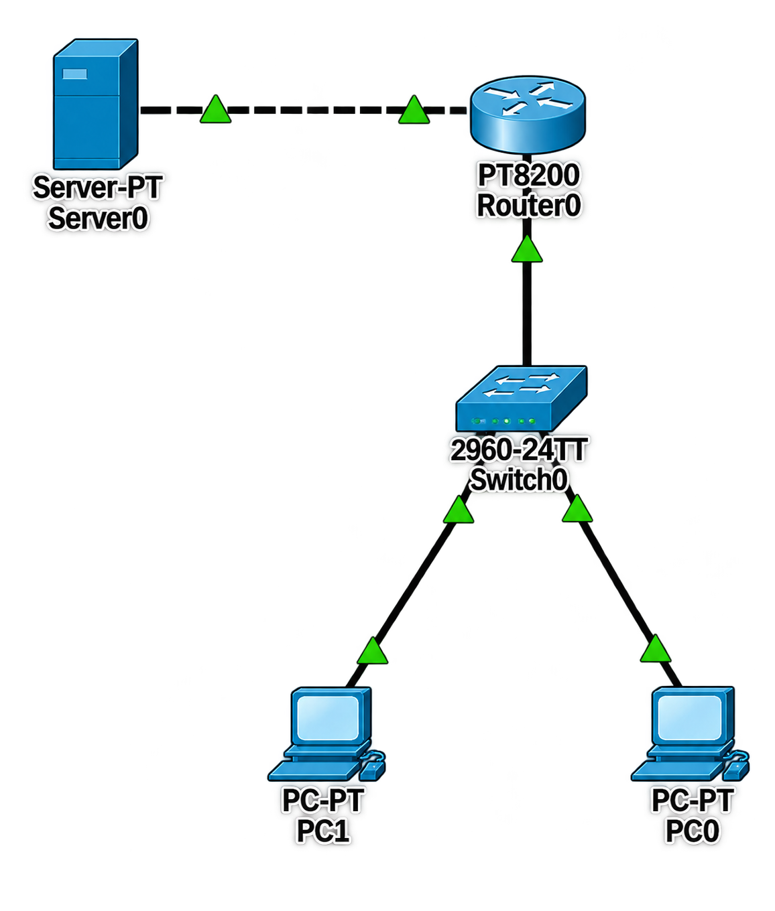

# 🛡️ Access-List (ACL)

## 📖 Apa itu Access-List?

**Access-List (ACL)** adalah mekanisme keamanan pada perangkat jaringan yang berfungsi untuk memfilter lalu lintas data berdasarkan kriteria tertentu seperti alamat IP, protokol, port, dan lain-lain. ACL digunakan untuk mengontrol akses ke jaringan, meningkatkan keamanan, dan mengelola lalu lintas data.

### 🎯 Tujuan Access-List:

1. **Keamanan** - Membatasi akses ke jaringan atau server tertentu
2. **Traffic Filtering** - Memfilter paket data berdasarkan aturan yang ditentukan
3. **Network Management** - Mengontrol lalu lintas untuk manajemen jaringan
4. **QoS** - Membedakan lalu lintas untuk kualitas layanan
5. **NAT** - Menentukan lalu lintas yang akan di-NAT

### 🏷️ Jenis-Jenis Access-List:

| Jenis ACL | Deskripsi | Range |
|-----------|-----------|-------|
| **Standard ACL** | Memfilter berdasarkan IP address sumber | 1-99, 1300-1999 |
| **Extended ACL** | Memfilter berdasarkan IP sumber, tujuan, protokol, port | 100-199, 2000-2699 |
| **Named ACL** | ACL dengan nama yang lebih deskriptif | - |
| **IPv6 ACL** | ACL untuk IPv6 | - |

### 📝 Struktur Access-List:

| Komponen | Standard ACL | Extended ACL |
|----------|-------------|--------------|
| **Access List Number** | 1-99, 1300-1999 | 100-199, 2000-2699 |
| **Action** | permit/deny | permit/deny |
| **Protocol** | - | IP, TCP, UDP, ICMP, dll |
| **Source IP** | IP Address + Wildcard | IP Address + Wildcard |
| **Destination IP** | - | IP Address + Wildcard |
| **Port** | - | Source/Destination Port |

### 🎯 Wildcard Mask:

| Wildcard Mask | Deskripsi |
|---------------|-----------|
| **0.0.0.0** | Match dengan IP tertentu (host) |
| **0.0.0.255** | Match dengan /24 network |
| **255.255.255.255** | Match dengan semua IP (any) |
| **0.0.255.255** | Match dengan /16 network |
| **255.255.255.0** | Inverse dari subnet mask 0.0.0.255 |

---

## 🌐 Topologi



---

## 📊 Tabel Perangkat dan IP Address

### Router

| Perangkat | Antarmuka | IP Address | Netmask | Keterangan |
|-----------|-----------|------------|---------|------------|
| **Router** | Gi0/0/0.10 | 192.168.10.1 | 255.255.255.0 | Sub-interface VLAN 10 |
| **Router** | Gi0/0/0.20 | 192.168.20.1 | 255.255.255.0 | Sub-interface VLAN 20 |
| **Router** | Gi0/0/1 | 10.0.0.1 | 255.255.255.252 | Ke Server |

### Server

| Perangkat | Antarmuka | IP Address | Netmask | Gateway | Keterangan |
|-----------|-----------|------------|---------|---------|------------|
| **Server** | NIC | 10.0.0.2 | 255.255.255.252 | 10.0.0.1 | Server yang dilindungi ACL |

### Switch

| Perangkat | Antarmuka | VLAN | Status | Keterangan |
|-----------|-----------|------|--------|------------|
| **Switch** | Fa0/1 | Trunk (802.1Q) | Up | Ke Router |
| **Switch** | Fa0/2 | VLAN 10 | Up | Ke PC VLAN 10 |
| **Switch** | Fa0/3 | VLAN 20 | Up | Ke PC VLAN 20 |
| **Switch** | Fa0/4-24 | VLAN 999 | Down | Blackhole |
| **Switch** | Gi0/1-2 | VLAN 999 | Down | Blackhole |

### Perangkat End-User

| Perangkat | VLAN | IP Address | Netmask | Gateway | Keterangan |
|-----------|------|------------|---------|---------|------------|
| **PC1** | VLAN 10 | 192.168.10.10 | 255.255.255.0 | 192.168.10.1 | Terhubung ke SW Fa0/2 |
| **PC2** | VLAN 10 | 192.168.10.20 | 255.255.255.0 | 192.168.10.1 | Terhubung ke SW Fa0/2 |
| **PC3** | VLAN 20 | 192.168.20.10 | 255.255.255.0 | 192.168.20.1 | Terhubung ke SW Fa0/3 |
| **PC4** | VLAN 20 | 192.168.20.20 | 255.255.255.0 | 192.168.20.1 | Terhubung ke SW Fa0/3 |

---

## 📋 Detail Konfigurasi

### Router

| Antarmuka | IP Address | Subnet Mask | Status | Keterangan |
|-----------|------------|-------------|--------|------------|
| Gi0/0/0.10 | 192.168.10.1 | 255.255.255.0 | Up | VLAN 10 Gateway |
| Gi0/0/0.20 | 192.168.20.1 | 255.255.255.0 | Up | VLAN 20 Gateway |
| Gi0/0/1 | 10.0.0.1 | 255.255.255.252 | Up | Ke Server |

### ACL Configuration

| ACL Number | Type | Rule | Action | Source | Destination | Keterangan |
|------------|------|------|--------|--------|-------------|------------|
| **100** | Extended | 10 | DENY | VLAN 10 (192.168.10.0/24) | Server (10.0.0.2/32) | VLAN 10 tidak bisa ke server |
| **100** | Extended | 20 | PERMIT | VLAN 20 (192.168.20.0/24) | Server (10.0.0.2/32) | VLAN 20 bisa ke server |
| **100** | Extended | 30 | PERMIT | Any | Any | Izinkan semua traffic lainnya |

---

## ⚙️ Langkah-Langkah Konfigurasi

### 1. Konfigurasi Router

#### 1.1 Konfigurasi Dasar Router

```cisco
Router> enable
Router# configure terminal
Router(config)# hostname R1

! Nonaktifkan DNS lookup
R1(config)# no ip domain-lookup

! Enkripsi password
R1(config)# service password-encryption

! Set password untuk akses console dan VTY
R1(config)# line console 0
R1(config-line)# password cisco
R1(config-line)# login
R1(config-line)# exit

R1(config)# line vty 0 4
R1(config-line)# password cisco
R1(config-line)# login
R1(config-line)# exit

! Set enable password
R1(config)# enable secret cisco123

R1(config)# end
R1# copy running-config startup-config
```

#### 1.2 Konfigurasi IP Address Router

```cisco
R1> enable
R1# configure terminal

! Aktifkan interface fisik Gi0/0/0
R1(config)# interface gigabitEthernet 0/0/0
R1(config-if)# no shutdown
R1(config-if)# exit

! Buat sub-interface untuk VLAN 10
R1(config)# interface gigabitEthernet 0/0/0.10
R1(config-subif)# description === VLAN 10 Gateway ===
R1(config-subif)# encapsulation dot1Q 10
R1(config-subif)# ip address 192.168.10.1 255.255.255.0
R1(config-subif)# no shutdown
R1(config-subif)# exit

! Buat sub-interface untuk VLAN 20
R1(config)# interface gigabitEthernet 0/0/0.20
R1(config-subif)# description === VLAN 20 Gateway ===
R1(config-subif)# encapsulation dot1Q 20
R1(config-subif)# ip address 192.168.20.1 255.255.255.0
R1(config-subif)# no shutdown
R1(config-subif)# exit

! Konfigurasi interface ke Server
R1(config)# interface gigabitEthernet 0/0/1
R1(config-if)# description === LINK TO SERVER ===
R1(config-if)# ip address 10.0.0.1 255.255.255.252
R1(config-if)# no shutdown
R1(config-if)# exit

R1(config)# end
R1# copy running-config startup-config
```

#### 1.3 Konfigurasi Access-List

```cisco
R1> enable
R1# configure terminal

! Buat Extended ACL 100
R1(config)# access-list 100 deny ip 192.168.10.0 0.0.0.255 host 10.0.0.2
R1(config)# access-list 100 permit ip 192.168.20.0 0.0.0.255 host 10.0.0.2
R1(config)# access-list 100 permit ip any any

! Aplikasikan ACL ke interface Gi0/0/1 (outbound)
R1(config)# interface gigabitEthernet 0/0/1
R1(config-if)# ip access-group 100 out
R1(config-if)# exit

R1(config)# end
R1# copy running-config startup-config
```

**Penjelasan:**
- `access-list 100 deny ip 192.168.10.0 0.0.0.255 host 10.0.0.2` : 
  - `100` = Extended ACL number
  - `deny` = Menolak traffic
  - `ip` = Semua protokol IP
  - `192.168.10.0 0.0.0.255` = Network VLAN 10 dengan wildcard mask
  - `host 10.0.0.2` = Server IP (host = single IP)

- `access-list 100 permit ip 192.168.20.0 0.0.0.255 host 10.0.0.2` :
  - Mengizinkan VLAN 20 ke server

- `access-list 100 permit ip any any` :
  - Mengizinkan semua traffic lainnya (harus ada agar traffic lain tidak terblokir)

- `ip access-group 100 out` :
  - Menerapkan ACL 100 pada interface Gi0/0/1 dengan arah outbound
  - `out` = Paket yang keluar dari interface menuju server

#### 1.4 Verifikasi ACL

```cisco
R1# show access-lists
```

---

### 2. Konfigurasi Switch

#### 2.1 Konfigurasi Dasar Switch

```cisco
Switch> enable
Switch# configure terminal
Switch(config)# hostname SW1

! Nonaktifkan DNS lookup
SW1(config)# no ip domain-lookup

! Enkripsi password
SW1(config)# service password-encryption

! Set password untuk akses console dan VTY
SW1(config)# line console 0
SW1(config-line)# password cisco
SW1(config-line)# login
SW1(config-line)# exit

SW1(config)# line vty 0 15
SW1(config-line)# password cisco
SW1(config-line)# login
SW1(config-line)# exit

! Set enable password
SW1(config)# enable secret cisco123

SW1(config)# end
SW1# copy running-config startup-config
```

#### 2.2 Membuat VLAN

```cisco
SW1> enable
SW1# configure terminal

! Buat VLAN 10
SW1(config)# vlan 10
SW1(config-vlan)# name DATA_VLAN_10
SW1(config-vlan)# exit

! Buat VLAN 20
SW1(config)# vlan 20
SW1(config-vlan)# name DATA_VLAN_20
SW1(config-vlan)# exit

! Buat VLAN 999 (Blackhole)
SW1(config)# vlan 999
SW1(config-vlan)# name BLACKHOLE
SW1(config-vlan)# exit

SW1(config)# end
SW1# copy running-config startup-config
```

#### 2.3 Konfigurasi Trunk ke Router

```cisco
SW1> enable
SW1# configure terminal

! Interface Fa0/1 sebagai Trunk ke Router
SW1(config)# interface fastEthernet 0/1
SW1(config-if)# description === TRUNK TO ROUTER ===
SW1(config-if)# switchport trunk encapsulation dot1q
SW1(config-if)# switchport mode trunk
SW1(config-if)# switchport trunk native vlan 999
SW1(config-if)# switchport trunk allowed vlan 10,20
SW1(config-if)# no shutdown
SW1(config-if)# exit

SW1(config)# end
SW1# copy running-config startup-config
```

#### 2.4 Konfigurasi Access Port VLAN 10

```cisco
SW1> enable
SW1# configure terminal

! Interface Fa0/2 untuk VLAN 10
SW1(config)# interface fastEthernet 0/2
SW1(config-if)# description === PC - VLAN 10 ===
SW1(config-if)# switchport mode access
SW1(config-if)# switchport access vlan 10
SW1(config-if)# no shutdown
SW1(config-if)# exit

SW1(config)# end
SW1# copy running-config startup-config
```

#### 2.5 Konfigurasi Access Port VLAN 20

```cisco
SW1> enable
SW1# configure terminal

! Interface Fa0/3 untuk VLAN 20
SW1(config)# interface fastEthernet 0/3
SW1(config-if)# description === PC - VLAN 20 ===
SW1(config-if)# switchport mode access
SW1(config-if)# switchport access vlan 20
SW1(config-if)# no shutdown
SW1(config-if)# exit

SW1(config)# end
SW1# copy running-config startup-config
```

#### 2.6 Konfigurasi Blackhole VLAN 999

```cisco
SW1> enable
SW1# configure terminal

! Interface Fa0/4-24 sebagai Blackhole
SW1(config)# interface range fastEthernet 0/4 - 24
SW1(config-if-range)# description === BLACKHOLE - UNUSED ===
SW1(config-if-range)# switchport mode access
SW1(config-if-range)# switchport access vlan 999
SW1(config-if-range)# shutdown
SW1(config-if-range)# exit

! Interface Gi0/1-2 sebagai Blackhole
SW1(config)# interface range gigabitEthernet 0/1 - 2
SW1(config-if-range)# description === BLACKHOLE - UNUSED ===
SW1(config-if-range)# switchport mode access
SW1(config-if-range)# switchport access vlan 999
SW1(config-if-range)# shutdown
SW1(config-if-range)# exit

SW1(config)# end
SW1# copy running-config startup-config
```

---

### 3. Konfigurasi Server

#### 3.1 Konfigurasi IP Address Server

| Parameter | Nilai |
|-----------|-------|
| IP Address | 10.0.0.2 |
| Netmask | 255.255.255.252 |
| Gateway | 10.0.0.1 |
| DNS | 8.8.8.8 |

---

### 4. Konfigurasi Perangkat End-User

#### 4.1 PC1 (VLAN 10)

| Parameter | Nilai |
|-----------|-------|
| IP Address | 192.168.10.10 |
| Netmask | 255.255.255.0 |
| Gateway | 192.168.10.1 |
| DNS | 8.8.8.8 |

#### 4.2 PC2 (VLAN 10)

| Parameter | Nilai |
|-----------|-------|
| IP Address | 192.168.10.20 |
| Netmask | 255.255.255.0 |
| Gateway | 192.168.10.1 |
| DNS | 8.8.8.8 |

#### 4.3 PC3 (VLAN 20)

| Parameter | Nilai |
|-----------|-------|
| IP Address | 192.168.20.10 |
| Netmask | 255.255.255.0 |
| Gateway | 192.168.20.1 |
| DNS | 8.8.8.8 |

#### 4.4 PC4 (VLAN 20)

| Parameter | Nilai |
|-----------|-------|
| IP Address | 192.168.20.20 |
| Netmask | 255.255.255.0 |
| Gateway | 192.168.20.1 |
| DNS | 8.8.8.8 |

---

## ✅ Verifikasi Konfigurasi

### 1. Verifikasi IP Address Router

```cisco
R1# show ip interface brief
```

**Output yang diharapkan:**
```
Interface              IP-Address      OK? Method Status                Protocol
GigabitEthernet0/0/0   unassigned      YES unset  up                    up
GigabitEthernet0/0/0.10 192.168.10.1   YES manual up                    up
GigabitEthernet0/0/0.20 192.168.20.1   YES manual up                    up
GigabitEthernet0/0/1   10.0.0.1        YES manual up                    up
```

### 2. Verifikasi Access-List

```cisco
R1# show access-lists
```

**Output yang diharapkan:**
```
Extended IP access list 100
    10 deny ip 192.168.10.0 0.0.0.255 host 10.0.0.2
    20 permit ip 192.168.20.0 0.0.0.255 host 10.0.0.2
    30 permit ip any any
```

### 3. Verifikasi ACL Applied to Interface

```cisco
R1# show ip interface gigabitEthernet 0/0/1
```

**Output yang diharapkan:**
```
GigabitEthernet0/0/1 is up, line protocol is up
  Internet address is 10.0.0.1/30
  Broadcast address is 255.255.255.255
  Address determined by setup command
  MTU is 1500 bytes
  Helper address is not set
  Directed broadcast forwarding is disabled
  Outgoing access list is 100
  ...
```

### 4. Verifikasi Konfigurasi Switch

```cisco
SW1# show vlan brief
```

**Output yang diharapkan:**
```
VLAN Name                             Status    Ports
---- -------------------------------- --------- -------------------------------
1    default                          active    Fa0/0, Gi0/0
10   DATA_VLAN_10                     active    Fa0/2
20   DATA_VLAN_20                     active    Fa0/3
999  BLACKHOLE                        active    Fa0/4, Fa0/5, ... Fa0/24, Gi0/1, Gi0/2
```

### 5. Verifikasi Trunk

```cisco
SW1# show interfaces trunk
```

**Output yang diharapkan:**
```
Port        Mode         Encapsulation  Status        Native vlan
Fa0/1       on           802.1q         trunking      999

Port        Vlans allowed on trunk
Fa0/1       10,20

Port        Vlans allowed and active in management domain
Fa0/1       10,20

Port        Vlans in spanning tree forwarding state and not pruned
Fa0/1       10,20
```

### 6. Verifikasi ACL dengan ICMP (Ping Test)

**Dari PC1 (VLAN 10 - 192.168.10.10) ke Server:**

```cmd
ping 10.0.0.2
```

**Output yang diharapkan:**
```
Pinging 10.0.0.2 with 32 bytes of data:
Request timed out.
Request timed out.
Request timed out.
Request timed out.

Ping statistics for 10.0.0.2:
    Packets: Sent = 4, Received = 0, Lost = 4 (100% loss)
```

**Penjelasan:** VLAN 10 **TIDAK BISA** mencapai server (diblokir ACL)

---

**Dari PC3 (VLAN 20 - 192.168.20.10) ke Server:**

```cmd
ping 10.0.0.2
```

**Output yang diharapkan:**
```
Pinging 10.0.0.2 with 32 bytes of data:
Reply from 10.0.0.2: bytes=32 time<1ms TTL=255
Reply from 10.0.0.2: bytes=32 time<1ms TTL=255
Reply from 10.0.0.2: bytes=32 time<1ms TTL=255
Reply from 10.0.0.2: bytes=32 time<1ms TTL=255

Ping statistics for 10.0.0.2:
    Packets: Sent = 4, Received = 4, Lost = 0 (0% loss)
```

**Penjelasan:** VLAN 20 **BISA** mencapai server (diizinkan ACL)

---

### 7. Verifikasi ACL dengan ACL Hit Count

```cisco
R1# show access-lists 100
```

**Output yang diharapkan:**
```
Extended IP access list 100
    10 deny ip 192.168.10.0 0.0.0.255 host 10.0.0.2 (8 matches)
    20 permit ip 192.168.20.0 0.0.0.255 host 10.0.0.2 (4 matches)
    30 permit ip any any (10 matches)
```

**Penjelasan:**
- `(8 matches)` = 8 paket dari VLAN 10 telah ditolak
- `(4 matches)` = 4 paket dari VLAN 20 telah diizinkan
- `(10 matches)` = 10 paket lainnya telah diizinkan

### 8. Verifikasi Koneksi Antar VLAN

**Dari PC1 (VLAN 10) ke PC3 (VLAN 20):**

```cmd
ping 192.168.20.10
```

**Output yang diharapkan:**
```
Pinging 192.168.20.10 with 32 bytes of data:
Reply from 192.168.20.10: bytes=32 time<1ms TTL=127
Reply from 192.168.20.10: bytes=32 time<1ms TTL=127
Reply from 192.168.20.10: bytes=32 time<1ms TTL=127
Reply from 192.168.20.10: bytes=32 time<1ms TTL=127

Ping statistics for 192.168.20.10:
    Packets: Sent = 4, Received = 4, Lost = 0 (0% loss)
```

**Penjelasan:** Komunikasi antar VLAN tetap berjalan normal

**Dari PC3 (VLAN 20) ke PC1 (VLAN 10):**

```cmd
ping 192.168.10.10
```

**Output yang diharapkan:**
```
Pinging 192.168.10.10 with 32 bytes of data:
Reply from 192.168.10.10: bytes=32 time<1ms TTL=127
Reply from 192.168.10.10: bytes=32 time<1ms TTL=127
Reply from 192.168.10.10: bytes=32 time<1ms TTL=127
Reply from 192.168.10.10: bytes=32 time<1ms TTL=127

Ping statistics for 192.168.10.10:
    Packets: Sent = 4, Received = 4, Lost = 0 (0% loss)
```

---

### 9. Verifikasi Traceroute

**Dari PC1 (VLAN 10) ke Server:**

```cmd
tracert 10.0.0.2
```

**Output yang diharapkan:**
```
Tracing route to 10.0.0.2 over a maximum of 30 hops:

  1    <1 ms    <1 ms    <1 ms  192.168.10.1
  2     *        *        *     Request timed out.
  3     *        *        *     Request timed out.
  4     *        *        *     Request timed out.
```

**Penjelasan:** Paket dari VLAN 10 terblokir di router sebelum mencapai server

---

### 10. Debugging ACL (Opsional)

```cisco
! Untuk melihat log ACL
R1# access-list 100 deny ip 192.168.10.0 0.0.0.255 host 10.0.0.2 log

! Aktifkan debug ACL
R1# debug ip packet detail

! Matikan debugging
R1# undebug all
```

---

## 📊 Ringkasan Konfigurasi

### Router

| Parameter | Nilai |
|-----------|-------|
| **Hostname** | R1 |
| **Gi0/0/0.10 IP** | 192.168.10.1/24 (VLAN 10 Gateway) |
| **Gi0/0/0.20 IP** | 192.168.20.1/24 (VLAN 20 Gateway) |
| **Gi0/0/1 IP** | 10.0.0.1/30 (Ke Server) |
| **ACL Number** | 100 (Extended ACL) |
| **ACL Rule 10** | Deny VLAN 10 → Server |
| **ACL Rule 20** | Permit VLAN 20 → Server |
| **ACL Rule 30** | Permit any any |
| **ACL Applied** | Gi0/0/1 (outbound) |

### Switch

| Parameter | Nilai |
|-----------|-------|
| **Hostname** | SW1 |
| **VLAN 10** | DATA_VLAN_10 (Fa0/2) |
| **VLAN 20** | DATA_VLAN_20 (Fa0/3) |
| **VLAN 999** | BLACKHOLE (Fa0/4-24, Gi0/1-2) |
| **Trunk Port** | Fa0/1 (ke Router) |
| **Native VLAN** | 999 |

### Server

| Parameter | Nilai |
|-----------|-------|
| **IP Address** | 10.0.0.2/30 |
| **Gateway** | 10.0.0.1 |

### PC

| Perangkat | VLAN | IP Address | Gateway | Akses ke Server |
|-----------|------|------------|---------|-----------------|
| **PC1** | 10 | 192.168.10.10 | 192.168.10.1 | ❌ DIBLOKIR |
| **PC2** | 10 | 192.168.10.20 | 192.168.10.1 | ❌ DIBLOKIR |
| **PC3** | 20 | 192.168.20.10 | 192.168.20.1 | ✅ DIIZINKAN |
| **PC4** | 20 | 192.168.20.20 | 192.168.20.1 | ✅ DIIZINKAN |

---

## 🔧 Troubleshooting

| Masalah | Kemungkinan Penyebab | Solusi |
|---------|---------------------|--------|
| ACL tidak bekerja | ACL tidak diaplikasikan ke interface | Cek `show ip interface` |
| Semua traffic terblokir | Tidak ada permit any any | Tambahkan `permit ip any any` |
| VLAN 10 masih bisa ke server | ACL diterapkan dengan arah salah | Cek arah ACL (in/out) |
| VLAN 20 tidak bisa ke server | ACL rule salah | Cek `show access-lists` |
| PC tidak bisa ping gateway | Interface down | Cek `show ip interface brief` |
| Trunk tidak aktif | Native VLAN mismatch | Pastikan native VLAN sama di kedua ujung |
| ACL tidak match | Wildcard mask salah | Cek wildcard mask yang digunakan |
| ACL tidak match | IP address salah | Cek IP address di ACL |

---

## 📚 Referensi

- [Cisco Access Control Lists Documentation](https://www.cisco.com/c/en/us/support/docs/security/ios-firewall/23602-confaccesslists.html)
- [Cisco Extended ACL Configuration](https://www.cisco.com/c/en/us/td/docs/ios-xml/ios/security/a1/sec-a1-cr-book/sec-cr-a1.html)
- [Cisco ACL Best Practices](https://www.cisco.com/c/en/us/support/docs/security/ios-firewall/65327-acl-trouble.html)

---