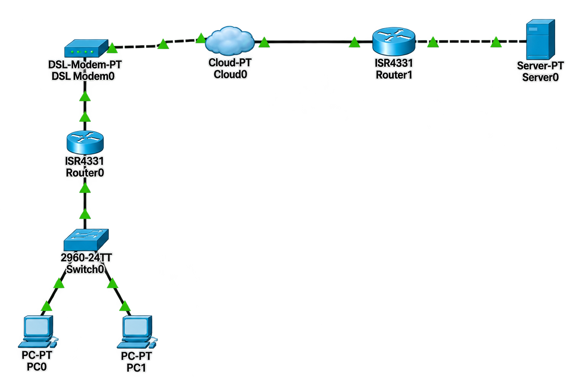

# 🔄 NAT (Network Address Translation)

## 📖 Apa itu NAT?

**NAT (Network Address Translation)** adalah teknologi yang memungkinkan perangkat jaringan seperti router untuk menerjemahkan alamat IP dari satu jaringan ke jaringan lainnya. NAT berfungsi sebagai jembatan antara jaringan lokal (private) dan jaringan publik (internet) dengan mengubah alamat IP private menjadi alamat IP public yang terdaftar.

### 🎯 Tujuan NAT:

1. **Menghemat IPv4** - Memungkinkan banyak perangkat menggunakan satu alamat IP publik
2. **Keamanan** - Menyembunyikan struktur jaringan internal dari publik
3. **Konektivitas** - Memungkinkan perangkat dengan IP private mengakses internet
4. **Fleksibilitas** - Memudahkan migrasi dan perubahan jaringan
5. **Load Balancing** - Mendistribusikan traffic ke beberapa server

### 🏷️ Konsep Dasar NAT:

| Istilah | Deskripsi |
|---------|-----------|
| **Inside Local** | Alamat IP private di dalam jaringan lokal |
| **Inside Global** | Alamat IP public yang terdaftar di internet |
| **Outside Local** | Alamat IP tujuan dari perspektif lokal |
| **Outside Global** | Alamat IP tujuan dari perspektif global |
| **Inside Network** | Jaringan internal yang menggunakan IP private |
| **Outside Network** | Jaringan eksternal (internet) yang menggunakan IP public |

---

## 📊 Jenis-Jenis NAT

### 1. Static NAT (1-to-1)

**Static NAT** adalah penerjemahan satu-ke-satu antara alamat IP private dengan alamat IP public. Setiap alamat IP private dipetakan secara permanen ke satu alamat IP public.

**Karakteristik:**
- Pemetaan 1:1 antara IP private dan IP public
- Tetap/permanen
- Digunakan untuk server yang perlu diakses dari internet
- Memerlukan satu IP public untuk setiap IP private

**Contoh Konfigurasi:**
```cisco
ip nat inside source static 192.168.10.10 8.8.8.10
```

**Ilustrasi:**
```
Inside Local (Private)    →    Inside Global (Public)
192.168.10.10             →    8.8.8.10
192.168.10.20             →    8.8.8.20
```

**Keunggulan:**
- Server dapat diakses dari internet
- Mudah untuk hosting aplikasi

**Kekurangan:**
- Membutuhkan banyak IP public
- Tidak efisien untuk banyak perangkat

---

### 2. Dynamic NAT (Many-to-Many)

**Dynamic NAT** adalah penerjemahan dinamis dimana alamat IP private dipetakan ke pool alamat IP public yang tersedia secara otomatis.

**Karakteristik:**
- Pemetaan dinamis dari pool IP public
- IP public digunakan saat dibutuhkan
- Tidak permanen (lease)
- Setiap perangkat mendapatkan IP public yang berbeda

**Contoh Konfigurasi:**
```cisco
ip nat pool PUBLIC_POOL 8.8.8.10 8.8.8.20 netmask 255.255.255.240
ip nat inside source list 1 pool PUBLIC_POOL
```

**Ilustrasi:**
```
Inside Local (Private)    →    Inside Global (Public)
192.168.10.10             →    8.8.8.10
192.168.10.20             →    8.8.8.11
192.168.20.10             →    8.8.8.12
```

**Keunggulan:**
- Efisien untuk perangkat yang tidak selalu online
- Otomatis mengelola pemetaan

**Kekurangan:**
- Membutuhkan pool IP public
- Tidak semua perangkat bisa online bersamaan
- Tidak bisa digunakan untuk hosting (kecuali static)

---

### 3. NAT Overload (PAT - Port Address Translation)

**NAT Overload** atau **PAT (Port Address Translation)** adalah jenis NAT yang paling umum digunakan. Banyak perangkat private berbagi satu alamat IP public dengan menggunakan port yang berbeda untuk membedakan koneksi.

**Karakteristik:**
- Banyak-ke-satu (Many-to-One)
- Menggunakan port untuk membedakan koneksi
- Paling efisien untuk penggunaan IP public
- Jenis NAT yang digunakan di router rumah/kantor

**Contoh Konfigurasi:**
```cisco
ip nat inside source list 1 interface gigabitEthernet 0/0/0 overload
```

**Ilustrasi:**
```
Inside Local (Private)    →    Inside Global (Public)
192.168.10.10:12345       →    8.8.8.1:40001
192.168.10.20:12345       →    8.8.8.1:40002
192.168.20.10:12345       →    8.8.8.1:40003
192.168.20.20:12345       →    8.8.8.1:40004
```

**Keunggulan:**
- Hanya memerlukan 1 IP public
- Mendukung banyak perangkat (hingga 65535 per IP)
- Paling efisien dan hemat IP
- Cocok untuk jaringan rumah/kantor kecil

**Kekurangan:**
- Tidak bisa diakses dari luar (kecuali port forwarding)
- Memerlukan port forwarding untuk hosting

---

### 📊 Perbandingan Jenis NAT

| Fitur | Static NAT | Dynamic NAT | NAT Overload (PAT) |
|-------|-----------|-------------|-------------------|
| **Pemetaan** | 1:1 | Many-to-Many | Many-to-1 |
| **IP Public** | Per perangkat | Pool | 1 IP |
| **Keamanan** | Medium | Tinggi | Tinggi |
| **Hosting Server** | ✅ Ya | ❌ Tidak | ❌ Tidak (kecuali forwarding) |
| **Efisiensi IP** | ❌ Buruk | ⚠️ Sedang | ✅ Sangat Baik |
| **Penggunaan** | Server publik | Jaringan menengah | Router rumahan/kantor |
| **Traffic** | Unidirectional | Bidirectional | Bidirectional |

---

## 🌐 Topologi



---

## 📊 Tabel Perangkat dan IP Address

### Router Internet (ISP/Internet)

| Perangkat | Antarmuka | IP Address | Netmask | Keterangan |
|-----------|-----------|------------|---------|------------|
| **Router Internet** | Gi0/0/0 | 192.168.100.2 | 255.255.255.252 | Ke Router Rumah |
| **Router Internet** | Gi0/0/1 | 8.8.8.1 | 255.255.255.240 | Ke Server (IP Public) |

### Router Rumah (NAT Router)

| Perangkat | Antarmuka | IP Address | Netmask | Keterangan |
|-----------|-----------|------------|---------|------------|
| **Router Rumah** | Gi0/0/0 | 192.168.100.1 | 255.255.255.252 | Ke Router Internet |
| **Router Rumah** | Gi0/0/1.10 | 192.168.10.1 | 255.255.255.0 | Sub-interface VLAN 10 |
| **Router Rumah** | Gi0/0/1.20 | 192.168.20.1 | 255.255.255.0 | Sub-interface VLAN 20 |

### Switch Rumah

| Perangkat | Antarmuka | VLAN | Status | Keterangan |
|-----------|-----------|------|--------|------------|
| **Switch Rumah** | Fa0/1 | Trunk | Up | Ke Router Rumah |
| **Switch Rumah** | Fa0/2 | VLAN 10 | Up | Ke PC VLAN 10 |
| **Switch Rumah** | Fa0/3 | VLAN 20 | Up | Ke PC VLAN 20 |
| **Switch Rumah** | Fa0/4-24 | VLAN 999 | Down | Blackhole |
| **Switch Rumah** | Gi0/1-2 | VLAN 999 | Down | Blackhole |

### Server

| Perangkat | Antarmuka | IP Address | Netmask | Gateway | Keterangan |
|-----------|-----------|------------|---------|---------|------------|
| **Server** | NIC | 8.8.8.8 | 255.255.255.240 | 8.8.8.1 | Server di internet |

### Perangkat End-User

| Perangkat | VLAN | IP Address | Netmask | Gateway | Keterangan |
|-----------|------|------------|---------|---------|------------|
| **PC1** | VLAN 10 | 192.168.10.10 | 255.255.255.0 | 192.168.10.1 | Terhubung ke SW Fa0/2 |
| **PC2** | VLAN 10 | 192.168.10.20 | 255.255.255.0 | 192.168.10.1 | Terhubung ke SW Fa0/2 |
| **PC3** | VLAN 20 | 192.168.20.10 | 255.255.255.0 | 192.168.20.1 | Terhubung ke SW Fa0/3 |
| **PC4** | VLAN 20 | 192.168.20.20 | 255.255.255.0 | 192.168.20.1 | Terhubung ke SW Fa0/3 |

---

## 📋 Detail Konfigurasi NAT

### NAT Overload Configuration

| Komponen | Nilai | Keterangan |
|----------|-------|------------|
| **Inside Interface** | Gi0/0/1.10, Gi0/0/1.20 | Interface ke VLAN internal |
| **Outside Interface** | Gi0/0/0 | Interface ke internet |
| **NAT Type** | Overload (PAT) | Menggunakan port translation |
| **Inside Global IP** | 192.168.100.1 | IP public (interface Gi0/0/0) |
| **ACL** | 1 | Mengizinkan semua network internal |

---

## ⚙️ Langkah-Langkah Konfigurasi

### 1. Konfigurasi Router Internet

#### 1.1 Konfigurasi Dasar Router Internet

```cisco
Router> enable
Router# configure terminal
Router(config)# hostname R_INTERNET

! Nonaktifkan DNS lookup
R_INTERNET(config)# no ip domain-lookup

! Enkripsi password
R_INTERNET(config)# service password-encryption

! Set password untuk akses console dan VTY
R_INTERNET(config)# line console 0
R_INTERNET(config-line)# password cisco
R_INTERNET(config-line)# login
R_INTERNET(config-line)# exit

R_INTERNET(config)# line vty 0 4
R_INTERNET(config-line)# password cisco
R_INTERNET(config-line)# login
R_INTERNET(config-line)# exit

! Set enable password
R_INTERNET(config)# enable secret cisco123

R_INTERNET(config)# end
R_INTERNET# copy running-config startup-config
```

#### 1.2 Konfigurasi IP Address Router Internet

```cisco
R_INTERNET> enable
R_INTERNET# configure terminal

! Konfigurasi interface ke Router Rumah (Gi0/0/0)
R_INTERNET(config)# interface gigabitEthernet 0/0/0
R_INTERNET(config-if)# description === LINK TO ROUTER RUMAH ===
R_INTERNET(config-if)# ip address 192.168.100.2 255.255.255.252
R_INTERNET(config-if)# no shutdown
R_INTERNET(config-if)# exit

! Konfigurasi interface ke Server (Gi0/0/1)
R_INTERNET(config)# interface gigabitEthernet 0/0/1
R_INTERNET(config-if)# description === LINK TO SERVER ===
R_INTERNET(config-if)# ip address 8.8.8.1 255.255.255.240
R_INTERNET(config-if)# no shutdown
R_INTERNET(config-if)# exit

R_INTERNET(config)# end
R_INTERNET# copy running-config startup-config
```

---

### 2. Konfigurasi Router Rumah (NAT Router)

#### 2.1 Konfigurasi Dasar Router Rumah

```cisco
Router> enable
Router# configure terminal
Router(config)# hostname R_RUMAH

! Nonaktifkan DNS lookup
R_RUMAH(config)# no ip domain-lookup

! Enkripsi password
R_RUMAH(config)# service password-encryption

! Set password untuk akses console dan VTY
R_RUMAH(config)# line console 0
R_RUMAH(config-line)# password cisco
R_RUMAH(config-line)# login
R_RUMAH(config-line)# exit

R_RUMAH(config)# line vty 0 4
R_RUMAH(config-line)# password cisco
R_RUMAH(config-line)# login
R_RUMAH(config-line)# exit

! Set enable password
R_RUMAH(config)# enable secret cisco123

R_RUMAH(config)# end
R_RUMAH# copy running-config startup-config
```

#### 2.2 Konfigurasi IP Address Router Rumah

```cisco
R_RUMAH> enable
R_RUMAH# configure terminal

! Konfigurasi interface ke Router Internet (Gi0/0/0) - OUTSIDE
R_RUMAH(config)# interface gigabitEthernet 0/0/0
R_RUMAH(config-if)# description === LINK TO ROUTER INTERNET (OUTSIDE) ===
R_RUMAH(config-if)# ip address 192.168.100.1 255.255.255.252
R_RUMAH(config-if)# no shutdown
R_RUMAH(config-if)# exit

! Aktifkan interface fisik Gi0/0/1
R_RUMAH(config)# interface gigabitEthernet 0/0/1
R_RUMAH(config-if)# no shutdown
R_RUMAH(config-if)# exit

! Buat sub-interface untuk VLAN 10 (INSIDE)
R_RUMAH(config)# interface gigabitEthernet 0/0/1.10
R_RUMAH(config-subif)# description === VLAN 10 Gateway (INSIDE) ===
R_RUMAH(config-subif)# encapsulation dot1Q 10
R_RUMAH(config-subif)# ip address 192.168.10.1 255.255.255.0
R_RUMAH(config-subif)# no shutdown
R_RUMAH(config-subif)# exit

! Buat sub-interface untuk VLAN 20 (INSIDE)
R_RUMAH(config)# interface gigabitEthernet 0/0/1.20
R_RUMAH(config-subif)# description === VLAN 20 Gateway (INSIDE) ===
R_RUMAH(config-subif)# encapsulation dot1Q 20
R_RUMAH(config-subif)# ip address 192.168.20.1 255.255.255.0
R_RUMAH(config-subif)# no shutdown
R_RUMAH(config-subif)# exit

R_RUMAH(config)# end
R_RUMAH# copy running-config startup-config
```

#### 2.3 Konfigurasi Static Route

```cisco
R_RUMAH> enable
R_RUMAH# configure terminal

! Tambahkan default route ke Router Internet (Internet Gateway)
R_RUMAH(config)# ip route 0.0.0.0 0.0.0.0 192.168.100.2

R_RUMAH(config)# end
R_RUMAH# copy running-config startup-config
```

**Penjelasan:**
- `ip route 0.0.0.0 0.0.0.0 192.168.100.2` : Default route mengarah ke Router Internet

#### 2.4 Konfigurasi NAT Overload (PAT)

```cisco
R_RUMAH> enable
R_RUMAH# configure terminal

! Tentukan interface INSIDE (jaringan lokal)
R_RUMAH(config)# interface gigabitEthernet 0/0/1.10
R_RUMAH(config-subif)# ip nat inside
R_RUMAH(config-subif)# exit

R_RUMAH(config)# interface gigabitEthernet 0/0/1.20
R_RUMAH(config-subif)# ip nat inside
R_RUMAH(config-subif)# exit

! Tentukan interface OUTSIDE (jaringan public/internet)
R_RUMAH(config)# interface gigabitEthernet 0/0/0
R_RUMAH(config-if)# ip nat outside
R_RUMAH(config-if)# exit

! Buat ACL untuk menentukan traffic yang akan di-NAT
R_RUMAH(config)# access-list 1 permit 192.168.10.0 0.0.0.255
R_RUMAH(config)# access-list 1 permit 192.168.20.0 0.0.0.255

! Konfigurasi NAT Overload (PAT) - semua traffic ke interface OUTSIDE
R_RUMAH(config)# ip nat inside source list 1 interface gigabitEthernet 0/0/0 overload

R_RUMAH(config)# end
R_RUMAH# copy running-config startup-config
```

**Penjelasan:**
- `ip nat inside` : Menandai interface sebagai inside (jaringan internal)
- `ip nat outside` : Menandai interface sebagai outside (jaringan eksternal)
- `access-list 1 permit 192.168.10.0 0.0.0.255` : Mengizinkan traffic dari VLAN 10
- `access-list 1 permit 192.168.20.0 0.0.0.255` : Mengizinkan traffic dari VLAN 20
- `ip nat inside source list 1 interface gigabitEthernet 0/0/0 overload` :
  - `inside source` : NAT dari inside ke outside
  - `list 1` : Menggunakan ACL 1 untuk menentukan traffic
  - `interface gigabitEthernet 0/0/0` : Menggunakan IP interface sebagai IP public
  - `overload` : Mengaktifkan PAT (Port Address Translation)

---

### 3. Konfigurasi Switch Rumah

#### 3.1 Konfigurasi Dasar Switch Rumah

```cisco
Switch> enable
Switch# configure terminal
Switch(config)# hostname SW_RUMAH

! Nonaktifkan DNS lookup
SW_RUMAH(config)# no ip domain-lookup

! Enkripsi password
SW_RUMAH(config)# service password-encryption

! Set password untuk akses console dan VTY
SW_RUMAH(config)# line console 0
SW_RUMAH(config-line)# password cisco
SW_RUMAH(config-line)# login
SW_RUMAH(config-line)# exit

SW_RUMAH(config)# line vty 0 15
SW_RUMAH(config-line)# password cisco
SW_RUMAH(config-line)# login
SW_RUMAH(config-line)# exit

! Set enable password
SW_RUMAH(config)# enable secret cisco123

SW_RUMAH(config)# end
SW_RUMAH# copy running-config startup-config
```

#### 3.2 Membuat VLAN

```cisco
SW_RUMAH> enable
SW_RUMAH# configure terminal

! Buat VLAN 10
SW_RUMAH(config)# vlan 10
SW_RUMAH(config-vlan)# name DATA_VLAN_10
SW_RUMAH(config-vlan)# exit

! Buat VLAN 20
SW_RUMAH(config)# vlan 20
SW_RUMAH(config-vlan)# name DATA_VLAN_20
SW_RUMAH(config-vlan)# exit

! Buat VLAN 999 (Blackhole)
SW_RUMAH(config)# vlan 999
SW_RUMAH(config-vlan)# name BLACKHOLE
SW_RUMAH(config-vlan)# exit

SW_RUMAH(config)# end
SW_RUMAH# copy running-config startup-config
```

#### 3.3 Konfigurasi Trunk ke Router

```cisco
SW_RUMAH> enable
SW_RUMAH# configure terminal

! Interface Fa0/1 sebagai Trunk ke Router Rumah
SW_RUMAH(config)# interface fastEthernet 0/1
SW_RUMAH(config-if)# description === TRUNK TO ROUTER RUMAH ===
SW_RUMAH(config-if)# switchport trunk encapsulation dot1q
SW_RUMAH(config-if)# switchport mode trunk
SW_RUMAH(config-if)# switchport trunk native vlan 999
SW_RUMAH(config-if)# switchport trunk allowed vlan 10,20
SW_RUMAH(config-if)# no shutdown
SW_RUMAH(config-if)# exit

SW_RUMAH(config)# end
SW_RUMAH# copy running-config startup-config
```

#### 3.4 Konfigurasi Access Port VLAN 10

```cisco
SW_RUMAH> enable
SW_RUMAH# configure terminal

! Interface Fa0/2 untuk VLAN 10
SW_RUMAH(config)# interface fastEthernet 0/2
SW_RUMAH(config-if)# description === PC - VLAN 10 ===
SW_RUMAH(config-if)# switchport mode access
SW_RUMAH(config-if)# switchport access vlan 10
SW_RUMAH(config-if)# no shutdown
SW_RUMAH(config-if)# exit

SW_RUMAH(config)# end
SW_RUMAH# copy running-config startup-config
```

#### 3.5 Konfigurasi Access Port VLAN 20

```cisco
SW_RUMAH> enable
SW_RUMAH# configure terminal

! Interface Fa0/3 untuk VLAN 20
SW_RUMAH(config)# interface fastEthernet 0/3
SW_RUMAH(config-if)# description === PC - VLAN 20 ===
SW_RUMAH(config-if)# switchport mode access
SW_RUMAH(config-if)# switchport access vlan 20
SW_RUMAH(config-if)# no shutdown
SW_RUMAH(config-if)# exit

SW_RUMAH(config)# end
SW_RUMAH# copy running-config startup-config
```

#### 3.6 Konfigurasi Blackhole VLAN 999

```cisco
SW_RUMAH> enable
SW_RUMAH# configure terminal

! Interface Fa0/4-24 sebagai Blackhole
SW_RUMAH(config)# interface range fastEthernet 0/4 - 24
SW_RUMAH(config-if-range)# description === BLACKHOLE - UNUSED ===
SW_RUMAH(config-if-range)# switchport mode access
SW_RUMAH(config-if-range)# switchport access vlan 999
SW_RUMAH(config-if-range)# shutdown
SW_RUMAH(config-if-range)# exit

! Interface Gi0/1-2 sebagai Blackhole
SW_RUMAH(config)# interface range gigabitEthernet 0/1 - 2
SW_RUMAH(config-if-range)# description === BLACKHOLE - UNUSED ===
SW_RUMAH(config-if-range)# switchport mode access
SW_RUMAH(config-if-range)# switchport access vlan 999
SW_RUMAH(config-if-range)# shutdown
SW_RUMAH(config-if-range)# exit

SW_RUMAH(config)# end
SW_RUMAH# copy running-config startup-config
```

---

### 4. Konfigurasi Server

#### 4.1 Konfigurasi IP Address Server

| Parameter | Nilai |
|-----------|-------|
| IP Address | 8.8.8.8 |
| Netmask | 255.255.255.240 |
| Gateway | 8.8.8.1 |
| DNS | 8.8.8.8 |

#### 4.2 Konfigurasi Web Server (Opsional untuk Pengujian)

Aktifkan layanan HTTP/HTTPS pada server untuk pengujian akses.

---

### 5. Konfigurasi Perangkat End-User

#### 5.1 PC1 (VLAN 10)

| Parameter | Nilai |
|-----------|-------|
| IP Address | 192.168.10.10 |
| Netmask | 255.255.255.0 |
| Gateway | 192.168.10.1 |
| DNS | 8.8.8.8 |

#### 5.2 PC2 (VLAN 10)

| Parameter | Nilai |
|-----------|-------|
| IP Address | 192.168.10.20 |
| Netmask | 255.255.255.0 |
| Gateway | 192.168.10.1 |
| DNS | 8.8.8.8 |

#### 5.3 PC3 (VLAN 20)

| Parameter | Nilai |
|-----------|-------|
| IP Address | 192.168.20.10 |
| Netmask | 255.255.255.0 |
| Gateway | 192.168.20.1 |
| DNS | 8.8.8.8 |

#### 5.4 PC4 (VLAN 20)

| Parameter | Nilai |
|-----------|-------|
| IP Address | 192.168.20.20 |
| Netmask | 255.255.255.0 |
| Gateway | 192.168.20.1 |
| DNS | 8.8.8.8 |

---

## ✅ Verifikasi Konfigurasi

### 1. Verifikasi IP Address Router Rumah

```cisco
R_RUMAH# show ip interface brief
```

**Output yang diharapkan:**
```
Interface              IP-Address      OK? Method Status                Protocol
GigabitEthernet0/0/0   192.168.100.1   YES manual up                    up
GigabitEthernet0/0/1   unassigned      YES unset  up                    up
GigabitEthernet0/0/1.10 192.168.10.1   YES manual up                    up
GigabitEthernet0/0/1.20 192.168.20.1   YES manual up                    up
```

### 2. Verifikasi Konfigurasi NAT

```cisco
R_RUMAH# show ip nat statistics
```

**Output yang diharapkan:**
```
Total active translations: 0 (0 static, 0 dynamic; 0 extended)
Outside interfaces:
  GigabitEthernet0/0/0
Inside interfaces:
  GigabitEthernet0/0/1.10, GigabitEthernet0/0/1.20
Hits: 0  Misses: 0
Expired translations: 0
Dynamic mappings:
-- Inside Source
[Id: 1] access-list 1 interface GigabitEthernet0/0/0 refcount 0
```

### 3. Verifikasi NAT Translations

```cisco
R_RUMAH# show ip nat translations
```

**Output yang diharapkan:**
```
Pro  Inside global     Inside local       Outside local      Outside global
---  ---               ---                ---                ---
```

### 4. Verifikasi Routing Table Router Rumah

```cisco
R_RUMAH# show ip route
```

**Output yang diharapkan:**
```
Codes: L - local, C - connected, S - static, R - RIP, M - mobile, B - BGP
       D - EIGRP, EX - EIGRP external, O - OSPF, IA - OSPF inter area
       N1 - OSPF NSSA external type 1, N2 - OSPF NSSA external type 2
       E1 - OSPF external type 1, E2 - OSPF external type 2
       i - IS-IS, su - IS-IS summary, L1 - IS-IS level-1, L2 - IS-IS level-2
       ia - IS-IS inter area, * - candidate default

Gateway of last resort is 192.168.100.2 to network 0.0.0.0

C    192.168.100.0/30 is directly connected, GigabitEthernet0/0/0
L    192.168.100.1/32 is directly connected, GigabitEthernet0/0/0
C    192.168.10.0/24 is directly connected, GigabitEthernet0/0/1.10
L    192.168.10.1/32 is directly connected, GigabitEthernet0/0/1.10
C    192.168.20.0/24 is directly connected, GigabitEthernet0/0/1.20
L    192.168.20.1/32 is directly connected, GigabitEthernet0/0/1.20
S*   0.0.0.0/0 [1/0] via 192.168.100.2
```

### 5. Verifikasi Koneksi dengan Ping

**Dari PC1 (VLAN 10 - 192.168.10.10) ke Server (8.8.8.8):**

```cmd
ping 8.8.8.8
```

**Output yang diharapkan:**
```
Pinging 8.8.8.8 with 32 bytes of data:
Reply from 8.8.8.8: bytes=32 time<1ms TTL=255
Reply from 8.8.8.8: bytes=32 time<1ms TTL=255
Reply from 8.8.8.8: bytes=32 time<1ms TTL=255
Reply from 8.8.8.8: bytes=32 time<1ms TTL=255

Ping statistics for 8.8.8.8:
    Packets: Sent = 4, Received = 4, Lost = 0 (0% loss)
```

**Penjelasan:** PC1 berhasil mengakses server melalui NAT Overload

**Dari PC3 (VLAN 20 - 192.168.20.10) ke Server (8.8.8.8):**

```cmd
ping 8.8.8.8
```

**Output yang diharapkan:**
```
Pinging 8.8.8.8 with 32 bytes of data:
Reply from 8.8.8.8: bytes=32 time<1ms TTL=255
Reply from 8.8.8.8: bytes=32 time<1ms TTL=255
Reply from 8.8.8.8: bytes=32 time<1ms TTL=255
Reply from 8.8.8.8: bytes=32 time<1ms TTL=255

Ping statistics for 8.8.8.8:
    Packets: Sent = 4, Received = 4, Lost = 0 (0% loss)
```

**Penjelasan:** PC3 berhasil mengakses server melalui NAT Overload

### 6. Verifikasi NAT Translations Setelah Ping

```cisco
R_RUMAH# show ip nat translations
```

**Output yang diharapkan:**
```
Pro  Inside global        Inside local         Outside local      Outside global
icmp 192.168.100.1:40001  192.168.10.10:40001  8.8.8.8:40001      8.8.8.8:40001
icmp 192.168.100.1:40002  192.168.20.10:40002  8.8.8.8:40002      8.8.8.8:40002
```

**Penjelasan:**
- Kedua PC menggunakan IP public yang sama (192.168.100.1)
- Diferensiasi menggunakan port berbeda (40001 dan 40002)
- Inilah yang disebut PAT (Port Address Translation)

### 7. Verifikasi NAT Statistics Setelah Traffic

```cisco
R_RUMAH# show ip nat statistics
```

**Output yang diharapkan:**
```
Total active translations: 2 (0 static, 2 dynamic; 2 extended)
Outside interfaces:
  GigabitEthernet0/0/0
Inside interfaces:
  GigabitEthernet0/0/1.10, GigabitErm0/0/1.20
Hits: 8  Misses: 2
Expired translations: 0
Dynamic mappings:
-- Inside Source
[Id: 1] access-list 1 interface GigabitEthernet0/0/0 refcount 2
```

### 8. Verifikasi dengan Traceroute

**Dari PC1 (VLAN 10) ke Server (8.8.8.8):**

```cmd
tracert 8.8.8.8
```

**Output yang diharapkan:**
```
Tracing route to 8.8.8.8 over a maximum of 30 hops:

  1    <1 ms    <1 ms    <1 ms  192.168.10.1
  2    <1 ms    <1 ms    <1 ms  192.168.100.2
  3    <1 ms    <1 ms    <1 ms  8.8.8.8

Trace complete.
```

### 9. Debugging NAT (Opsional)

```cisco
! Aktifkan debug NAT
R_RUMAH# debug ip nat

! Matikan debugging
R_RUMAH# undebug all
```

**Output yang diharapkan:**
```
NAT: s=192.168.10.10->192.168.100.1, d=8.8.8.8 [1]
NAT: s=8.8.8.8, d=192.168.100.1->192.168.10.10 [1]
```

---

## 📊 Ringkasan Konfigurasi

### Router Internet

| Parameter | Nilai |
|-----------|-------|
| **Hostname** | R_INTERNET |
| **Gi0/0/0 IP** | 192.168.100.2/30 (Ke Router Rumah) |
| **Gi0/0/1 IP** | 8.8.8.1/28 (Ke Server) |

### Router Rumah (NAT Router)

| Parameter | Nilai |
|-----------|-------|
| **Hostname** | R_RUMAH |
| **Gi0/0/0 IP** | 192.168.100.1/30 (OUTSIDE) |
| **Gi0/0/1.10 IP** | 192.168.10.1/24 (INSIDE - VLAN 10) |
| **Gi0/0/1.20 IP** | 192.168.20.1/24 (INSIDE - VLAN 20) |
| **Default Route** | 0.0.0.0/0 via 192.168.100.2 |
| **NAT Type** | Overload (PAT) |
| **Inside Interfaces** | Gi0/0/1.10, Gi0/0/1.20 |
| **Outside Interface** | Gi0/0/0 |
| **ACL** | 1 (mengizinkan 192.168.10.0/24, 192.168.20.0/24) |
| **NAT Rule** | ip nat inside source list 1 interface Gi0/0/0 overload |

### Switch Rumah

| Parameter | Nilai |
|-----------|-------|
| **Hostname** | SW_RUMAH |
| **VLAN 10** | DATA_VLAN_10 (Fa0/2) |
| **VLAN 20** | DATA_VLAN_20 (Fa0/3) |
| **VLAN 999** | BLACKHOLE (Fa0/4-24, Gi0/1-2) |
| **Trunk Port** | Fa0/1 (ke Router) |
| **Native VLAN** | 999 |

### Server

| Parameter | Nilai |
|-----------|-------|
| **IP Address** | 8.8.8.8/28 |
| **Gateway** | 8.8.8.1 |

### PC

| Perangkat | VLAN | IP Address | Gateway | NAT |
|-----------|------|------------|---------|-----|
| **PC1** | 10 | 192.168.10.10 | 192.168.10.1 | ✅ Overload |
| **PC2** | 10 | 192.168.10.20 | 192.168.10.1 | ✅ Overload |
| **PC3** | 20 | 192.168.20.10 | 192.168.20.1 | ✅ Overload |
| **PC4** | 20 | 192.168.20.20 | 192.168.20.1 | ✅ Overload |

---

## 🔧 Troubleshooting

| Masalah | Kemungkinan Penyebab | Solusi |
|---------|---------------------|--------|
| PC tidak bisa akses internet | Default route tidak ada | Cek `show ip route` |
| NAT tidak bekerja | Interface tidak ditandai inside/outside | Cek `show ip nat statistics` |
| NAT tidak bekerja | ACL tidak mengizinkan traffic | Cek `show access-lists` |
| NAT translation tidak ada | Traffic tidak melewati NAT | Cek `show ip nat translations` |
| PC tidak bisa ping gateway | Interface down | Cek `show ip interface brief` |
| Trunk tidak aktif | Native VLAN mismatch | Pastikan native VLAN sama di kedua ujung |
| Server tidak bisa diakses | Routing di Router Internet salah | Cek routing di Router Internet |
| NAT translation habis (overflow) | Terlalu banyak koneksi | Tingkatkan timeout atau gunakan lebih banyak IP |

---

## 📚 Referensi

- [Cisco NAT Documentation](https://www.cisco.com/c/en/us/support/docs/ip/network-address-translation-nat/26704-5.html)
- [Cisco NAT Configuration Guide](https://www.cisco.com/c/en/us/td/docs/ios-xml/ios/ipaddr_nat/configuration/15-s/nat-15-s-book.html)
- [Cisco PAT Configuration](https://www.cisco.com/c/en/us/support/docs/ip/network-address-translation-nat/13772-12.html)

---
