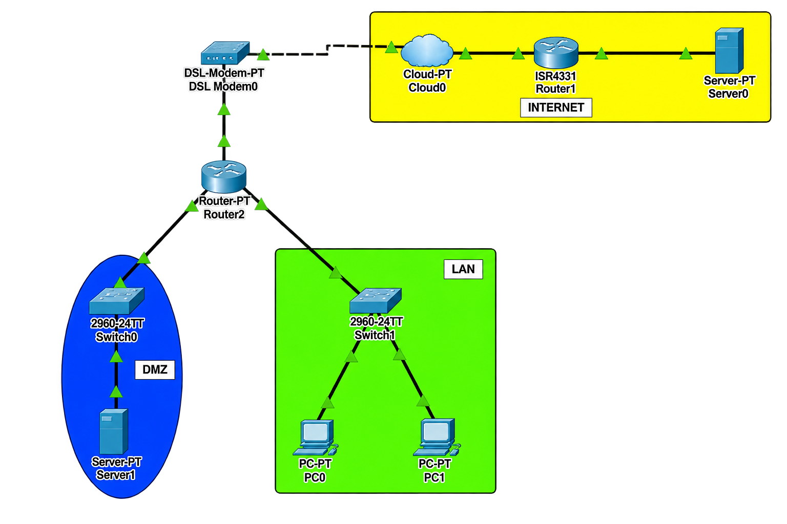

# 🏢 DMZ (Demilitarized Zone)

## 📖 Apa itu DMZ?

**DMZ (Demilitarized Zone)** adalah subnet jaringan yang terletak di antara jaringan internal (private) dan jaringan eksternal (public/internet). DMZ berfungsi sebagai zona buffer yang memisahkan jaringan internal dari internet, di mana server-server publik ditempatkan untuk dapat diakses dari internet tanpa mengorbankan keamanan jaringan internal.

### 🎯 Tujuan DMZ:

1. **Keamanan** - Memisahkan server publik dari jaringan internal
2. **Akses Terbatas** - Mengontrol akses dari internet ke server tertentu
3. **Perlindungan** - Melindungi jaringan internal dari serangan dari internet
4. **Isolasi** - Mengisolasi server yang rentan dari jaringan internal
5. **Kontrol Akses** - Mengimplementasikan kebijakan keamanan yang ketat

### 🏷️ Konsep DMZ:

| Komponen | Deskripsi |
|----------|-----------|
| **Public Zone** | Jaringan di luar (internet) yang tidak aman |
| **DMZ Zone** | Jaringan semi-aman untuk server publik |
| **Private Zone** | Jaringan internal yang sangat aman |
| **Firewall** | Mengontrol traffic antar zona |
| **NAT** | Menerjemahkan alamat untuk akses publik |

---

## 🌐 Topologi




---

## 📊 Tabel Perangkat dan IP Address

### Router Internet

| Perangkat | Antarmuka | IP Address | Netmask | Keterangan |
|-----------|-----------|------------|---------|------------|
| **Router Internet** | Gi0/0/0 | 192.168.100.2 | 255.255.255.248 | Ke Router Rumah |
| **Router Internet** | Gi0/0/1 | 8.8.8.1 | 255.255.255.240 | Ke Server Internet |

### Router Rumah (DMZ Router)

| Perangkat | Antarmuka | IP Address | Netmask | Keterangan |
|-----------|-----------|------------|---------|------------|
| **Router Rumah** | Fa0/0 | 192.168.100.1 | 255.255.255.248 | Ke Router Internet (Outside) |
| **Router Rumah** | Fa0/1 | 172.168.10.1 | 255.255.255.0 | DMZ Server Network |
| **Router Rumah** | Fa0/2.20 | 192.168.20.1 | 255.255.255.0 | VLAN 20 (DHCP) |
| **Router Rumah** | Fa0/3.30 | 192.168.30.1 | 255.255.255.0 | VLAN 30 (DHCP) |

### Switch 1 (DMZ Server)

| Perangkat | Antarmuka | VLAN | Status | Keterangan |
|-----------|-----------|------|--------|------------|
| **Switch 1** | Fa0/1 | VLAN 1 (Native) | Up | Ke Router Rumah Fa0/1 |
| **Switch 1** | Fa0/2 | VLAN 1 (Native) | Up | Ke Server Rumah |

### Switch 2 (VLAN 20, 30)

| Perangkat | Antarmuka | VLAN | Status | Keterangan |
|-----------|-----------|------|--------|------------|
| **Switch 2** | Fa0/1 | Trunk | Up | Ke Router Rumah |
| **Switch 2** | Fa0/2 | VLAN 20 | Up | Ke PC VLAN 20 |
| **Switch 2** | Fa0/3 | VLAN 30 | Up | Ke PC VLAN 30 |
| **Switch 2** | Fa0/4-24 | VLAN 999 | Down | Blackhole |
| **Switch 2** | Gi0/1-2 | VLAN 999 | Down | Blackhole |

### Server

| Perangkat | Antarmuka | IP Address | Netmask | Gateway | Keterangan |
|-----------|-----------|------------|---------|---------|------------|
| **Server Rumah (DMZ)** | NIC | 172.168.10.2 | 255.255.255.0 | 172.168.10.1 | DMZ Server |
| **Server Internet** | NIC | 8.8.8.8 | 255.255.255.240 | 8.8.8.1 | Internet Server |

### Perangkat End-User

| Perangkat | VLAN | IP Address | Netmask | Gateway | Keterangan |
|-----------|------|------------|---------|---------|------------|
| **PC1** | VLAN 20 | DHCP | 255.255.255.0 | 192.168.20.1 | Terhubung ke SW2 Fa0/2 |
| **PC2** | VLAN 20 | DHCP | 255.255.255.0 | 192.168.20.1 | Terhubung ke SW2 Fa0/2 |
| **PC3** | VLAN 30 | DHCP | 255.255.255.0 | 192.168.30.1 | Terhubung ke SW2 Fa0/3 |
| **PC4** | VLAN 30 | DHCP | 255.255.255.0 | 192.168.30.1 | Terhubung ke SW2 Fa0/3 |

---

## 📋 Detail Konfigurasi

### NAT Configuration

| Jenis NAT | Source | Destination | IP Public | Keterangan |
|-----------|--------|-------------|-----------|------------|
| **Static NAT** | Server Rumah (172.168.10.2) | - | 192.168.100.3 | DMZ Server untuk akses dari internet |
| **NAT Overload** | VLAN 20,30 (192.168.20.0/24, 192.168.30.0/24) | - | 192.168.100.4 | PAT untuk VLAN internal |

### ACL Rules

| ACL Number | Rule | Action | Source | Destination | Protocol/Port | Keterangan |
|------------|------|--------|--------|-------------|---------------|------------|
| **101** | 10 | PERMIT | 8.8.8.0/28 | 172.168.10.2/32 | ICMP | Internet ke DMZ Server (ICMP) |
| **101** | 20 | PERMIT | 8.8.8.0/28 | 172.168.10.2/32 | TCP 80 | Internet ke DMZ Server (HTTP) |
| **101** | 30 | PERMIT | 8.8.8.0/28 | 172.168.10.2/32 | TCP 443 | Internet ke DMZ Server (HTTPS) |
| **101** | 40 | PERMIT | 8.8.8.0/28 | 172.168.10.2/32 | TCP 22 | Internet ke DMZ Server (SSH) |
| **101** | 50 | PERMIT | 8.8.8.0/28 | 172.168.10.2/32 | TCP 23 | Internet ke DMZ Server (Telnet) |
| **101** | 60 | DENY | 8.8.8.0/28 | 192.168.20.0/24 | IP | Internet ke VLAN 20 |
| **101** | 70 | DENY | 8.8.8.0/28 | 192.168.30.0/24 | IP | Internet ke VLAN 30 |
| **101** | 80 | PERMIT | Any | Any | IP | Izinkan traffic lainnya |

### ACL Rules (VLAN ke DMZ Server)

| ACL Number | Rule | Action | Source | Destination | Protocol/Port | Keterangan |
|------------|------|--------|--------|-------------|---------------|------------|
| **102** | 10 | PERMIT | 192.168.20.0/24 | 172.168.10.2/32 | ICMP | VLAN 20 ke DMZ Server (ICMP) |
| **102** | 20 | PERMIT | 192.168.20.0/24 | 172.168.10.2/32 | TCP 80 | VLAN 20 ke DMZ Server (HTTP) |
| **102** | 30 | PERMIT | 192.168.20.0/24 | 172.168.10.2/32 | TCP 443 | VLAN 20 ke DMZ Server (HTTPS) |
| **102** | 40 | PERMIT | 192.168.20.0/24 | 172.168.10.2/32 | TCP 22 | VLAN 20 ke DMZ Server (SSH) |
| **102** | 50 | PERMIT | 192.168.20.0/24 | 172.168.10.2/32 | TCP 23 | VLAN 20 ke DMZ Server (Telnet) |
| **102** | 60 | DENY | 192.168.20.0/24 | 172.168.10.2/32 | IP | Blokir lainnya |
| **102** | 70 | PERMIT | 192.168.30.0/24 | 172.168.10.2/32 | ICMP | VLAN 30 ke DMZ Server (ICMP) |
| **102** | 80 | PERMIT | 192.168.30.0/24 | 172.168.10.2/32 | TCP 80 | VLAN 30 ke DMZ Server (HTTP) |
| **102** | 90 | PERMIT | 192.168.30.0/24 | 172.168.10.2/32 | TCP 443 | VLAN 30 ke DMZ Server (HTTPS) |
| **102** | 100 | PERMIT | 192.168.30.0/24 | 172.168.10.2/32 | TCP 22 | VLAN 30 ke DMZ Server (SSH) |
| **102** | 110 | PERMIT | 192.168.30.0/24 | 172.168.10.2/32 | TCP 23 | VLAN 30 ke DMZ Server (Telnet) |
| **102** | 120 | DENY | 192.168.30.0/24 | 172.168.10.2/32 | IP | Blokir lainnya |
| **102** | 130 | PERMIT | Any | Any | IP | Izinkan traffic lainnya |

---

## ⚙️ Langkah-Langkah Konfigurasi

### 1. Konfigurasi Router Internet

#### 1.1 Konfigurasi Dasar Router Internet

```cisco
Router> enable
Router# configure terminal
Router(config)# hostname R_INTERNET

! Nonaktifkan DNS lookup
R_INTERNET(config)# no ip domain-lookup

! Enkripsi password
R_INTERNET(config)# service password-encryption

! Set password untuk akses console dan VTY
R_INTERNET(config)# line console 0
R_INTERNET(config-line)# password cisco
R_INTERNET(config-line)# login
R_INTERNET(config-line)# exit

R_INTERNET(config)# line vty 0 4
R_INTERNET(config-line)# password cisco
R_INTERNET(config-line)# login
R_INTERNET(config-line)# exit

! Set enable password
R_INTERNET(config)# enable secret cisco123

R_INTERNET(config)# end
R_INTERNET# copy running-config startup-config
```

#### 1.2 Konfigurasi IP Address Router Internet

```cisco
R_INTERNET> enable
R_INTERNET# configure terminal

! Konfigurasi interface ke Router Rumah (Gi0/0/0)
R_INTERNET(config)# interface gigabitEthernet 0/0/0
R_INTERNET(config-if)# description === LINK TO ROUTER RUMAH ===
R_INTERNET(config-if)# ip address 192.168.100.2 255.255.255.248
R_INTERNET(config-if)# no shutdown
R_INTERNET(config-if)# exit

! Konfigurasi interface ke Server Internet (Gi0/0/1)
R_INTERNET(config)# interface gigabitEthernet 0/0/1
R_INTERNET(config-if)# description === LINK TO SERVER INTERNET ===
R_INTERNET(config-if)# ip address 8.8.8.1 255.255.255.240
R_INTERNET(config-if)# no shutdown
R_INTERNET(config-if)# exit

R_INTERNET(config)# end
R_INTERNET# copy running-config startup-config
```

---

### 2. Konfigurasi Router Rumah (DMZ Router)

#### 2.1 Konfigurasi Dasar Router Rumah

```cisco
Router> enable
Router# configure terminal
Router(config)# hostname R_RUMAH

! Nonaktifkan DNS lookup
R_RUMAH(config)# no ip domain-lookup

! Enkripsi password
R_RUMAH(config)# service password-encryption

! Set password untuk akses console dan VTY
R_RUMAH(config)# line console 0
R_RUMAH(config-line)# password cisco
R_RUMAH(config-line)# login
R_RUMAH(config-line)# exit

R_RUMAH(config)# line vty 0 4
R_RUMAH(config-line)# password cisco
R_RUMAH(config-line)# login
R_RUMAH(config-line)# exit

! Set enable password
R_RUMAH(config)# enable secret cisco123

R_RUMAH(config)# end
R_RUMAH# copy running-config startup-config
```

#### 2.2 Konfigurasi IP Address Router Rumah

```cisco
R_RUMAH> enable
R_RUMAH# configure terminal

! Konfigurasi interface ke Router Internet (Fa0/0) - OUTSIDE
R_RUMAH(config)# interface fastEthernet 0/0
R_RUMAH(config-if)# description === LINK TO ROUTER INTERNET (OUTSIDE) ===
R_RUMAH(config-if)# ip address 192.168.100.1 255.255.255.248
R_RUMAH(config-if)# no shutdown
R_RUMAH(config-if)# exit

! Konfigurasi interface DMZ Server (Fa0/1) - INSIDE
R_RUMAH(config)# interface fastEthernet 0/1
R_RUMAH(config-if)# description === LINK TO DMZ SERVER ===
R_RUMAH(config-if)# ip address 172.168.10.1 255.255.255.0
R_RUMAH(config-if)# no shutdown
R_RUMAH(config-if)# exit

! Aktifkan interface fisik Fa0/2
R_RUMAH(config)# interface fastEthernet 0/2
R_RUMAH(config-if)# no shutdown
R_RUMAH(config-if)# exit

! Buat sub-interface untuk VLAN 20
R_RUMAH(config)# interface fastEthernet 0/2.20
R_RUMAH(config-subif)# description === VLAN 20 Gateway ===
R_RUMAH(config-subif)# encapsulation dot1Q 20
R_RUMAH(config-subif)# ip address 192.168.20.1 255.255.255.0
R_RUMAH(config-subif)# no shutdown
R_RUMAH(config-subif)# exit

! Aktifkan interface fisik Fa0/3
R_RUMAH(config)# interface fastEthernet 0/3
R_RUMAH(config-if)# no shutdown
R_RUMAH(config-if)# exit

! Buat sub-interface untuk VLAN 30
R_RUMAH(config)# interface fastEthernet 0/3.30
R_RUMAH(config-subif)# description === VLAN 30 Gateway ===
R_RUMAH(config-subif)# encapsulation dot1Q 30
R_RUMAH(config-subif)# ip address 192.168.30.1 255.255.255.0
R_RUMAH(config-subif)# no shutdown
R_RUMAH(config-subif)# exit

R_RUMAH(config)# end
R_RUMAH# copy running-config startup-config
```

#### 2.3 Konfigurasi DHCP Server untuk VLAN 20 dan 30

```cisco
R_RUMAH> enable
R_RUMAH# configure terminal

! Buat DHCP pool untuk VLAN 20
R_RUMAH(config)# ip dhcp pool VLAN20_POOL
R_RUMAH(dhcp-config)# network 192.168.20.0 255.255.255.0
R_RUMAH(dhcp-config)# default-router 192.168.20.1
R_RUMAH(dhcp-config)# dns-server 8.8.8.8
R_RUMAH(dhcp-config)# exit

! Buat DHCP pool untuk VLAN 30
R_RUMAH(config)# ip dhcp pool VLAN30_POOL
R_RUMAH(dhcp-config)# network 192.168.30.0 255.255.255.0
R_RUMAH(dhcp-config)# default-router 192.168.30.1
R_RUMAH(dhcp-config)# dns-server 8.8.8.8
R_RUMAH(dhcp-config)# exit

! Kecualikan IP gateway agar tidak diberikan ke client
R_RUMAH(config)# ip dhcp excluded-address 192.168.20.1
R_RUMAH(config)# ip dhcp excluded-address 192.168.30.1

R_RUMAH(config)# end
R_RUMAH# copy running-config startup-config
```

#### 2.4 Konfigurasi Static Route

```cisco
R_RUMAH> enable
R_RUMAH# configure terminal

! Tambahkan default route ke Router Internet
R_RUMAH(config)# ip route 0.0.0.0 0.0.0.0 192.168.100.2

R_RUMAH(config)# end
R_RUMAH# copy running-config startup-config
```

#### 2.5 Konfigurasi Access-List untuk Keamanan

```cisco
R_RUMAH> enable
R_RUMAH# configure terminal

! ACL 101: Filter traffic dari internet ke internal
! Rules diurutkan dari yang paling spesifik ke umum

! Izinkan internet ke DMZ Server (ICMP)
R_RUMAH(config)# access-list 101 permit icmp 8.8.8.0 0.0.0.15 host 172.168.10.2

! Izinkan internet ke DMZ Server (HTTP - port 80)
R_RUMAH(config)# access-list 101 permit tcp 8.8.8.0 0.0.0.15 host 172.168.10.2 eq 80

! Izinkan internet ke DMZ Server (HTTPS - port 443)
R_RUMAH(config)# access-list 101 permit tcp 8.8.8.0 0.0.0.15 host 172.168.10.2 eq 443

! Izinkan internet ke DMZ Server (SSH - port 22)
R_RUMAH(config)# access-list 101 permit tcp 8.8.8.0 0.0.0.15 host 172.168.10.2 eq 22

! Izinkan internet ke DMZ Server (Telnet - port 23)
R_RUMAH(config)# access-list 101 permit tcp 8.8.8.0 0.0.0.15 host 172.168.10.2 eq 23

! Blokir internet ke VLAN 20
R_RUMAH(config)# access-list 101 deny ip 8.8.8.0 0.0.0.15 192.168.20.0 0.0.0.255

! Blokir internet ke VLAN 30
R_RUMAH(config)# access-list 101 deny ip 8.8.8.0 0.0.0.15 192.168.30.0 0.0.0.255

! Izinkan semua traffic lainnya
R_RUMAH(config)# access-list 101 permit ip any any

! Aplikasikan ACL 101 ke interface Fa0/0 (outbound ke internet)
R_RUMAH(config)# interface fastEthernet 0/0
R_RUMAH(config-if)# ip access-group 101 out
R_RUMAH(config-if)# exit

! ACL 102: Filter traffic dari VLAN ke DMZ Server
! Izinkan VLAN 20 ke DMZ Server (ICMP)
R_RUMAH(config)# access-list 102 permit icmp 192.168.20.0 0.0.0.255 host 172.168.10.2

! Izinkan VLAN 20 ke DMZ Server (HTTP)
R_RUMAH(config)# access-list 102 permit tcp 192.168.20.0 0.0.0.255 host 172.168.10.2 eq 80

! Izinkan VLAN 20 ke DMZ Server (HTTPS)
R_RUMAH(config)# access-list 102 permit tcp 192.168.20.0 0.0.0.255 host 172.168.10.2 eq 443

! Izinkan VLAN 20 ke DMZ Server (SSH)
R_RUMAH(config)# access-list 102 permit tcp 192.168.20.0 0.0.0.255 host 172.168.10.2 eq 22

! Izinkan VLAN 20 ke DMZ Server (Telnet)
R_RUMAH(config)# access-list 102 permit tcp 192.168.20.0 0.0.0.255 host 172.168.10.2 eq 23

! Blokir VLAN 20 ke DMZ Server lainnya
R_RUMAH(config)# access-list 102 deny ip 192.168.20.0 0.0.0.255 host 172.168.10.2

! Izinkan VLAN 30 ke DMZ Server (ICMP)
R_RUMAH(config)# access-list 102 permit icmp 192.168.30.0 0.0.0.255 host 172.168.10.2

! Izinkan VLAN 30 ke DMZ Server (HTTP)
R_RUMAH(config)# access-list 102 permit tcp 192.168.30.0 0.0.0.255 host 172.168.10.2 eq 80

! Izinkan VLAN 30 ke DMZ Server (HTTPS)
R_RUMAH(config)# access-list 102 permit tcp 192.168.30.0 0.0.0.255 host 172.168.10.2 eq 443

! Izinkan VLAN 30 ke DMZ Server (SSH)
R_RUMAH(config)# access-list 102 permit tcp 192.168.30.0 0.0.0.255 host 172.168.10.2 eq 22

! Izinkan VLAN 30 ke DMZ Server (Telnet)
R_RUMAH(config)# access-list 102 permit tcp 192.168.30.0 0.0.0.255 host 172.168.10.2 eq 23

! Blokir VLAN 30 ke DMZ Server lainnya
R_RUMAH(config)# access-list 102 deny ip 192.168.30.0 0.0.0.255 host 172.168.10.2

! Izinkan semua traffic lainnya
R_RUMAH(config)# access-list 102 permit ip any any

! Aplikasikan ACL 102 ke interface Fa0/1 (inbound dari internal)
R_RUMAH(config)# interface fastEthernet 0/1
R_RUMAH(config-if)# ip access-group 102 in
R_RUMAH(config-if)# exit

R_RUMAH(config)# end
R_RUMAH# copy running-config startup-config
```

#### 2.6 Konfigurasi NAT

```cisco
R_RUMAH> enable
R_RUMAH# configure terminal

! Tentukan interface INSIDE (jaringan lokal)
R_RUMAH(config)# interface fastEthernet 0/1
R_RUMAH(config-if)# ip nat inside
R_RUMAH(config-if)# exit

R_RUMAH(config)# interface fastEthernet 0/2.20
R_RUMAH(config-subif)# ip nat inside
R_RUMAH(config-subif)# exit

R_RUMAH(config)# interface fastEthernet 0/3.30
R_RUMAH(config-subif)# ip nat inside
R_RUMAH(config-subif)# exit

! Tentukan interface OUTSIDE (jaringan public/internet)
R_RUMAH(config)# interface fastEthernet 0/0
R_RUMAH(config-if)# ip nat outside
R_RUMAH(config-if)# exit

! Static NAT untuk DMZ Server (172.168.10.2 -> 192.168.100.3)
R_RUMAH(config)# ip nat inside source static 172.168.10.2 192.168.100.3

! Buat ACL untuk NAT Overload (VLAN 20 dan 30)
R_RUMAH(config)# access-list 1 permit 192.168.20.0 0.0.0.255
R_RUMAH(config)# access-list 1 permit 192.168.30.0 0.0.0.255

! NAT Overload untuk VLAN 20 dan 30 (ke IP 192.168.100.4)
! Catatan: Karena hanya ada 1 interface outside, kita gunakan overload dengan IP yang sama
R_RUMAH(config)# ip nat inside source list 1 interface fastEthernet 0/0 overload

! Untuk memaksa NAT menggunakan IP 192.168.100.4 sebagai inside global
! Tambahkan secondary IP pada interface outside
R_RUMAH(config)# interface fastEthernet 0/0
R_RUMAH(config-if)# ip address 192.168.100.4 255.255.255.248 secondary
R_RUMAH(config-if)# exit

! NAT Overload dengan secondary IP
R_RUMAH(config)# ip nat inside source list 1 interface fastEthernet 0/0 192.168.100.4 overload

R_RUMAH(config)# end
R_RUMAH# copy running-config startup-config
```

**Penjelasan NAT:**
- `ip nat inside source static 172.168.10.2 192.168.100.3` : Static NAT 1:1 untuk DMZ Server
- `ip nat inside source list 1 interface fastEthernet 0/0 192.168.100.4 overload` : NAT Overload untuk VLAN 20,30 dengan IP public 192.168.100.4

---

### 3. Konfigurasi Switch 1 (DMZ Server)

#### 3.1 Konfigurasi Dasar Switch 1

```cisco
Switch> enable
Switch# configure terminal
Switch(config)# hostname SW1_DMZ

! Nonaktifkan DNS lookup
SW1_DMZ(config)# no ip domain-lookup

! Enkripsi password
SW1_DMZ(config)# service password-encryption

! Set password untuk akses console dan VTY
SW1_DMZ(config)# line console 0
SW1_DMZ(config-line)# password cisco
SW1_DMZ(config-line)# login
SW1_DMZ(config-line)# exit

SW1_DMZ(config)# line vty 0 15
SW1_DMZ(config-line)# password cisco
SW1_DMZ(config-line)# login
SW1_DMZ(config-line)# exit

! Set enable password
SW1_DMZ(config)# enable secret cisco123

SW1_DMZ(config)# end
SW1_DMZ# copy running-config startup-config
```

#### 3.2 Konfigurasi Port Switch 1

```cisco
SW1_DMZ> enable
SW1_DMZ# configure terminal

! Konfigurasi port Fa0/1 ke Router Rumah (VLAN 1 Native)
SW1_DMZ(config)# interface fastEthernet 0/1
SW1_DMZ(config-if)# description === LINK TO ROUTER RUMAH (DMZ) ===
SW1_DMZ(config-if)# switchport mode access
SW1_DMZ(config-if)# switchport access vlan 1
SW1_DMZ(config-if)# no shutdown
SW1_DMZ(config-if)# exit

! Konfigurasi port Fa0/2 ke Server Rumah (VLAN 1 Native)
SW1_DMZ(config)# interface fastEthernet 0/2
SW1_DMZ(config-if)# description === LINK TO DMZ SERVER ===
SW1_DMZ(config-if)# switchport mode access
SW1_DMZ(config-if)# switchport access vlan 1
SW1_DMZ(config-if)# no shutdown
SW1_DMZ(config-if)# exit

SW1_DMZ(config)# end
SW1_DMZ# copy running-config startup-config
```

---

### 4. Konfigurasi Switch 2 (VLAN 20, 30)

#### 4.1 Konfigurasi Dasar Switch 2

```cisco
Switch> enable
Switch# configure terminal
Switch(config)# hostname SW2_VLAN

! Nonaktifkan DNS lookup
SW2_VLAN(config)# no ip domain-lookup

! Enkripsi password
SW2_VLAN(config)# service password-encryption

! Set password untuk akses console dan VTY
SW2_VLAN(config)# line console 0
SW2_VLAN(config-line)# password cisco
SW2_VLAN(config-line)# login
SW2_VLAN(config-line)# exit

SW2_VLAN(config)# line vty 0 15
SW2_VLAN(config-line)# password cisco
SW2_VLAN(config-line)# login
SW2_VLAN(config-line)# exit

! Set enable password
SW2_VLAN(config)# enable secret cisco123

SW2_VLAN(config)# end
SW2_VLAN# copy running-config startup-config
```

#### 4.2 Membuat VLAN

```cisco
SW2_VLAN> enable
SW2_VLAN# configure terminal

! Buat VLAN 20
SW2_VLAN(config)# vlan 20
SW2_VLAN(config-vlan)# name DATA_VLAN_20
SW2_VLAN(config-vlan)# exit

! Buat VLAN 30
SW2_VLAN(config)# vlan 30
SW2_VLAN(config-vlan)# name DATA_VLAN_30
SW2_VLAN(config-vlan)# exit

! Buat VLAN 999 (Blackhole)
SW2_VLAN(config)# vlan 999
SW2_VLAN(config-vlan)# name BLACKHOLE
SW2_VLAN(config-vlan)# exit

SW2_VLAN(config)# end
SW2_VLAN# copy running-config startup-config
```

#### 4.3 Konfigurasi Trunk ke Router

```cisco
SW2_VLAN> enable
SW2_VLAN# configure terminal

! Interface Fa0/1 sebagai Trunk ke Router Rumah
SW2_VLAN(config)# interface fastEthernet 0/1
SW2_VLAN(config-if)# description === TRUNK TO ROUTER RUMAH ===
SW2_VLAN(config-if)# switchport trunk encapsulation dot1q
SW2_VLAN(config-if)# switchport mode trunk
SW2_VLAN(config-if)# switchport trunk native vlan 999
SW2_VLAN(config-if)# switchport trunk allowed vlan 20,30
SW2_VLAN(config-if)# no shutdown
SW2_VLAN(config-if)# exit

SW2_VLAN(config)# end
SW2_VLAN# copy running-config startup-config
```

#### 4.4 Konfigurasi Access Port VLAN 20

```cisco
SW2_VLAN> enable
SW2_VLAN# configure terminal

! Interface Fa0/2 untuk VLAN 20
SW2_VLAN(config)# interface fastEthernet 0/2
SW2_VLAN(config-if)# description === PC - VLAN 20 ===
SW2_VLAN(config-if)# switchport mode access
SW2_VLAN(config-if)# switchport access vlan 20
SW2_VLAN(config-if)# no shutdown
SW2_VLAN(config-if)# exit

SW2_VLAN(config)# end
SW2_VLAN# copy running-config startup-config
```

#### 4.5 Konfigurasi Access Port VLAN 30

```cisco
SW2_VLAN> enable
SW2_VLAN# configure terminal

! Interface Fa0/3 untuk VLAN 30
SW2_VLAN(config)# interface fastEthernet 0/3
SW2_VLAN(config-if)# description === PC - VLAN 30 ===
SW2_VLAN(config-if)# switchport mode access
SW2_VLAN(config-if)# switchport access vlan 30
SW2_VLAN(config-if)# no shutdown
SW2_VLAN(config-if)# exit

SW2_VLAN(config)# end
SW2_VLAN# copy running-config startup-config
```

#### 4.6 Konfigurasi Blackhole VLAN 999

```cisco
SW2_VLAN> enable
SW2_VLAN# configure terminal

! Interface Fa0/4-24 sebagai Blackhole
SW2_VLAN(config)# interface range fastEthernet 0/4 - 24
SW2_VLAN(config-if-range)# description === BLACKHOLE - UNUSED ===
SW2_VLAN(config-if-range)# switchport mode access
SW2_VLAN(config-if-range)# switchport access vlan 999
SW2_VLAN(config-if-range)# shutdown
SW2_VLAN(config-if-range)# exit

! Interface Gi0/1-2 sebagai Blackhole
SW2_VLAN(config)# interface range gigabitEthernet 0/1 - 2
SW2_VLAN(config-if-range)# description === BLACKHOLE - UNUSED ===
SW2_VLAN(config-if-range)# switchport mode access
SW2_VLAN(config-if-range)# switchport access vlan 999
SW2_VLAN(config-if-range)# shutdown
SW2_VLAN(config-if-range)# exit

SW2_VLAN(config)# end
SW2_VLAN# copy running-config startup-config
```

---

### 5. Konfigurasi Server

#### 5.1 Konfigurasi Server Rumah (DMZ Server)

| Parameter | Nilai |
|-----------|-------|
| IP Address | 172.168.10.2 |
| Netmask | 255.255.255.0 |
| Gateway | 172.168.10.1 |
| DNS | 8.8.8.8 |

**Aktifkan Services untuk Pengujian:**
- HTTP (port 80)
- HTTPS (port 443)
- SSH (port 22)
- Telnet (port 23)

#### 5.2 Konfigurasi Server Internet

| Parameter | Nilai |
|-----------|-------|
| IP Address | 8.8.8.8 |
| Netmask | 255.255.255.240 |
| Gateway | 8.8.8.1 |
| DNS | 8.8.8.8 |

---

### 6. Konfigurasi Perangkat End-User

#### 6.1 PC1 - PC2 (VLAN 20)

| Parameter | Nilai |
|-----------|-------|
| IP Address | DHCP |
| Netmask | 255.255.255.0 |
| Gateway | 192.168.20.1 |
| DNS | 8.8.8.8 |

#### 6.2 PC3 - PC4 (VLAN 30)

| Parameter | Nilai |
|-----------|-------|
| IP Address | DHCP |
| Netmask | 255.255.255.0 |
| Gateway | 192.168.30.1 |
| DNS | 8.8.8.8 |

---

## ✅ Verifikasi Konfigurasi

### 1. Verifikasi IP Address Router Rumah

```cisco
R_RUMAH# show ip interface brief
```

**Output yang diharapkan:**
```
Interface              IP-Address      OK? Method Status                Protocol
FastEthernet0/0        192.168.100.1   YES manual up                    up
FastEthernet0/0        192.168.100.4   YES manual secondary             up
FastEthernet0/1        172.168.10.1    YES manual up                    up
FastEthernet0/2        unassigned      YES unset  up                    up
FastEthernet0/2.20     192.168.20.1    YES manual up                    up
FastEthernet0/3        unassigned      YES unset  up                    up
FastEthernet0/3.30     192.168.30.1    YES manual up                    up
```

### 2. Verifikasi DHCP Pool

```cisco
R_RUMAH# show ip dhcp binding
```

**Output yang diharapkan:**
```
IP address       Client-ID/              Lease expiration        Type
                 Hardware address
192.168.20.10    0050.7966.6801          --                     Automatic
192.168.20.11    0050.7966.6802          --                     Automatic
192.168.30.10    0050.7966.6803          --                     Automatic
192.168.30.11    0050.7966.6804          --                     Automatic
```

### 3. Verifikasi Access-List

```cisco
R_RUMAH# show access-lists
```

**Output yang diharapkan:**
```
Extended IP access list 101
    10 permit icmp 8.8.8.0 0.0.0.15 host 172.168.10.2
    20 permit tcp 8.8.8.0 0.0.0.15 host 172.168.10.2 eq 80
    30 permit tcp 8.8.8.0 0.0.0.15 host 172.168.10.2 eq 443
    40 permit tcp 8.8.8.0 0.0.0.15 host 172.168.10.2 eq 22
    50 permit tcp 8.8.8.0 0.0.0.15 host 172.168.10.2 eq 23
    60 deny ip 8.8.8.0 0.0.0.15 192.168.20.0 0.0.0.255
    70 deny ip 8.8.8.0 0.0.0.15 192.168.30.0 0.0.0.255
    80 permit ip any any

Extended IP access list 102
    10 permit icmp 192.168.20.0 0.0.0.255 host 172.168.10.2
    20 permit tcp 192.168.20.0 0.0.0.255 host 172.168.10.2 eq 80
    30 permit tcp 192.168.20.0 0.0.0.255 host 172.168.10.2 eq 443
    40 permit tcp 192.168.20.0 0.0.0.255 host 172.168.10.2 eq 22
    50 permit tcp 192.168.20.0 0.0.0.255 host 172.168.10.2 eq 23
    60 deny ip 192.168.20.0 0.0.0.255 host 172.168.10.2
    70 permit icmp 192.168.30.0 0.0.0.255 host 172.168.10.2
    80 permit tcp 192.168.30.0 0.0.0.255 host 172.168.10.2 eq 80
    90 permit tcp 192.168.30.0 0.0.0.255 host 172.168.10.2 eq 443
    100 permit tcp 192.168.30.0 0.0.0.255 host 172.168.10.2 eq 22
    110 permit tcp 192.168.30.0 0.0.0.255 host 172.168.10.2 eq 23
    120 deny ip 192.168.30.0 0.0.0.255 host 172.168.10.2
    130 permit ip any any
```

### 4. Verifikasi NAT Translations

```cisco
R_RUMAH# show ip nat translations
```

**Output yang diharapkan:**
```
Pro  Inside global         Inside local          Outside local      Outside global
---  192.168.100.3         172.168.10.2          ---                ---
icmp 192.168.100.4:40001  192.168.20.10:40001   8.8.8.8:40001      8.8.8.8:40001
icmp 192.168.100.4:40002  192.168.30.10:40002   8.8.8.8:40002      8.8.8.8:40002
```

### 5. Verifikasi NAT Statistics

```cisco
R_RUMAH# show ip nat statistics
```

**Output yang diharapkan:**
```
Total active translations: 3 (1 static, 2 dynamic; 2 extended)
Outside interfaces:
  FastEthernet0/0
Inside interfaces:
  FastEthernet0/1, FastEthernet0/2.20, FastEthernet0/3.30
Hits: 0  Misses: 0
Expired translations: 0
Dynamic mappings:
-- Inside Source
[Id: 1] access-list 1 interface FastEthernet0/0 overload
```

### 6. Verifikasi Koneksi (Internet ke DMZ Server)

**Dari Server Internet (8.8.8.8) ke DMZ Server (172.168.10.2):**

#### Ping Test (ICMP)
```cmd
ping 172.168.10.2
```

**Output yang diharapkan:**
```
Pinging 172.168.10.2 with 32 bytes of data:
Reply from 172.168.10.2: bytes=32 time<1ms TTL=127
Reply from 172.168.10.2: bytes=32 time<1ms TTL=127
Reply from 172.168.10.2: bytes=32 time<1ms TTL=127
Reply from 172.168.10.2: bytes=32 time<1ms TTL=127
```
**Penjelasan:** Internet bisa ping ke DMZ Server ✅

#### Web Server Test (HTTP - Port 80)
```cmd
telnet 172.168.10.2 80
```
atau akses browser ke `http://172.168.10.2`

**Output yang diharapkan:**
```
Connected to 172.168.10.2
```
**Penjelasan:** Internet bisa akses HTTP ke DMZ Server ✅

#### SSH Test (Port 22)
```cmd
ssh admin@172.168.10.2
```
**Penjelasan:** Internet bisa akses SSH ke DMZ Server ✅

#### Telnet Test (Port 23)
```cmd
telnet 172.168.10.2
```
**Penjelasan:** Internet bisa akses Telnet ke DMZ Server ✅

### 7. Verifikasi Koneksi (Internet ke VLAN 20,30) - HARUS GAGAL

**Dari Server Internet (8.8.8.8) ke PC VLAN 20 (192.168.20.10):**

```cmd
ping 192.168.20.10
```

**Output yang diharapkan:**
```
Pinging 192.168.20.10 with 32 bytes of data:
Request timed out.
Request timed out.
Request timed out.
Request timed out.

Ping statistics for 192.168.20.10:
    Packets: Sent = 4, Received = 0, Lost = 4 (100% loss)
```
**Penjelasan:** Internet TIDAK BISA akses ke VLAN 20 ❌ (diblokir ACL)

**Dari Server Internet (8.8.8.8) ke PC VLAN 30 (192.168.30.10):**

```cmd
ping 192.168.30.10
```

**Output yang diharapkan:**
```
Pinging 192.168.30.10 with 32 bytes of data:
Request timed out.
Request timed out.
Request timed out.
Request timed out.

Ping statistics for 192.168.30.10:
    Packets: Sent = 4, Received = 0, Lost = 4 (100% loss)
```
**Penjelasan:** Internet TIDAK BISA akses ke VLAN 30 ❌ (diblokir ACL)

### 8. Verifikasi Koneksi (VLAN ke Internet) - HARUS BERHASIL

**Dari PC VLAN 20 (192.168.20.10) ke Server Internet (8.8.8.8):**

```cmd
ping 8.8.8.8
```

**Output yang diharapkan:**
```
Pinging 8.8.8.8 with 32 bytes of data:
Reply from 8.8.8.8: bytes=32 time<1ms TTL=255
Reply from 8.8.8.8: bytes=32 time<1ms TTL=255
Reply from 8.8.8.8: bytes=32 time<1ms TTL=255
Reply from 8.8.8.8: bytes=32 time<1ms TTL=255
```
**Penjelasan:** VLAN 20 BISA akses ke internet ✅ (NAT Overload)

**Dari PC VLAN 30 (192.168.30.10) ke Server Internet (8.8.8.8):**

```cmd
ping 8.8.8.8
```

**Output yang diharapkan:**
```
Pinging 8.8.8.8 with 32 bytes of data:
Reply from 8.8.8.8: bytes=32 time<1ms TTL=255
Reply from 8.8.8.8: bytes=32 time<1ms TTL=255
Reply from 8.8.8.8: bytes=32 time<1ms TTL=255
Reply from 8.8.8.8: bytes=32 time<1ms TTL=255
```
**Penjelasan:** VLAN 30 BISA akses ke internet ✅ (NAT Overload)

### 9. Verifikasi Koneksi (DMZ Server ke Internet) - HARUS BERHASIL

**Dari DMZ Server (172.168.10.2) ke Server Internet (8.8.8.8):**

```cmd
ping 8.8.8.8
```

**Output yang diharapkan:**
```
Pinging 8.8.8.8 with 32 bytes of data:
Reply from 8.8.8.8: bytes=32 time<1ms TTL=255
Reply from 8.8.8.8: bytes=32 time<1ms TTL=255
Reply from 8.8.8.8: bytes=32 time<1ms TTL=255
Reply from 8.8.8.8: bytes=32 time<1ms TTL=255
```
**Penjelasan:** DMZ Server BISA akses ke internet ✅ (NAT)

### 10. Verifikasi Koneksi (VLAN ke DMZ Server) - TERBATAS

**Dari PC VLAN 20 (192.168.20.10) ke DMZ Server (172.168.10.2):**

#### ICMP Test - HARUS BERHASIL
```cmd
ping 172.168.10.2
```

**Output yang diharapkan:**
```
Pinging 172.168.10.2 with 32 bytes of data:
Reply from 172.168.10.2: bytes=32 time<1ms TTL=127
Reply from 172.168.10.2: bytes=32 time<1ms TTL=127
Reply from 172.168.10.2: bytes=32 time<1ms TTL=127
Reply from 172.168.10.2: bytes=32 time<1ms TTL=127
```
**Penjelasan:** VLAN 20 BISA ping ke DMZ Server ✅

#### HTTP Test - HARUS BERHASIL
```cmd
telnet 172.168.10.2 80
```
**Penjelasan:** VLAN 20 BISA akses HTTP ke DMZ Server ✅

#### SSH Test - HARUS BERHASIL
```cmd
telnet 172.168.10.2 22
```
**Penjelasan:** VLAN 20 BISA akses SSH ke DMZ Server ✅

#### Telnet Test - HARUS BERHASIL
```cmd
telnet 172.168.10.2
```
**Penjelasan:** VLAN 20 BISA akses Telnet ke DMZ Server ✅

#### Port Lain Test - HARUS GAGAL (kecuali yang diizinkan)
```cmd
telnet 172.168.10.2 21
```

**Output yang diharapkan:**
```
Connecting to 172.168.10.2:21... Failed
```
**Penjelasan:** VLAN 20 TIDAK BISA akses port lain ❌ (diblokir ACL)

---

## 📊 Ringkasan Konfigurasi

### Router Internet

| Parameter | Nilai |
|-----------|-------|
| **Hostname** | R_INTERNET |
| **Gi0/0/0 IP** | 192.168.100.2/29 (Ke Router Rumah) |
| **Gi0/0/1 IP** | 8.8.8.1/28 (Ke Server Internet) |

### Router Rumah (DMZ Router)

| Parameter | Nilai |
|-----------|-------|
| **Hostname** | R_RUMAH |
| **Fa0/0 IP** | 192.168.100.1/29 (OUTSIDE) |
| **Fa0/0 Secondary IP** | 192.168.100.4/29 (OUTSIDE - NAT Overload) |
| **Fa0/1 IP** | 172.168.10.1/24 (INSIDE - DMZ) |
| **Fa0/2.20 IP** | 192.168.20.1/24 (INSIDE - VLAN 20) |
| **Fa0/3.30 IP** | 192.168.30.1/24 (INSIDE - VLAN 30) |
| **Default Route** | 0.0.0.0/0 via 192.168.100.2 |

### NAT Configuration

| Jenis NAT | Source | Destination | IP Public |
|-----------|--------|-------------|-----------|
| **Static NAT** | 172.168.10.2 | - | 192.168.100.3 |
| **NAT Overload** | 192.168.20.0/24, 192.168.30.0/24 | - | 192.168.100.4 |

### ACL Configuration

| ACL | Aplikasi | Arah | Fungsi |
|-----|----------|------|--------|
| **101** | Fa0/0 | Out | Filter traffic dari internet ke internal |
| **102** | Fa0/1 | In | Filter traffic dari VLAN ke DMZ Server |

### Access Rules Summary

| Sumber | Tujuan | Diizinkan | Diblokir |
|--------|--------|-----------|----------|
| **Internet** | DMZ Server | ICMP, HTTP, HTTPS, SSH, Telnet | Lainnya |
| **Internet** | VLAN 20, 30 | - | Semua (IP) |
| **VLAN 20, 30** | Internet | Semua | - |
| **DMZ Server** | Internet | Semua | - |
| **VLAN 20, 30** | DMZ Server | ICMP, HTTP, HTTPS, SSH, Telnet | Lainnya |

---

## 🔧 Troubleshooting

| Masalah | Kemungkinan Penyebab | Solusi |
|---------|---------------------|--------|
| Internet tidak bisa akses DMZ Server | NAT Static tidak bekerja | Cek `show ip nat translations` |
| VLAN tidak bisa akses internet | NAT Overload tidak bekerja | Cek `show ip nat statistics` |
| Internet bisa akses VLAN 20,30 | ACL tidak diaplikasikan | Cek `show access-lists` dan interface |
| VLAN bisa akses semua ke DMZ Server | ACL 102 tidak bekerja | Cek `show access-lists 102` |
| DMZ Server tidak bisa akses internet | Interface inside tidak ditandai | Cek `ip nat inside` pada interface |
| IP tidak dapat dari DHCP | DHCP tidak aktif | Cek `show ip dhcp binding` |
| Trunk tidak aktif | Native VLAN mismatch | Cek `show interfaces trunk` |

---

## 📚 Referensi

- [Cisco DMZ Design Guide](https://www.cisco.com/c/en/us/support/docs/security/ios-firewall/61700-iosdmz.html)
- [Cisco NAT Documentation](https://www.cisco.com/c/en/us/support/docs/ip/network-address-translation-nat/26704-5.html)
- [Cisco ACL Documentation](https://www.cisco.com/c/en/us/support/docs/security/ios-firewall/23602-confaccesslists.html)

---
