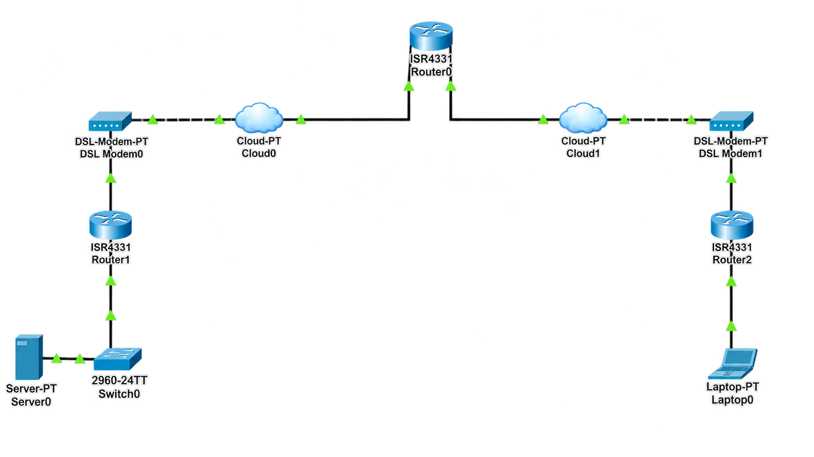

# 🔒 VPN (Virtual Private Network)

## 📖 Apa itu VPN?

**VPN (Virtual Private Network)** adalah teknologi yang memungkinkan pengguna untuk membuat koneksi jaringan yang aman dan terenkripsi melalui jaringan publik seperti internet. VPN memungkinkan perangkat di lokasi yang berbeda untuk terhubung seolah-olah berada dalam jaringan lokal yang sama dengan aman.

### 🎯 Tujuan VPN:

1. **Keamanan** - Mengenkripsi data yang dikirim melalui jaringan publik
2. **Akses Jarak Jauh** - Memungkinkan akses ke jaringan internal dari luar
3. **Privasi** - Menyembunyikan aktivitas online dari ISP
4. **Koneksi Antar Kantor** - Menghubungkan beberapa kantor cabang
5. **Melewati Blokir** - Mengakses konten yang dibatasi secara geografis

### 🏷️ Jenis-Jenis VPN:

| Jenis VPN | Deskripsi |
|-----------|-----------|
| **Site-to-Site VPN** | Menghubungkan dua atau lebih jaringan (kantor cabang) |
| **Remote Access VPN** | Mengakses jaringan internal dari jarak jauh (client) |
| **IPSec VPN** | Menggunakan protokol IPSec untuk keamanan |
| **SSL VPN** | Menggunakan protokol SSL/TLS (biasanya via browser) |
| **GRE Tunnel** | Generic Routing Encapsulation untuk tunneling |
| **DMVPN** | Dynamic Multipoint VPN untuk topologi hub-spoke |

### 📊 Protokol VPN:

| Protokol | Port | Keamanan | Deskripsi |
|----------|------|----------|-----------|
| **IPSec** | ESP/AH | Tinggi | Keamanan layer 3, enkripsi dan autentikasi |
| **GRE** | IP 47 | Rendah | Tunneling, tidak ada enkripsi bawaan |
| **L2TP** | UDP 1701 | Sedang | Layer 2 Tunneling Protocol |
| **PPTP** | TCP 1723 | Rendah | Point-to-Point Tunneling Protocol (usang) |
| **OpenVPN** | UDP 1194 | Tinggi | Open source, SSL/TLS based |

---

## 🌐 Topologi



---

## 📊 Tabel Perangkat dan IP Address

### Router Rumah (Site 1)

| Perangkat | Antarmuka | IP Address | Netmask | Keterangan |
|-----------|-----------|------------|---------|------------|
| **Router Rumah** | Gi0/0/0 | 20.20.20.2 | 255.255.255.252 | Ke Router Internet |
| **Router Rumah** | Gi0/0/1 | 172.168.10.1 | 255.255.255.0 | Ke Laptop Rumah |
| **Router Rumah** | Tunnel 0 | 10.0.0.1 | 255.255.255.252 | VPN Tunnel ke Kantor |

### Router Internet

| Perangkat | Antarmuka | IP Address | Netmask | Keterangan |
|-----------|-----------|------------|---------|------------|
| **Router Internet** | Gi0/0/0 | 10.10.10.2 | 255.255.255.252 | Ke Router Kantor |
| **Router Internet** | Gi0/0/1 | 20.20.20.1 | 255.255.255.252 | Ke Router Rumah |

### Router Kantor (Site 2)

| Perangkat | Antarmuka | IP Address | Netmask | Keterangan |
|-----------|-----------|------------|---------|------------|
| **Router Kantor** | Gi0/0/0 | 10.10.10.1 | 255.255.255.252 | Ke Router Internet |
| **Router Kantor** | Gi0/0/1.10 | 192.168.10.1 | 255.255.255.0 | VLAN 10 Gateway |
| **Router Kantor** | Tunnel 0 | 10.0.0.2 | 255.255.255.252 | VPN Tunnel ke Rumah |

### Switch Kantor

| Perangkat | Antarmuka | VLAN | Status | Keterangan |
|-----------|-----------|------|--------|------------|
| **Switch Kantor** | Fa0/1 | Trunk | Up | Ke Router Kantor |
| **Switch Kantor** | Fa0/2 | VLAN 10 | Up | Ke Server Kantor |
| **Switch Kantor** | Fa0/3-24 | VLAN 999 | Down | Blackhole |
| **Switch Kantor** | Gi0/1-2 | VLAN 999 | Down | Blackhole |

### Perangkat End-User

| Perangkat | Lokasi | IP Address | Netmask | Gateway | Keterangan |
|-----------|--------|------------|---------|---------|------------|
| **Laptop Rumah** | Rumah | 172.168.10.10 | 255.255.255.0 | 172.168.10.1 | Client di rumah |
| **Server Kantor** | Kantor | 192.168.10.10 | 255.255.255.0 | 192.168.10.1 | Server di kantor |

---

## 📋 Detail Konfigurasi

### Router Rumah

| Antarmuka | IP Address | Subnet Mask | Keterangan |
|-----------|------------|-------------|------------|
| Gi0/0/0 | 20.20.20.2 | 255.255.255.252 | Ke Internet (Outside) |
| Gi0/0/1 | 172.168.10.1 | 255.255.255.0 | Ke Laptop (Inside) |
| Tunnel 0 | 10.0.0.1 | 255.255.255.252 | VPN Tunnel ke Kantor |

### Router Kantor

| Antarmuka | IP Address | Subnet Mask | Keterangan |
|-----------|------------|-------------|------------|
| Gi0/0/0 | 10.10.10.1 | 255.255.255.252 | Ke Internet (Outside) |
| Gi0/0/1.10 | 192.168.10.1 | 255.255.255.0 | VLAN 10 (Inside) |
| Tunnel 0 | 10.0.0.2 | 255.255.255.252 | VPN Tunnel ke Rumah |

### VPN Configuration

| Parameter | Router Rumah | Router Kantor |
|-----------|--------------|---------------|
| **Tunnel Source** | Gi0/0/0 (20.20.20.2) | Gi0/0/0 (10.10.10.1) |
| **Tunnel Destination** | 10.10.10.1 | 20.20.20.2 |
| **Tunnel IP** | 10.0.0.1/30 | 10.0.0.2/30 |
| **Tunnel Mode** | GRE/IPSec | GRE/IPSec |
| **ISAKMP Policy** | 10 | 10 |
| **Pre-shared Key** | cisco123 | cisco123 |
| **Crypto Map** | VPN_MAP | VPN_MAP |

### NAT Configuration

| Router | Source Network | NAT IP | Keterangan |
|--------|---------------|--------|------------|
| **Router Rumah** | 172.168.10.0/24 | 20.20.20.2 | Overload ke internet |
| **Router Kantor** | 192.168.10.0/24 | 10.10.10.1 | Overload ke internet |

---

## ⚙️ Langkah-Langkah Konfigurasi

### 1. Konfigurasi Router Internet

#### 1.1 Konfigurasi Dasar Router Internet

```cisco
Router> enable
Router# configure terminal
Router(config)# hostname R_INTERNET

! Nonaktifkan DNS lookup
R_INTERNET(config)# no ip domain-lookup

! Enkripsi password
R_INTERNET(config)# service password-encryption

! Set password untuk akses console dan VTY
R_INTERNET(config)# line console 0
R_INTERNET(config-line)# password cisco
R_INTERNET(config-line)# login
R_INTERNET(config-line)# exit

R_INTERNET(config)# line vty 0 4
R_INTERNET(config-line)# password cisco
R_INTERNET(config-line)# login
R_INTERNET(config-line)# exit

! Set enable password
R_INTERNET(config)# enable secret cisco123

R_INTERNET(config)# end
R_INTERNET# copy running-config startup-config
```

#### 1.2 Konfigurasi IP Address Router Internet

```cisco
R_INTERNET> enable
R_INTERNET# configure terminal

! Konfigurasi interface ke Router Kantor (Gi0/0/0)
R_INTERNET(config)# interface gigabitEthernet 0/0/0
R_INTERNET(config-if)# description === LINK TO ROUTER KANTOR ===
R_INTERNET(config-if)# ip address 10.10.10.2 255.255.255.252
R_INTERNET(config-if)# no shutdown
R_INTERNET(config-if)# exit

! Konfigurasi interface ke Router Rumah (Gi0/0/1)
R_INTERNET(config)# interface gigabitEthernet 0/0/1
R_INTERNET(config-if)# description === LINK TO ROUTER RUMAH ===
R_INTERNET(config-if)# ip address 20.20.20.1 255.255.255.252
R_INTERNET(config-if)# no shutdown
R_INTERNET(config-if)# exit

R_INTERNET(config)# end
R_INTERNET# copy running-config startup-config
```

---

### 2. Konfigurasi Router Rumah (Site 1)

#### 2.1 Konfigurasi Dasar Router Rumah

```cisco
Router> enable
Router# configure terminal
Router(config)# hostname R_RUMAH

! Nonaktifkan DNS lookup
R_RUMAH(config)# no ip domain-lookup

! Enkripsi password
R_RUMAH(config)# service password-encryption

! Set password untuk akses console dan VTY
R_RUMAH(config)# line console 0
R_RUMAH(config-line)# password cisco
R_RUMAH(config-line)# login
R_RUMAH(config-line)# exit

R_RUMAH(config)# line vty 0 4
R_RUMAH(config-line)# password cisco
R_RUMAH(config-line)# login
R_RUMAH(config-line)# exit

! Set enable password
R_RUMAH(config)# enable secret cisco123

R_RUMAH(config)# end
R_RUMAH# copy running-config startup-config
```

#### 2.2 Konfigurasi IP Address Router Rumah

```cisco
R_RUMAH> enable
R_RUMAH# configure terminal

! Konfigurasi interface ke Router Internet (Gi0/0/0) - OUTSIDE
R_RUMAH(config)# interface gigabitEthernet 0/0/0
R_RUMAH(config-if)# description === LINK TO ROUTER INTERNET (OUTSIDE) ===
R_RUMAH(config-if)# ip address 20.20.20.2 255.255.255.252
R_RUMAH(config-if)# no shutdown
R_RUMAH(config-if)# exit

! Konfigurasi interface ke Laptop (Gi0/0/1) - INSIDE
R_RUMAH(config)# interface gigabitEthernet 0/0/1
R_RUMAH(config-if)# description === LINK TO LAPTOP (172.168.10.0/24) ===
R_RUMAH(config-if)# ip address 172.168.10.1 255.255.255.0
R_RUMAH(config-if)# no shutdown
R_RUMAH(config-if)# exit

R_RUMAH(config)# end
R_RUMAH# copy running-config startup-config
```

#### 2.3 Konfigurasi Static Route

```cisco
R_RUMAH> enable
R_RUMAH# configure terminal

! Default route ke internet
R_RUMAH(config)# ip route 0.0.0.0 0.0.0.0 20.20.20.1

! Route ke network kantor melalui VPN tunnel
R_RUMAH(config)# ip route 192.168.10.0 255.255.255.0 10.0.0.2

R_RUMAH(config)# end
R_RUMAH# copy running-config startup-config
```

#### 2.4 Konfigurasi NAT Overload

```cisco
R_RUMAH> enable
R_RUMAH# configure terminal

! Tentukan interface INSIDE
R_RUMAH(config)# interface gigabitEthernet 0/0/1
R_RUMAH(config-if)# ip nat inside
R_RUMAH(config-if)# exit

! Tentukan interface OUTSIDE
R_RUMAH(config)# interface gigabitEthernet 0/0/0
R_RUMAH(config-if)# ip nat outside
R_RUMAH(config-if)# exit

! Buat ACL untuk NAT
R_RUMAH(config)# access-list 1 permit 172.168.10.0 0.0.0.255

! Konfigurasi NAT Overload
R_RUMAH(config)# ip nat inside source list 1 interface gigabitEthernet 0/0/0 overload

R_RUMAH(config)# end
R_RUMAH# copy running-config startup-config
```

#### 2.5 Konfigurasi IPSec VPN

```cisco
R_RUMAH> enable
R_RUMAH# configure terminal

! ISAKMP Policy
R_RUMAH(config)# crypto isakmp policy 10
R_RUMAH(config-isakmp)# encryption aes 256
R_RUMAH(config-isakmp)# hash sha256
R_RUMAH(config-isakmp)# authentication pre-share
R_RUMAH(config-isakmp)# group 14
R_RUMAH(config-isakmp)# lifetime 86400
R_RUMAH(config-isakmp)# exit

! Pre-shared key untuk peer
R_RUMAH(config)# crypto isakmp key cisco123 address 10.10.10.1

! IPsec Transform Set
R_RUMAH(config)# crypto ipsec transform-set VPN_SET esp-aes 256 esp-sha256-hmac
R_RUMAH(cfg-crypto-trans)# mode tunnel
R_RUMAH(cfg-crypto-trans)# exit

! Crypto Map
R_RUMAH(config)# crypto map VPN_MAP 10 ipsec-isakmp
R_RUMAH(config-crypto-map)# set peer 10.10.10.1
R_RUMAH(config-crypto-map)# set transform-set VPN_SET
R_RUMAH(config-crypto-map)# match address 100
R_RUMAH(config-crypto-map)# exit

! ACL untuk menarik traffic yang akan di-encrypt
R_RUMAH(config)# access-list 100 permit ip 172.168.10.0 0.0.0.255 192.168.10.0 0.0.0.255

! Aplikasikan crypto map ke interface outside
R_RUMAH(config)# interface gigabitEthernet 0/0/0
R_RUMAH(config-if)# crypto map VPN_MAP
R_RUMAH(config-if)# exit

R_RUMAH(config)# end
R_RUMAH# copy running-config startup-config
```

#### 2.6 Konfigurasi GRE Tunnel

```cisco
R_RUMAH> enable
R_RUMAH# configure terminal

! Buat GRE Tunnel
R_RUMAH(config)# interface tunnel 0
R_RUMAH(config-if)# description === VPN TUNNEL TO KANTOR ===
R_RUMAH(config-if)# ip address 10.0.0.1 255.255.255.252
R_RUMAH(config-if)# tunnel source 20.20.20.2
R_RUMAH(config-if)# tunnel destination 10.10.10.1
R_RUMAH(config-if)# tunnel mode gre ip
R_RUMAH(config-if)# no shutdown
R_RUMAH(config-if)# exit

R_RUMAH(config)# end
R_RUMAH# copy running-config startup-config
```

**Penjelasan:**
- `crypto isakmp policy 10` : Membuat ISAKMP policy untuk IKE phase 1
- `encryption aes 256` : Menggunakan enkripsi AES 256-bit
- `hash sha256` : Menggunakan SHA256 untuk autentikasi
- `authentication pre-share` : Menggunakan pre-shared key
- `group 14` : Menggunakan Diffie-Hellman group 14 (2048-bit)
- `crypto ipsec transform-set VPN_SET` : Mendefinisikan transform set untuk IKE phase 2
- `crypto map VPN_MAP` : Menghubungkan semua komponen IPSec
- `interface tunnel 0` : Membuat GRE tunnel untuk VPN
- `tunnel source/destination` : Menentukan IP source dan destination tunnel

---

### 3. Konfigurasi Router Kantor (Site 2)

#### 3.1 Konfigurasi Dasar Router Kantor

```cisco
Router> enable
Router# configure terminal
Router(config)# hostname R_KANTOR

! Nonaktifkan DNS lookup
R_KANTOR(config)# no ip domain-lookup

! Enkripsi password
R_KANTOR(config)# service password-encryption

! Set password untuk akses console dan VTY
R_KANTOR(config)# line console 0
R_KANTOR(config-line)# password cisco
R_KANTOR(config-line)# login
R_KANTOR(config-line)# exit

R_KANTOR(config)# line vty 0 4
R_KANTOR(config-line)# password cisco
R_KANTOR(config-line)# login
R_KANTOR(config-line)# exit

! Set enable password
R_KANTOR(config)# enable secret cisco123

R_KANTOR(config)# end
R_KANTOR# copy running-config startup-config
```

#### 3.2 Konfigurasi IP Address Router Kantor

```cisco
R_KANTOR> enable
R_KANTOR# configure terminal

! Konfigurasi interface ke Router Internet (Gi0/0/0) - OUTSIDE
R_KANTOR(config)# interface gigabitEthernet 0/0/0
R_KANTOR(config-if)# description === LINK TO ROUTER INTERNET (OUTSIDE) ===
R_KANTOR(config-if)# ip address 10.10.10.1 255.255.255.252
R_KANTOR(config-if)# no shutdown
R_KANTOR(config-if)# exit

! Aktifkan interface fisik Gi0/0/1
R_KANTOR(config)# interface gigabitEthernet 0/0/1
R_KANTOR(config-if)# no shutdown
R_KANTOR(config-if)# exit

! Buat sub-interface untuk VLAN 10 - INSIDE
R_KANTOR(config)# interface gigabitEthernet 0/0/1.10
R_KANTOR(config-subif)# description === VLAN 10 Gateway (192.168.10.0/24) ===
R_KANTOR(config-subif)# encapsulation dot1Q 10
R_KANTOR(config-subif)# ip address 192.168.10.1 255.255.255.0
R_KANTOR(config-subif)# no shutdown
R_KANTOR(config-subif)# exit

R_KANTOR(config)# end
R_KANTOR# copy running-config startup-config
```

#### 3.3 Konfigurasi Static Route

```cisco
R_KANTOR> enable
R_KANTOR# configure terminal

! Default route ke internet
R_KANTOR(config)# ip route 0.0.0.0 0.0.0.0 10.10.10.2

! Route ke network rumah melalui VPN tunnel
R_KANTOR(config)# ip route 172.168.10.0 255.255.255.0 10.0.0.1

R_KANTOR(config)# end
R_KANTOR# copy running-config startup-config
```

#### 3.4 Konfigurasi NAT Overload

```cisco
R_KANTOR> enable
R_KANTOR# configure terminal

! Tentukan interface INSIDE
R_KANTOR(config)# interface gigabitEthernet 0/0/1.10
R_KANTOR(config-subif)# ip nat inside
R_KANTOR(config-subif)# exit

! Tentukan interface OUTSIDE
R_KANTOR(config)# interface gigabitEthernet 0/0/0
R_KANTOR(config-if)# ip nat outside
R_KANTOR(config-if)# exit

! Buat ACL untuk NAT
R_KANTOR(config)# access-list 1 permit 192.168.10.0 0.0.0.255

! Konfigurasi NAT Overload
R_KANTOR(config)# ip nat inside source list 1 interface gigabitEthernet 0/0/0 overload

R_KANTOR(config)# end
R_KANTOR# copy running-config startup-config
```

#### 3.5 Konfigurasi IPSec VPN

```cisco
R_KANTOR> enable
R_KANTOR# configure terminal

! ISAKMP Policy (sama dengan router rumah)
R_KANTOR(config)# crypto isakmp policy 10
R_KANTOR(config-isakmp)# encryption aes 256
R_KANTOR(config-isakmp)# hash sha256
R_KANTOR(config-isakmp)# authentication pre-share
R_KANTOR(config-isakmp)# group 14
R_KANTOR(config-isakmp)# lifetime 86400
R_KANTOR(config-isakmp)# exit

! Pre-shared key untuk peer (IP Router Rumah)
R_KANTOR(config)# crypto isakmp key cisco123 address 20.20.20.2

! IPsec Transform Set (sama dengan router rumah)
R_KANTOR(config)# crypto ipsec transform-set VPN_SET esp-aes 256 esp-sha256-hmac
R_KANTOR(cfg-crypto-trans)# mode tunnel
R_KANTOR(cfg-crypto-trans)# exit

! Crypto Map
R_KANTOR(config)# crypto map VPN_MAP 10 ipsec-isakmp
R_KANTOR(config-crypto-map)# set peer 20.20.20.2
R_KANTOR(config-crypto-map)# set transform-set VPN_SET
R_KANTOR(config-crypto-map)# match address 100
R_KANTOR(config-crypto-map)# exit

! ACL untuk menarik traffic yang akan di-encrypt
R_KANTOR(config)# access-list 100 permit ip 192.168.10.0 0.0.0.255 172.168.10.0 0.0.0.255

! Aplikasikan crypto map ke interface outside
R_KANTOR(config)# interface gigabitEthernet 0/0/0
R_KANTOR(config-if)# crypto map VPN_MAP
R_KANTOR(config-if)# exit

R_KANTOR(config)# end
R_KANTOR# copy running-config startup-config
```

#### 3.6 Konfigurasi GRE Tunnel

```cisco
R_KANTOR> enable
R_KANTOR# configure terminal

! Buat GRE Tunnel
R_KANTOR(config)# interface tunnel 0
R_KANTOR(config-if)# description === VPN TUNNEL TO RUMAH ===
R_KANTOR(config-if)# ip address 10.0.0.2 255.255.255.252
R_KANTOR(config-if)# tunnel source 10.10.10.1
R_KANTOR(config-if)# tunnel destination 20.20.20.2
R_KANTOR(config-if)# tunnel mode gre ip
R_KANTOR(config-if)# no shutdown
R_KANTOR(config-if)# exit

R_KANTOR(config)# end
R_KANTOR# copy running-config startup-config
```

---

### 4. Konfigurasi Switch Kantor

#### 4.1 Konfigurasi Dasar Switch Kantor

```cisco
Switch> enable
Switch# configure terminal
Switch(config)# hostname SW_KANTOR

! Nonaktifkan DNS lookup
SW_KANTOR(config)# no ip domain-lookup

! Enkripsi password
SW_KANTOR(config)# service password-encryption

! Set password untuk akses console dan VTY
SW_KANTOR(config)# line console 0
SW_KANTOR(config-line)# password cisco
SW_KANTOR(config-line)# login
SW_KANTOR(config-line)# exit

SW_KANTOR(config)# line vty 0 15
SW_KANTOR(config-line)# password cisco
SW_KANTOR(config-line)# login
SW_KANTOR(config-line)# exit

! Set enable password
SW_KANTOR(config)# enable secret cisco123

SW_KANTOR(config)# end
SW_KANTOR# copy running-config startup-config
```

#### 4.2 Membuat VLAN

```cisco
SW_KANTOR> enable
SW_KANTOR# configure terminal

! Buat VLAN 10
SW_KANTOR(config)# vlan 10
SW_KANTOR(config-vlan)# name DATA_VLAN_10
SW_KANTOR(config-vlan)# exit

! Buat VLAN 999 (Blackhole)
SW_KANTOR(config)# vlan 999
SW_KANTOR(config-vlan)# name BLACKHOLE
SW_KANTOR(config-vlan)# exit

SW_KANTOR(config)# end
SW_KANTOR# copy running-config startup-config
```

#### 4.3 Konfigurasi Trunk ke Router

```cisco
SW_KANTOR> enable
SW_KANTOR# configure terminal

! Interface Fa0/1 sebagai Trunk ke Router Kantor
SW_KANTOR(config)# interface fastEthernet 0/1
SW_KANTOR(config-if)# description === TRUNK TO ROUTER KANTOR ===
SW_KANTOR(config-if)# switchport trunk encapsulation dot1q
SW_KANTOR(config-if)# switchport mode trunk
SW_KANTOR(config-if)# switchport trunk native vlan 999
SW_KANTOR(config-if)# switchport trunk allowed vlan 10
SW_KANTOR(config-if)# no shutdown
SW_KANTOR(config-if)# exit

SW_KANTOR(config)# end
SW_KANTOR# copy running-config startup-config
```

#### 4.4 Konfigurasi Access Port VLAN 10

```cisco
SW_KANTOR> enable
SW_KANTOR# configure terminal

! Interface Fa0/2 untuk Server Kantor
SW_KANTOR(config)# interface fastEthernet 0/2
SW_KANTOR(config-if)# description === SERVER - VLAN 10 ===
SW_KANTOR(config-if)# switchport mode access
SW_KANTOR(config-if)# switchport access vlan 10
SW_KANTOR(config-if)# no shutdown
SW_KANTOR(config-if)# exit

SW_KANTOR(config)# end
SW_KANTOR# copy running-config startup-config
```

#### 4.5 Konfigurasi Blackhole VLAN 999

```cisco
SW_KANTOR> enable
SW_KANTOR# configure terminal

! Interface Fa0/3-24 sebagai Blackhole
SW_KANTOR(config)# interface range fastEthernet 0/3 - 24
SW_KANTOR(config-if-range)# description === BLACKHOLE - UNUSED ===
SW_KANTOR(config-if-range)# switchport mode access
SW_KANTOR(config-if-range)# switchport access vlan 999
SW_KANTOR(config-if-range)# shutdown
SW_KANTOR(config-if-range)# exit

! Interface Gi0/1-2 sebagai Blackhole
SW_KANTOR(config)# interface range gigabitEthernet 0/1 - 2
SW_KANTOR(config-if-range)# description === BLACKHOLE - UNUSED ===
SW_KANTOR(config-if-range)# switchport mode access
SW_KANTOR(config-if-range)# switchport access vlan 999
SW_KANTOR(config-if-range)# shutdown
SW_KANTOR(config-if-range)# exit

SW_KANTOR(config)# end
SW_KANTOR# copy running-config startup-config
```

---

### 5. Konfigurasi Perangkat End-User

#### 5.1 Laptop Rumah

| Parameter | Nilai |
|-----------|-------|
| IP Address | 172.168.10.10 |
| Netmask | 255.255.255.0 |
| Gateway | 172.168.10.1 |
| DNS | 8.8.8.8 |

#### 5.2 Server Kantor

| Parameter | Nilai |
|-----------|-------|
| IP Address | 192.168.10.10 |
| Netmask | 255.255.255.0 |
| Gateway | 192.168.10.1 |
| DNS | 8.8.8.8 |

---

## ✅ Verifikasi Konfigurasi

### 1. Verifikasi IP Address Router Rumah

```cisco
R_RUMAH# show ip interface brief
```

**Output yang diharapkan:**
```
Interface              IP-Address      OK? Method Status                Protocol
GigabitEthernet0/0/0   20.20.20.2      YES manual up                    up
GigabitEthernet0/0/1   172.168.10.1    YES manual up                    up
Tunnel0                10.0.0.1        YES manual up                    up
```

### 2. Verifikasi IP Address Router Kantor

```cisco
R_KANTOR# show ip interface brief
```

**Output yang diharapkan:**
```
Interface              IP-Address      OK? Method Status                Protocol
GigabitEthernet0/0/0   10.10.10.1      YES manual up                    up
GigabitEthernet0/0/1   unassigned      YES unset  up                    up
GigabitEthernet0/0/1.10 192.168.10.1   YES manual up                    up
Tunnel0                10.0.0.2        YES manual up                    up
```

### 3. Verifikasi Status Tunnel

```cisco
R_RUMAH# show interface tunnel 0
```

**Output yang diharapkan:**
```
Tunnel0 is up, line protocol is up
  Hardware is Tunnel
  Internet address is 10.0.0.1/30
  MTU 17916 bytes, BW 100 Kbit/sec, DLY 50000 usec,
     reliability 255/255, txload 1/255, rxload 1/255
  Encapsulation TUNNEL, loopback not set
  Keepalive not set
  Tunnel source 20.20.20.2, destination 10.10.10.1
  Tunnel protocol/transport GRE/IP
  Key disabled, sequencing disabled
  Checksumming of packets disabled
```

### 4. Verifikasi ISAKMP SA

```cisco
R_RUMAH# show crypto isakmp sa
```

**Output yang diharapkan:**
```
IPv4 Crypto ISAKMP SA
dst             src             state          conn-id status
10.10.10.1      20.20.20.2      QM_IDLE           1001 ACTIVE
```

### 5. Verifikasi IPSec SA

```cisco
R_RUMAH# show crypto ipsec sa
```

**Output yang diharapkan:**
```
interface: GigabitEthernet0/0/0
    Crypto map tag: VPN_MAP, local addr 20.20.20.2

   protected vrf: (none)
   local  ident (addr/mask/prot/port): (172.168.10.0/255.255.255.0/0/0)
   remote ident (addr/mask/prot/port): (192.168.10.0/255.255.255.0/0/0)
   current_peer 10.10.10.1 port 500
     PERMIT, flags={origin_is_acl,}
    #pkts encaps: 4, #pkts encrypt: 4, #pkts digest: 4
    #pkts decaps: 4, #pkts decrypt: 4, #pkts verify: 4
```

### 6. Verifikasi Routing Table Router Rumah

```cisco
R_RUMAH# show ip route
```

**Output yang diharapkan:**
```
Codes: L - local, C - connected, S - static, R - RIP, M - mobile, B - BGP
       D - EIGRP, EX - EIGRP external, O - OSPF, IA - OSPF inter area
       N1 - OSPF NSSA external type 1, N2 - OSPF NSSA external type 2
       E1 - OSPF external type 1, E2 - OSPF external type 2
       i - IS-IS, su - IS-IS summary, L1 - IS-IS level-1, L2 - IS-IS level-2
       ia - IS-IS inter area, * - candidate default

Gateway of last resort is 20.20.20.1 to network 0.0.0.0

S    192.168.10.0/24 [1/0] via 10.0.0.2
C    172.168.10.0/24 is directly connected, GigabitEthernet0/0/1
L    172.168.10.1/32 is directly connected, GigabitEthernet0/0/1
C    20.20.20.0/30 is directly connected, GigabitEthernet0/0/0
L    20.20.20.2/32 is directly connected, GigabitEthernet0/0/0
C    10.0.0.0/30 is directly connected, Tunnel0
L    10.0.0.1/32 is directly connected, Tunnel0
S*   0.0.0.0/0 [1/0] via 20.20.20.1
```

### 7. Verifikasi Routing Table Router Kantor

```cisco
R_KANTOR# show ip route
```

**Output yang diharapkan:**
```
Codes: L - local, C - connected, S - static, R - RIP, M - mobile, B - BGP
       D - EIGRP, EX - EIGRP external, O - OSPF, IA - OSPF inter area
       N1 - OSPF NSSA external type 1, N2 - OSPF NSSA external type 2
       E1 - OSPF external type 1, E2 - OSPF external type 2
       i - IS-IS, su - IS-IS summary, L1 - IS-IS level-1, L2 - IS-IS level-2
       ia - IS-IS inter area, * - candidate default

Gateway of last resort is 10.10.10.2 to network 0.0.0.0

C    10.10.10.0/30 is directly connected, GigabitEthernet0/0/0
L    10.10.10.1/32 is directly connected, GigabitEthernet0/0/0
C    192.168.10.0/24 is directly connected, GigabitEthernet0/0/1.10
L    192.168.10.1/32 is directly connected, GigabitEthernet0/0/1.10
C    10.0.0.0/30 is directly connected, Tunnel0
L    10.0.0.2/32 is directly connected, Tunnel0
S    172.168.10.0/24 [1/0] via 10.0.0.1
S*   0.0.0.0/0 [1/0] via 10.10.10.2
```

### 8. Verifikasi Koneksi VPN (Ping Test)

**Dari Laptop Rumah (172.168.10.10) ke Server Kantor (192.168.10.10):**

```cmd
ping 192.168.10.10
```

**Output yang diharapkan:**
```
Pinging 192.168.10.10 with 32 bytes of data:
Reply from 192.168.10.10: bytes=32 time=10ms TTL=127
Reply from 192.168.10.10: bytes=32 time=10ms TTL=127
Reply from 192.168.10.10: bytes=32 time=10ms TTL=127
Reply from 192.168.10.10: bytes=32 time=10ms TTL=127

Ping statistics for 192.168.10.10:
    Packets: Sent = 4, Received = 4, Lost = 0 (0% loss)
```
**Penjelasan:** Koneksi VPN berhasil, laptop rumah bisa akses server kantor ✅

**Dari Server Kantor (192.168.10.10) ke Laptop Rumah (172.168.10.10):**

```cmd
ping 172.168.10.10
```

**Output yang diharapkan:**
```
Pinging 172.168.10.10 with 32 bytes of data:
Reply from 172.168.10.10: bytes=32 time=10ms TTL=127
Reply from 172.168.10.10: bytes=32 time=10ms TTL=127
Reply from 172.168.10.10: bytes=32 time=10ms TTL=127
Reply from 172.168.10.10: bytes=32 time=10ms TTL=127

Ping statistics for 172.168.10.10:
    Packets: Sent = 4, Received = 4, Lost = 0 (0% loss)
```
**Penjelasan:** Koneksi VPN bidirectional (dua arah) ✅

### 9. Verifikasi NAT Translation

**Router Rumah (NAT untuk akses internet):**

```cisco
R_RUMAH# show ip nat translations
```

**Output yang diharapkan:**
```
Pro  Inside global         Inside local          Outside local      Outside global
icmp 20.20.20.2:40001     172.168.10.10:40001    8.8.8.8:40001      8.8.8.8:40001
```

**Router Kantor (NAT untuk akses internet):**

```cisco
R_KANTOR# show ip nat translations
```

**Output yang diharapkan:**
```
Pro  Inside global         Inside local          Outside local      Outside global
icmp 10.10.10.1:50001     192.168.10.10:50001   8.8.8.8:50001      8.8.8.8:50001
```

### 10. Verifikasi Traceroute (Melalui VPN)

**Dari Laptop Rumah ke Server Kantor:**

```cmd
tracert 192.168.10.10
```

**Output yang diharapkan:**
```
Tracing route to 192.168.10.10 over a maximum of 30 hops:

  1    <1 ms    <1 ms    <1 ms  172.168.10.1
  2    10 ms    10 ms    10 ms  10.0.0.2
  3    11 ms    10 ms    10 ms  192.168.10.10

Trace complete.
```

**Penjelasan:** Rute melewati tunnel VPN (10.0.0.2) ✅

### 11. Verifikasi Crypto Session

```cisco
R_RUMAH# show crypto session
```

**Output yang diharapkan:**
```
Crypto session current status

Interface: GigabitEthernet0/0/0
Session status: UP-ACTIVE
Peer: 10.10.10.1 port 500
  IKE SA: local 20.20.20.2/500 remote 10.10.10.1/500 Active
  IPSEC FLOW: permit ip 172.168.10.0/255.255.255.0 192.168.10.0/255.255.255.0
    Active SAs: 2, origin: crypto map
```

### 12. Debugging VPN (Opsional)

```cisco
! Aktifkan debug ISAKMP
R_RUMAH# debug crypto isakmp

! Aktifkan debug IPSec
R_RUMAH# debug crypto ipsec

! Matikan debugging
R_RUMAH# undebug all
```

---

## 📊 Ringkasan Konfigurasi

### Router Rumah

| Parameter | Nilai |
|-----------|-------|
| **Hostname** | R_RUMAH |
| **Gi0/0/0 IP** | 20.20.20.2/30 (OUTSIDE) |
| **Gi0/0/1 IP** | 172.168.10.1/24 (INSIDE) |
| **Tunnel 0 IP** | 10.0.0.1/30 |
| **Tunnel Source** | 20.20.20.2 |
| **Tunnel Destination** | 10.10.10.1 |
| **Default Route** | 0.0.0.0/0 via 20.20.20.1 |
| **Route ke Kantor** | 192.168.10.0/24 via 10.0.0.2 |
| **NAT** | 172.168.10.0/24 → 20.20.20.2 (overload) |
| **ISAKMP Policy** | 10 (AES256, SHA256, Pre-share, Group 14) |
| **Pre-shared Key** | cisco123 |
| **Crypto Map** | VPN_MAP |

### Router Kantor

| Parameter | Nilai |
|-----------|-------|
| **Hostname** | R_KANTOR |
| **Gi0/0/0 IP** | 10.10.10.1/30 (OUTSIDE) |
| **Gi0/0/1.10 IP** | 192.168.10.1/24 (INSIDE) |
| **Tunnel 0 IP** | 10.0.0.2/30 |
| **Tunnel Source** | 10.10.10.1 |
| **Tunnel Destination** | 20.20.20.2 |
| **Default Route** | 0.0.0.0/0 via 10.10.10.2 |
| **Route ke Rumah** | 172.168.10.0/24 via 10.0.0.1 |
| **NAT** | 192.168.10.0/24 → 10.10.10.1 (overload) |
| **ISAKMP Policy** | 10 (AES256, SHA256, Pre-share, Group 14) |
| **Pre-shared Key** | cisco123 |
| **Crypto Map** | VPN_MAP |

### Switch Kantor

| Parameter | Nilai |
|-----------|-------|
| **Hostname** | SW_KANTOR |
| **VLAN 10** | DATA_VLAN_10 (Fa0/2) |
| **VLAN 999** | BLACKHOLE (Fa0/3-24, Gi0/1-2) |
| **Trunk Port** | Fa0/1 (ke Router) |
| **Native VLAN** | 999 |

### Perangkat End-User

| Perangkat | Lokasi | IP Address | Gateway |
|-----------|--------|------------|---------|
| **Laptop Rumah** | Rumah | 172.168.10.10/24 | 172.168.10.1 |
| **Server Kantor** | Kantor | 192.168.10.10/24 | 192.168.10.1 |

---

## 🔧 Troubleshooting

| Masalah | Kemungkinan Penyebab | Solusi |
|---------|---------------------|--------|
| VPN Tunnel tidak UP | GRE Tunnel tidak aktif | Cek `show interface tunnel 0` |
| VPN Tunnel tidak UP | IPSec SA tidak terbentuk | Cek `show crypto isakmp sa` |
| VPN Tunnel tidak UP | Pre-shared key berbeda | Pastikan key sama di kedua sisi |
| VPN Tunnel tidak UP | ISAKMP policy mismatch | Pastikan policy sama di kedua sisi |
| Traffic tidak melewati VPN | Route tidak ada | Cek `show ip route` |
| Traffic tidak melewati VPN | ACL tidak match | Cek `show access-lists 100` |
| Tidak bisa akses internet | NAT tidak bekerja | Cek `show ip nat translations` |
| Ping timeout | Firewall blocking | Periksa ACL dan firewall |
| Tunnel flapping | Koneksi internet tidak stabil | Periksa koneksi fisik |

---

## 📚 Referensi

- [Cisco VPN Documentation](https://www.cisco.com/c/en/us/support/security/vpn/index.html)
- [Cisco IPSec Configuration Guide](https://www.cisco.com/c/en/us/td/docs/ios-xml/ios/security/a1/sec-a1-cr-book/sec-a1-ipsec.html)
- [Cisco GRE Tunnel Configuration](https://www.cisco.com/c/en/us/support/docs/ip/generic-routing-encapsulation-gre/12756-47.html)

---